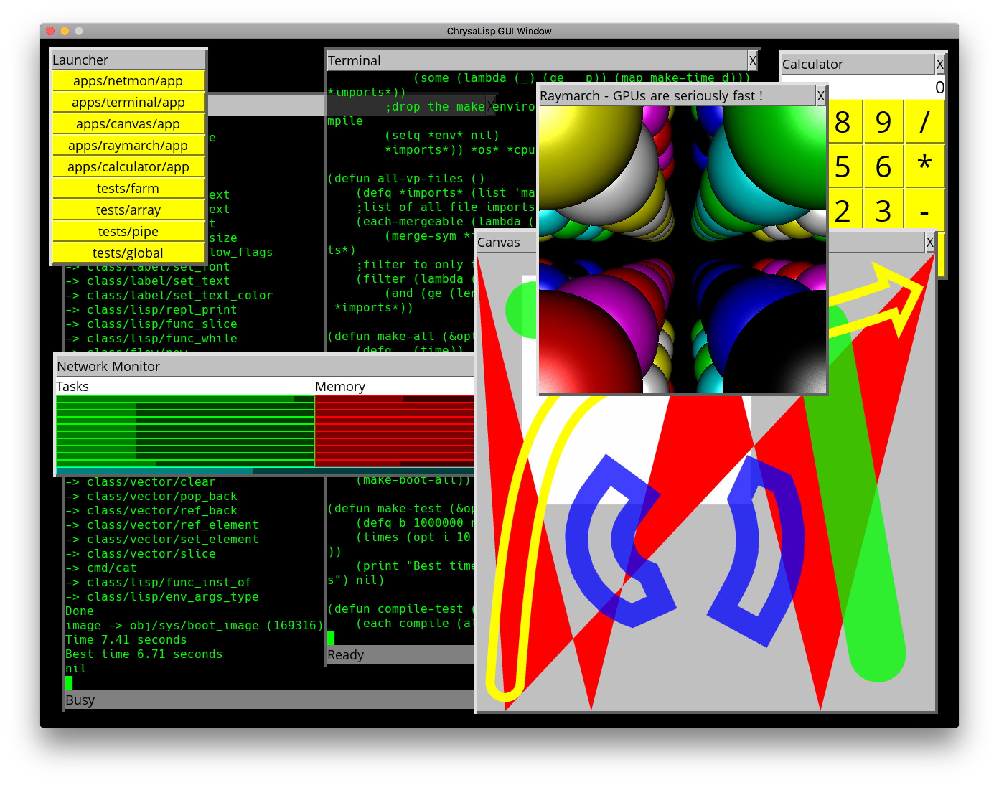

# ChrysaLisp



Assembler/C-Script/Lisp 64 bit OS. MIMD, multi CPU, multi threaded, multi core,
multi user.

Runs on OSX or Linux for x64, PI64 Linux for Aarch64. Will move to bare metal
eventually but it's useful for now to run hosted while experimenting. When time
allows I will be doing a VM boot image for UniKernel type appliances and a
WebAssembly target to play around within the browser.

Allows modelling of various network topologies with point to point links. Each
CPU in the network is modelled as a separate host process, point to point links
use shared memory to simulate CPU to CPU, point to point, bi directional
connections. There is no global bus based networking on purpose.

Uses a virtual CPU instruction set to avoid use of x64/ARM native instructions.
Currently it compiles to native code but there is no reason it can't also go
via a byte code form and runtime translation.

Register juggling for parameter passing is eliminated by having all functions
define their register interface and parameter source and destinations are
mapped automatically using a topological sort. Non DAG mappings are detected
so the user can break them with a temporary if required. Operators are provided
to simplify binding of parameters to dynamic bound functions, relative
addresses, auto defined string pools, references and local stack frame values.
Unused output parameters can be ignored with an _.

There is a powerful object and class system, not just for an assembler, but
quite as capable as a high level language. Static classes or virtual classes
with inline, virtual, final, static and override methods can be defined. The
GUI and Lisp are constructed using this class system.

Has function level dynamic binding and loading. Individual functions are loaded
and bound on demand as tasks are created and distributed. Currently functions
are loaded from the CPU file system on which the task finds itself, but these
will eventually come from the server object that the task was created with and
functions will be transported across the network as required. Functions are
shared between all tasks that share the same server object, so only a single
copy of a function is loaded regardless of how many tasks use that function.

The interface to the system functions is provided as a set of static classes,
easing use and removing the need to remember static function locations, plus
decoupling the source from changes at the system level. Look in the
*sys/xxx.inc* files to see the interface definitions.

A command terminal with a familiar interface for pipe style command line
applications is provided with args vector, stdin, stdout, stderr etc. Classes
for easy construction of pipe masters and slaves, with arbitrary nesting of
command line pipes. While this isn't the best way to create parallel
applications it is very useful for the composition of tools and hides all the
message passing behind a familiar streams based API.

A Common Lisp like interpreter is provided. This is available from the command
line, via the command `lisp`. To build the entire system type `(make)`,
calculates minimum compile workload, or `(make-all)` to do everything
regardless, at the Lisp command prompt. This Lisp has a C-Script 'snippets'
capability to allow mixing of C-Script compiled expressions within assignment
and function calling code. An elementary optimise pass exists for these
expressions and more will be done shortly. Both the virtual assembler and
C-Script compiler are written in Lisp, look in the *sys/code.inc*,
*sys/func.inc*, *sys/x64.inc*, *sys/arm.inc* and *sys/vp.inc* for how this is
done. Some of the Lisp primitives are constructed via a boot script that each
instance of a Lisp class runs on construction, see *class/lisp/boot.lisp* for
details. The compilation and make environment, along with all the compile and
make commands are created via the Lisp command line tool in *cmd/asm.inc*,
again this auto runs for each instance of the `lisp` command run from the
terminal. You can extend this with any number of additional files, just place
them after the lisp command and they will execute after the *cmd/asm.inc* file
and before processing of stdin.

Don't get the idea that due to being coded in interpreted Lisp the assembler
and compiler will be slow. A full cleaned system build from source, including
creation of a full recursive pre-bound boot image file, takes on the order of 2
seconds on a 2014 MacBook Pro ! Dev cycle `(make)` and `(remake)` under 1
second. It ain't slow.

You can enable a guard page memory allocator if chasing a buffer overrun bug.
Look in the *sys/heap/heap.vp* file alloc function and enable the guard page
version and rebuild with `(remake)`. Also enable the `printf` in the *main.c*
file in order to be able to calculate the instruction offset from the crash
dumps IP. Then you can load up *obj/os/cpu/sys/boot_image* into any hex dump
and find exactly which instruction is faulting. Sometimes it's the only way to
find them!

Network link routing tables are created on booting a link, and the process is
distributed in nature, each link starts a flood fill that eventually reaches
all the CPU's and along the way has marked all the routes from one CPU to
another. All shortest routes are found, messages going off CPU are assigned to
a link as the link becomes free and multiple links can and do route messages
over parallel routes simultaneously. Large messages are broken into smaller
fragments on sending and reconstructed at the destination to maximize use of
available routes.

The `-run` command line option launches tasks on booting that CPU, such as the
test suit or experimental GUI (a work in progress, `-run gui/gui`). You can
change the network launch script to run more than one GUI session if you want,
try launching the GUI on more than CPU 0, look in *funcs.sh* at the
`boot_cpu_gui` function ! :)

The `-l` command line option creates a link, currently up to 1000 CPU's are
allowed but that is easy to adjust in the *sys/link.vp* file and is due to the
very simple link parameter parsing. The lower numbered CPU always comes first !
The shared memory link files are created in the tmp folder */tmp*, so for
example */tmp/000-001* would be the link file for the link between CPU 000 and
001.

The `-cpu` command line option just labels the CPU with its ID.

An example network viewed with ps looks like this for a 4x4 mesh network:

```
./main -cpu 15 -l 011-015 -l 003-015 -l 014-015 -l 012-015
./main -cpu 14 -l 010-014 -l 002-014 -l 013-014 -l 014-015
./main -cpu 13 -l 009-013 -l 001-013 -l 012-013 -l 013-014
./main -cpu 12 -l 008-012 -l 000-012 -l 012-015 -l 012-013
./main -cpu 11 -l 007-011 -l 011-015 -l 010-011 -l 008-011
./main -cpu 10 -l 006-010 -l 010-014 -l 009-010 -l 010-011
./main -cpu 9 -l 005-009 -l 009-013 -l 008-009 -l 009-010
./main -cpu 8 -l 004-008 -l 008-012 -l 008-011 -l 008-009
./main -cpu 7 -l 003-007 -l 007-011 -l 006-007 -l 004-007
./main -cpu 6 -l 002-006 -l 006-010 -l 005-006 -l 006-007
./main -cpu 5 -l 001-005 -l 005-009 -l 004-005 -l 005-006
./main -cpu 4 -l 000-004 -l 004-008 -l 004-007 -l 004-005
./main -cpu 3 -l 003-015 -l 003-007 -l 002-003 -l 000-003
./main -cpu 2 -l 002-014 -l 002-006 -l 001-002 -l 002-003
./main -cpu 1 -l 001-013 -l 001-005 -l 000-001 -l 001-002
./main -cpu 0 -l 000-012 -l 000-004 -l 000-003 -l 000-001 -run gui/gui
```


Make with:

```
make -j
```

Requires SDL2 and the SDL2_TTF library to be installed. SDL2 and SDL2_ttf are
for the experimental GUI.

Requirements:
Linux: Tested on Ubuntu 16-10, 17-10 and Debian PI64
```
sudo apt-get install libsdl2-ttf-dev
```

Run with:

```
./run_tui.sh <num_cpus>
```

Text user interface based fully connected network. Each CPU has links to every
other CPU. Careful with this as you can end up with a very large number of link
files and shared memory regions. CPU 0 launches a terminal to the host system.

```
./run.sh <num_cpus>
```

Fully connected network. Each CPU has links to every other CPU. Careful with
this as you can end up with a very large number of link files and shared memory
regions. CPU 0 launches a GUI.

```
./run_star.sh <num_cpus>
```

Star connected network. Each CPU has a link to the first CPU. CPU 0 launches a
GUI.

```
./run_ring.sh <num_cpus>
```

Ring connected network. Each CPU has links to the next and previous CPU's. CPU
0 launches a GUI.

```
./run_tree.sh <num_cpus>
```

Tree connected network. Each CPU has links to its parent CPU and up to two
child CPU's. CPU 0 launches a GUI.

```
./run_mesh.sh <num_cpus on a side>
```

Mesh connected network. Each CPU has links to 4 adjacent CPU's. This is similar
to Transputer meshes. CPU 0 launches a GUI.

```
./run_cube.sh <num_cpus on a side>
```

Cube connected network. Each CPU has links to 6 adjacent CPU's. This is similar
to TMS320C40 meshes. CPU 0 launches a GUI.

Stop with:

```
./stop.sh
```

Snapshot with:

```
make snapshot
```

This will create a *snapshot.zip* file of the *obj/* directory.

```
make boot
```

This will create a *snapshot.zip* file of the *obj/* directory containing only
the directory structure and *boot_image* files ! Used to create the more
compact *snapshot.zip* that goes up on Github. This must come after creation of
`(make-all-platforms)` *boot_image* set !

Clean with:

```
make clean
```
