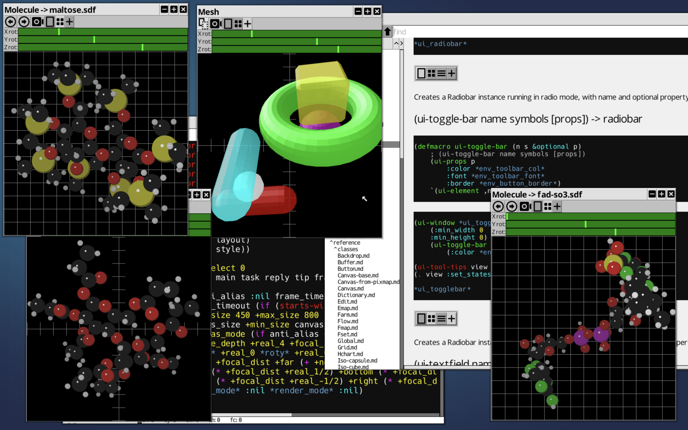
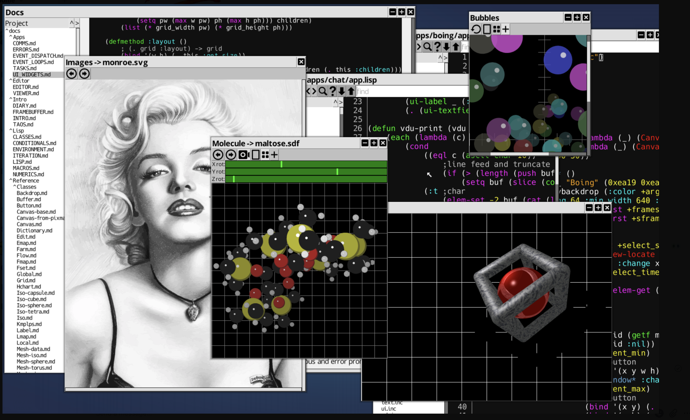

# ChrysaLisp

ChrysaLisp is a unique, 64-bit, MIMD operating system designed from the ground up for parallel and distributed computing. It's a complete, self-hosting environment featuring its own toolchain, a Virtual Processor (VP) for cross-platform portability, a responsive graphical user interface (GUI), a powerful command-line terminal with Unix-like pipes, an object-oriented assembler, extensive class libraries, a C-Script compiler for efficient low-level coding, a unique Lisp interpreter, an integrated debugger and profiler, powerful programers editor, and vector font engine.






## Demonstration Videos

Explore ChrysaLisp in action on our YouTube channel: [ChrysaLisp OS on YouTube](https://www.youtube.com/channel/UCp8kzLGrGC5BaAItw6-LnkQ)

Featured videos include:

* Installation, build process, and `make test` shorts.

* Demonstrations of the GUI environment and applications.

* Insights into the GUI compositor.

* A look at the integrated debugger.

## Key Features

* **Self-Hosting**: Includes its own assembler, Lisp interpreter, and build tools (`make`).

* **Virtual Processor (VP)**: A 64-bit RISC-like target ensuring portability across x64, ARM64, and RISC-V64, with a VP64 emulator for unsupported platforms or bootstrapping.

* **Parallel & Distributed**: Designed for MIMD architectures, supporting various network topologies simulated via shared memory links or bridged across physical machines using ChrysaLib.

* **Dynamic Binding & Loading**: Functions are loaded and linked on demand, promoting efficient memory use and shared code among tasks.

* **Object-Oriented Assembler**: A powerful class system underpins the entire OS, from low-level assembly to high-level Lisp.

* **C-Script Compiler**: Allows C-like expressions to be compiled into efficient VP code within Lisp.

* **Lisp Environment**: A unique Lisp interpreter for scripting, development, and system tasks.

* **Graphical User Interface**: A custom GUI system built using ChrysaLisp's own object model.

* **Command Terminal**: A familiar pipe-style command-line interface.

## Supported Platforms

ChrysaLisp currently runs as a hosted environment on:

* macOS (x64, arm64)

* Windows (64-bit x64)

* Linux (x64, arm64, riscv64)

    * Special support for Raspberry Pi (3/4, 64-bit OS) in framebuffer mode.

Future goals include bare-metal operation, UniKernel appliances, and a WebAssembly target.

## Quick Start Guide

This guide is for users familiar with command-line tools and build systems. For a more detailed, step-by-step walkthrough, please see the `docs/intro.md` document.

### 1. Download ChrysaLisp

* **Latest Release (Recommended)**:

  1. Go to [ChrysaLisp Releases](https://github.com/vygr/ChrysaLisp/releases).

  2. Download `ChrysaLisp-snapshot.zip`.

  3. Extract it. This contains source and pre-built VP64 boot image.

  *(or)*

* **Master Branch**:

  1. Ensure Git is installed.

  2. Clone:

```code
git clone https://github.com/vygr/ChrysaLisp.git
cd ChrysaLisp
```

### 2. Install Dependencies

* **macOS**:

  * Xcode Command Line Tools: `xcode-select --install` (if needed).

  * SDL2: `brew install sdl2 sdl2_mixer`

* **Linux (Debian/Ubuntu based)**:

  * Build tools: `sudo apt-get install build-essential git`

  * SDL2: `sudo apt-get install libsdl2-dev libsdl2-mixer-dev`

* **Windows**:

  * Copy SDL2 and SDL2_mixer DLLs (64-bit) into the ChrysaLisp root directory. See `docs/intro.md` for details.

* **Raspberry Pi (Framebuffer mode)**:

  * Follow specific setup in `docs/framebuffer.md` or the comprehensive `docs/intro.md`.

### 3. Build and Install ChrysaLisp System

This process compiles the host C/C++ programs and then uses them with a pre-supplied VP64 boot image to compile the entire ChrysaLisp system into a native boot image.

* **macOS / Linux / Raspberry Pi (Desktop GUI mode)**:

```code
make install
```

* **Windows**:

  (Ensure DLLs from step 2 are in place if using pre-built executables from the snapshot)

```code
install.bat
```

* **Raspberry Pi (Framebuffer mode)**:

```code
make GUI=fb install
```

### 4. Run ChrysaLisp

* **Text User Interface (TUI)**:

  * macOS/Linux: `./run_tui.sh`

  * Windows Batch: `run_tui.bat`

  * Windows PowerShell: `.\run_tui.ps1`

* **Graphical User Interface (GUI)**:

  * macOS/Linux: `./run.sh`

  * Windows Batch: `run.bat`

  * Windows PowerShell: `.\run.ps1`

  * Raspberry Pi (Framebuffer): `./run.sh -f`

### 5. Using the Internal `make` Command

Once inside the ChrysaLisp TUI (Terminal app), you can rebuild the system:

* `make`: Compiles only necessary changes based on file modification times.

* `make all`: Recompiles all VP source files, regardless of modification times.

* `make boot`: Creates a new native boot image for the current platform.

* `make docs`: Generates reference documentation by scanning source files.

* `make platforms`: Compiles and builds for all supported target platforms, not just the host system. This includes creating boot images for each.

* `make it`: A comprehensive build that includes `all`, `boot`, `platforms`, and `docs`.

* `make test`: Runs internal timing tests for the make process.

You can combine options, for example: `make all platforms boot`.

### 6. Stopping ChrysaLisp

* macOS/Linux: `./stop.sh`

* Windows Batch: `stop.bat`

* Windows PowerShell: `.\stop.ps1`

## Advanced Features & Networking

ChrysaLisp's architecture supports sophisticated distributed computing paradigms. You can simulate various network topologies (ring, mesh, cube, star, tree) using the provided `run_*.sh` scripts.

Furthermore, the [ChrysaLib project](https://github.com/vygr/ChrysaLib) allows you to bridge ChrysaLisp networks across multiple physical machines (macOS, Linux, Windows, Raspberry Pi) using IP or direct USB "copy" cables. This enables the creation of heterogeneous local or wide area ChrysaLisp networks and the development of C/C++ services that can interoperate with Lisp tasks on the VP network.

For detailed instructions on these advanced topics, please refer to the comprehensive `docs/intro.md` guide.

## Clean and Snapshot

* **Clean**: To remove compiled object files and revert to the snapshot state:

```code
make clean
```

(This will require `unzip` to be installed).

* **Snapshot**: To create a distributable `snapshot.zip` containing only essential pre-compiled binaries and the VP64 boot image (primarily for developers maintaining the project):

```code
make snapshot
```

This is typically done after `make it` from within ChrysaLisp !
