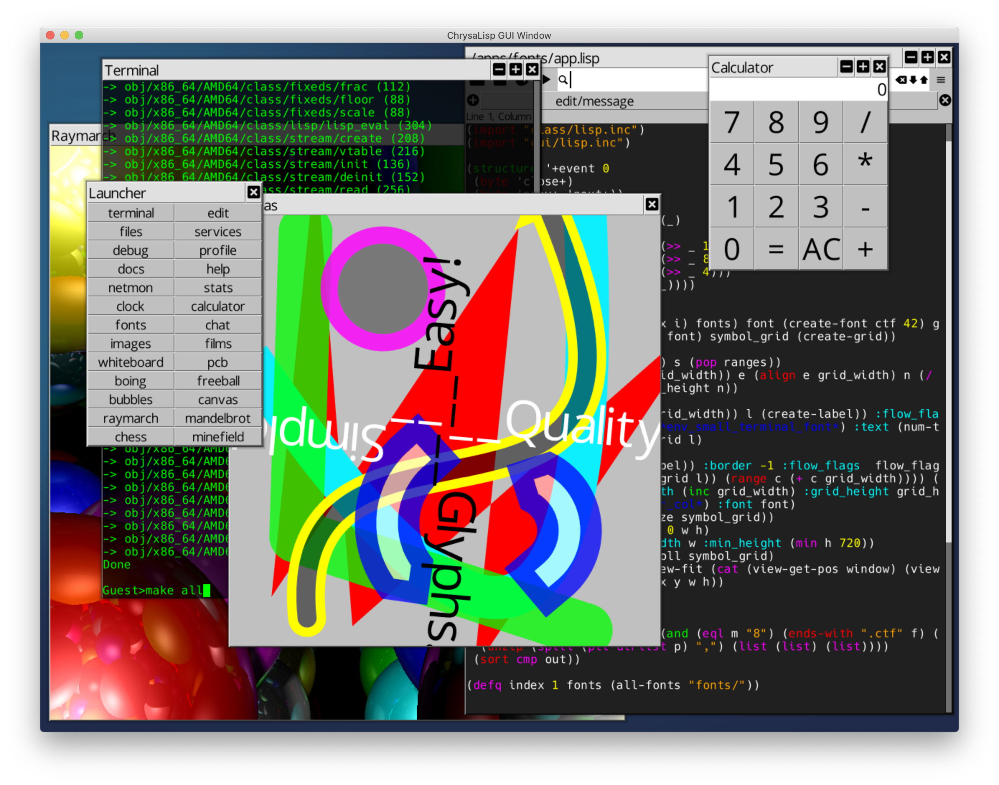

# ChrysaLisp

------

Tidied up the source trying to keep to a consistent style for register equated
source with (list) format rather than quasi-quote format.

------

Added support for type 1 pixel types to the .CPM loader. This enabled me to
load the shadow file for the Boing demo. This also means that the stream class
now supports a read_bits method for variable length data reading. write_bits
method will come along soon as part of the .CPM saving routines.

------

Created a list of symbols, `*func-syms*`, that get undef'd at the close of each
function in order to avoid cross contamination between labels and symbols and
raise errors at compilation time when such happens.

------

Added the shared memory link driver code for Windows platform and created
run.bat, run_tui.bat and run_mesh.bat launch scripts. Windows seams a little
slow on starting up the 64 CPU mesh compared to MacOS or Linux, but it does run
just fine. Enjoy.

------

Implemented the ability to draw anti-aliased polygons directly without needing
to super sample the canvas buffer. Both options are now available, even in
combination ! The anti-aliased routine uses an 8x rooks pattern sampling, which
seams pretty good and has good performance. At some future date I may need to
revisit the simple x sort as it's only fast provided there are not loads of
active edges.

------

A fix for the none-blocking stdin on Windows is done. However this shows up
another bug in Windows that you have to press enter twice to get stdin from the
console ! And the ESC key doesn't get sent through to stdin. Seams these issues
are know issues with Windows. I'll keep a look out for any updates and fixes
for this. For now however the TUI situation is restored to normal on all other
platforms and Windows TUI is far more useable than it was.

------

Many thanks to Martyn Bliss for pushing the Windows port forward. We now have
support for running on Windows 64bit. A few things remain to be done to get the
Windows version running a multiple virtual CPU network, but the GUI is now
running and the TUI is able to be used to compile and build images.

Due to Windows not supporting none-blocking reads from STDIN I'm in the middle
of changing things around to deal with this issue, so temporally the TUI can't
run interactive commands. The GUI terminal can do that still, this only effects
the TUI. This is top of the list to fix !

------

Got another hospital visit for the eyes :( Lots of garbage in my vision still,
but getting some useful documentation done and a few things to help out on the
Windows port.

Tried to concentrate on documenting the aspects of the VP and C-Script coding
that most people will be wondering about when looking at the source files. I
know what it's like when you read a statement and a huge lightbulb goes on in
your head. It's so easy to just assume these things are obvious when you wrote
the code to start with !

------

I have a torn retina ! Not sure how this happened, but just had laser treatment
to weld things down. So not a lot of screen time at the moment !

------

Big drive to get the platform isolation interface (PII) as simple as possible.
Started a windows branch for the windows port, thanks to some prompting by
BannanaEarwig.

------

Happy now with the polygon and stroking APIs after playing around with the new
analogue clock face demo. Makes a real difference the the flow of the source
code after rearranging the parameter ordering.

------

Implemented a set of long vector methods on the points class. Thinking along
the lines of numpy. Even though there not specifically for short 2D and 3D
vectors they have helped the Raymarch demo to go lots faster as far less churn
of objects happens.

Got plans to implement a genetic algorithm trained neural network 'evolving
bugs' demo using the long vectors as a way to shake down the API and tune
performance.

------

Implementation of system services allowed me to implement a multi-thread
debugger and single stepping logger. The Boing demo and Global tasks test now
exercise the features. New Debug app is in apps/debug/app.lisp, note there is
only Lisp code involved in this app. :)

------

Took a detour to create a C++ version of ChrysaLisp to directly compare with my
hand rolled compiler and format. The Lisp side of that project is now done and
can build the full OS from the same source files.

Based on comparison builds of the ChrysaLisp OS source using its own
compiler/assembler and the C++ version, ChrysaLisp native is around 2.5x faster
than the Clang C++ version.

The C++ Lisp executable on its own is currently 279kb, while the entire
ChrysaLisp OS including its compiler and Lisp and libraries, GUI etc, is 165kb.

https://github.com/vygr/ChrysaLisp-

Regards all

Chris
