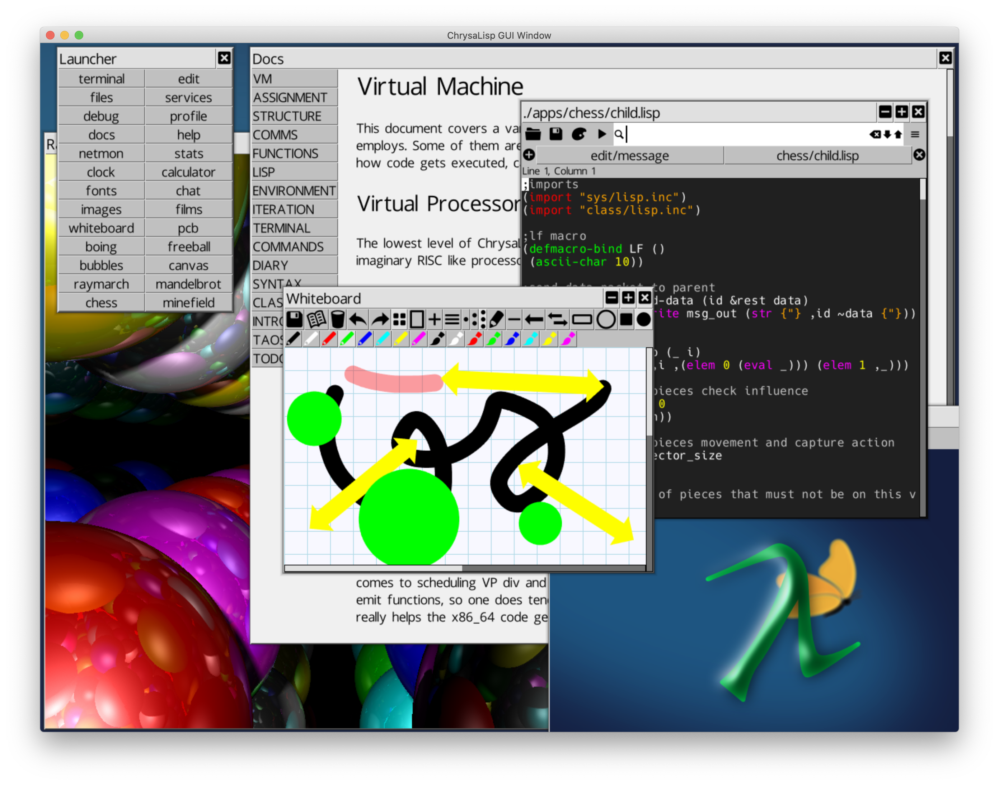

# ChrysaLisp

------

Removed sys_mail::trymail and sys_mail::tryread. Broke out sys_mail::poll from
sys_mail::select and standardised on this way of polling an array of mailboxes.
Made the API directly compatible with Lisp apps....

Tidy up of the msg_in and msg_out stream classes in readiness for the Lisp API
for sequenced streams between Lisp processes. All this is heading in the
direction of a higher level API for Lisp process message data handling and to
allow Lisp apps to drive new process communication models.

Eventually I want to remove the pipe and slave classes entirely, they will just
be a model that the terminal and cmd style Lisp apps employ, but it's driven
from Lisp and not a native feature in the class library.

First demo of this will be the improved Chess demo, told you there was method
in porting over that ! :)

Removed the app specific native code from the boot image and made the relevent
apps Jit compile their native code ! Not quite a virtual binary yet, but not
bad performance using brute force runtime use of (make) !

------

Ported over the simple Chess. This is a bit of trivial fun, but I'll use it to
optimise some of the Lisp and eventually do a proper GUI front end for it, plus
run the child process remotely and that will force me to sort out some better
standard for that.

------

Removed task::yield and made task::sleep 0 do the same things. Reduce footprint
slightly. Plus removed the call to yield from the Lisp while function. This was
being called far too often, so it's now up to the programmer to sprinkle
(task_sleep 0) where appropriate.

Add component::ref which lets Lisp code directly reference object fields.. I've
deliberated allowing this for a while and despite the bad taste it leaves I
can't shake the fact that it makes the Lisp bindings so much easier and faster.
This will allow me to push more and more performance insensitive code out into
the Lisp bindings and reduce the boot_image footprint. Eventually the goal is
for the GUI to only have the time critical View object core compositing in VP
code.

------

Implemented a more generic component connection idea. This gets rid of lots of
specific UI component code, around 2KB of boot_image ! Its also only allocates
the target id array if required so saving a small amount of RAM.

Fixed a silly memory leak in the Windows main.c myunmap function.

Finally implemented the view::hide and view::to_back methods with a minimal
redraw, title drag with the right button now does a to_back and drag.

Added a Freeball demo to thrash the sprite compositing. This shows that you
don't and never did have to have a Window in order to have content on the
screen. Any GUI component can be composited directly, nothing about a Window is
special.

Share GUI textures between canvas's loaded with the load_shared flag. Obvious
but I wasn't doing it before. Clearly saves a lot of GPU memory.

------

Implemented (assign-asm-asm) auto copy type for field access. Now when you
don't put a type qualifier (i ui b ub s us) as an optional third parameter,
assign will attempt to lookup the type of the symbol and use the correct VP cpy
instruction.

This makes things a lot more robust as you don't need to remember what your
type was, it all comes from the field type in your (def-struct). Plus this
removes the need for field access macros, something that was annoying me
somewhat.

So a large amount of source got modified and as I visit more files I will
convert over to the new way of doing things.

This will make the build time a fraction slower, but it's worth it.

------

Implemented nested (quasi-quote), made (list) not copy it's args and (some!)
and (each!) no longer reuse the parameter list within the loop.

Canvas now uses a custom GPU blend mode for the pre-multiplied alpha format so
that saves an entire buffer copy and format conversion per texture upload !
Canvas init and init_shared optimised and also made the edge array a shared
array.

VP instruction are now mostly macro generated.

------

Control statements can now take compounds expressions !

Swap to using standard Lisp syntax for <, >, >=, <=, =, /=, +, -, *, / and %.

Purchased a Raspberry PI4 and checked to make sure everything runs fine on it.
Running a CloudKernels 64bit 18.04 Ubuntu image on it everything worked and it
turns in a full build time of 2.1 seconds ! Not bad at all PI folks. PI3 is
currently managing about 5.2 seconds.

------

Lower all the hmap Lisp bindings to VP, so (def) (defq) (set) (setq) (undef)
(env) are all a little faster, plus this took the boot image size down over 1KB
! Really must get around to using the (env) functions more exotic uses to do
some OOPS stuff at the Lisp level.

------

Revisit the seq Lisp bindings, lowered to VP and removed the second function
param to (each!).

------

Big push on the consistency and ease of doing Lisp bindings to native VP code.
Anything that helps avoid finger trouble and produces tighter code.

Changed the env_arg_type checker function to not trash the Lisp object and args
regs. This allows the release build code to not have to do extra copies just to
allow the debug version to work, plus it gives better code even in debug builds
!.

Ongoing drive to avoid recursive functions. (bind-fun) and (macroexpand) now
avoid this, but (copy) and (quasiquote) still do so. They will be recode soon
to not do so. And then I will lower the default task stack size.

MacBook full build now at 0.35s, Raspberry PI3 6.0s. :)

Debug boot image sizes:

AMD64 158508 bytes
WIN64 158860 bytes
ARM64 189244 bytes

------

Added a better way of binding parameters from array values to function call
parameters. Worked through most of the Lisp bindings and used them to make the
code much simpler and easier to follow.

Various optimisations as I went along and revisited the source for all these
functions.

------

Some more work on the docs browser to add margins and highlight code words
within paragraphs plus structure the code a bit better.

Added a set of colour themes and used them everywhere, currently a subtle grey
shades look.

Continued to lower functions to VP, and made pre-binding throughout boot.inc
the standard and elsewhere a simple call profiler showed would benefit.

------

Implemented a simple docs browser, and that lead to a lot of rework on the GUI
compositor to better deal with idiotic amounts of components being placed in a
flow ! The eventual form of the docs browser needs a new GUI component to
handle blocks of text, but still it did end up with the compositor being better
so I can't complain too much.

Lowered and thought through the macro expansion code again. Can improve this
further eventually by not using recursion on the stack but this version is far
better than before.

------

Finally got round to implementing a heap collector ! You can clearly see the
effect by watching the Netmon app while running builds and so forth etc.

What I didn't expect was the performance gain from this. I suspect this is down
to the collector sorting the free lists into batches that map to each block, as
well as freeing up page table space on the host.

Seeing 0.55s builds now on the MacBook, and 7s builds on the Raspberry PI3. But
most importantly, memory is now freed back to the host OS during runtime !

------

Making some attempts to rename functions and macros to better fit with Common
Lisp. I'm not trying to duplicate the exact functionality, but at least make
things a little more familiar where it makes sense.

Added the (case) macro that helps with building a jump table dispatched case
clauses. Nice use of Lisp macros that one.

Updated the C++ ChrysaLisp to be able to build the latest OS image.

After all the lowering to VP work the MacBook build is now benchmarking at 0.7s
and the Raspberry PI3 build time has dropped from 12.5s to 9.2s, that's a great
result for the effort.

------

Worked through almost all the Lisp bindings to convert to VP. Saved several KB
on the boot image size as a result. Plus a small but worthwhile speed up.

------

Looks like SDL 2.0.9 fixes the 2.0.8 red screen on Mojave problem !!! So I'm
removing the temp fix for that problem. Thanks SDL crew for sorting this out in
this release.

------

A couple of improvements to the Kernel class code, specifically the opts
processing code that now gets used as part of the general process launch
handling as well as the -run boot option.

Will be out of action a few days due to suffering a Vertical Root Fracture and
emergency dental extraction ! Ouch. :(

------

Did a few more class lib tidy ups and VP lowering. Plus converted the TUI to
be written in Lisp ! That one has been on my mind for a while and it got back
around 1.5KB of boot image !

------

Moved the Lisp class bindings out to the classes that provide the functionality
being used. I still want to tidy up the Lisp boot.inc file to just include a
set of finer grained lisp.inc files though.

Lowered the stream class Lisp bindings to VP. Now that the bindings are
separated out it's going to be easier to get round to doing this to the rest of
them.

------

Last of the GUI apps, the terminal, converted over to Lisp. I'm going to have
to sort out a better way to handle the mailbox select functionality for Lisp
eventually, the change to pipe::select to get the Terminal app over to Lisp is
a bit of a bodge.

On prompting from no-identd I took a look at Anaphoric macros and agree that
they can be useful but folks should be aware of what the issues are if you use
them. So I've added the obvious ones to boot.inc. Maybe they should be going in
a separate class/lisp/anaphoric.inc file ?

------

Not had a huge amount of free time so did a few conversions to VP level code on
some critical Lisp functions. A little extra performance and helps to keep the
size of the boot image in check. Can always knock out a few VP conversions if
time won't allow anything more substantial.

I decide to change the 'sys_mem 'realloc to not trash r6-r7. Thoughts on this
are that if your going to end up doing the memory copy then the 2 registers
push/pop is no big deal, but the functions that use this can benefit from
having there iterators held in registers and not stack variables and that is a
far better situation.

------

Implemented a Lisp version of my PCB viewer app. Used it to thrash out some
issues with the circle drawing flatness tests. Plus it's a great demo of what
200 lines of Lisp can do. :)

------

Reorganised the obj/ folder to take advantage of the now common abi binaries !
Saved nearly 100KB on the snapshot.zip file as a result of the shared binaries
between Darwin and Linux x86_64 platforms.

------

Tidied up the source trying to keep to a consistent style for register equated
source with (list) format rather than quasi-quote format.

------

Added support for type 1 pixel types to the .CPM loader. This enabled me to
load the shadow file for the Boing demo. This also means that the stream class
now supports a read_bits method for variable length data reading. write_bits
method will come along soon as part of the .CPM saving routines.

------

Created a list of symbols, `*func-syms*`, that get undef'd at the close of each
function in order to avoid cross contamination between labels and symbols and
raise errors at compilation time when such happens.

------

Added the shared memory link driver code for Windows platform and created
run.bat, run_tui.bat and run_mesh.bat launch scripts. Windows seams a little
slow on starting up the 64 CPU mesh compared to MacOS or Linux, but it does run
just fine. Enjoy.

------

Implemented the ability to draw anti-aliased polygons directly without needing
to super sample the canvas buffer. Both options are now available, even in
combination ! The anti-aliased routine uses an 8x rooks pattern sampling, which
seams pretty good and has good performance. At some future date I may need to
revisit the simple x sort as it's only fast provided there are not loads of
active edges.

------

A fix for the none-blocking stdin on Windows is done. However this shows up
another bug in Windows that you have to press enter twice to get stdin from the
console ! And the ESC key doesn't get sent through to stdin. Seams these issues
are know issues with Windows. I'll keep a look out for any updates and fixes
for this. For now however the TUI situation is restored to normal on all other
platforms and Windows TUI is far more useable than it was.

------

Many thanks to Martyn Bliss for pushing the Windows port forward. We now have
support for running on Windows 64bit. A few things remain to be done to get the
Windows version running a multiple virtual CPU network, but the GUI is now
running and the TUI is able to be used to compile and build images.

Due to Windows not supporting none-blocking reads from STDIN I'm in the middle
of changing things around to deal with this issue, so temporally the TUI can't
run interactive commands. The GUI terminal can do that still, this only effects
the TUI. This is top of the list to fix !

------

Got another hospital visit for the eyes :( Lots of garbage in my vision still,
but getting some useful documentation done and a few things to help out on the
Windows port.

Tried to concentrate on documenting the aspects of the VP and C-Script coding
that most people will be wondering about when looking at the source files. I
know what it's like when you read a statement and a huge lightbulb goes on in
your head. It's so easy to just assume these things are obvious when you wrote
the code to start with !

------

I have a torn retina ! Not sure how this happened, but just had laser treatment
to weld things down. So not a lot of screen time at the moment !

------

Big drive to get the platform isolation interface (PII) as simple as possible.
Started a windows branch for the windows port, thanks to some prompting by
BannanaEarwig.

------

Happy now with the polygon and stroking APIs after playing around with the new
analogue clock face demo. Makes a real difference the the flow of the source
code after rearranging the parameter ordering.

------

Implemented a set of long vector methods on the points class. Thinking along
the lines of numpy. Even though there not specifically for short 2D and 3D
vectors they have helped the Raymarch demo to go lots faster as far less churn
of objects happens.

Got plans to implement a genetic algorithm trained neural network 'evolving
bugs' demo using the long vectors as a way to shake down the API and tune
performance.

------

Implementation of system services allowed me to implement a multi-thread
debugger and single stepping logger. The Boing demo and Global tasks test now
exercise the features. New Debug app is in apps/debug/app.lisp, note there is
only Lisp code involved in this app. :)

------

Took a detour to create a C++ version of ChrysaLisp to directly compare with my
hand rolled compiler and format. The Lisp side of that project is now done and
can build the full OS from the same source files.

Based on comparison builds of the ChrysaLisp OS source using its own
compiler/assembler and the C++ version, ChrysaLisp native is around 2.5x faster
than the Clang C++ version.

The C++ Lisp executable on its own is currently 279kb, while the entire
ChrysaLisp OS including its compiler and Lisp and libraries, GUI etc, is 165kb.

https://github.com/vygr/ChrysaLisp-

Regards all

Chris
