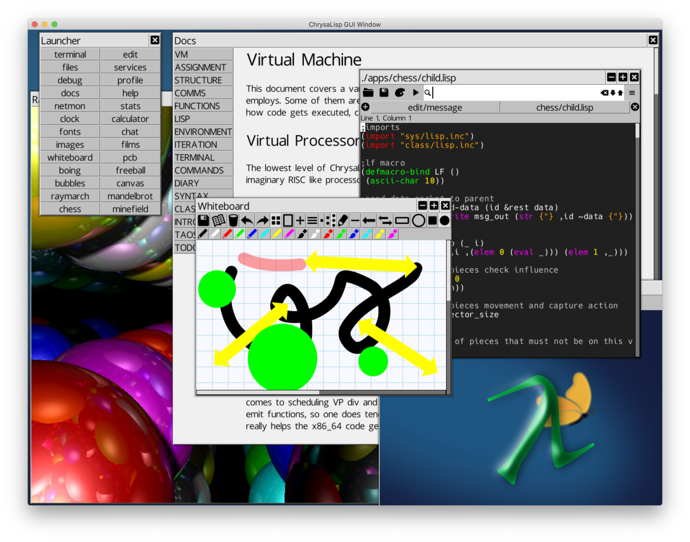

# ChrysaLisp



------

A link that is lost is made again, seen to happen.

*	It was in the code and in the tests of the logic, and had not been
	seen, there was no way on the Pi to break a connection. There is one.
	The Pi's route to the x86_64 Mac is cut, with its TCP told to give up
	after 2 tries where it takes 15. The link was gone 6 seconds into the
	cut, on both, and stayed gone. 2 seconds after the route came back there
	was one new link between the two, and one it stayed.

*	The modes of files are not sent by a sync and can not be yet. A new
	file is made as the host makes one, a script arrives not marked to run.
	The host has no call to set a mode, and one is a change to the table of
	host calls, so it waits for the next change that needs a new snapshot.

------

Mail over a TCP link was slow, two faults, neither in what was using it.

*	Found by asking why a sync with nothing to send took 1 to 2 seconds
	when listing the tree takes 15ms. The round trip of the smallest message
	to another machine was 48ms to a Raspberry Pi 4 and 20ms to an x86_64
	Mac, on a LAN where a ping is under 1. And a message too big for one
	packet took from 170ms to 1.8 seconds, a different time each go.

*	**The sockets of a link held back what was written.** A link writes a
	small header and then the data of each message. TCP holds a second small
	write till the first is acknowledged, and the other end puts that off,
	40ms on Linux. The host now sets `TCP_NODELAY` on a TCP socket as it
	connects or accepts, `src/host/net.cpp`. The smallest round trip is 4ms
	to the Pi and 8ms to the Mac.

*	**The postman did not wake the links.** A message bigger than a packet
	goes to the postman, `sys/mail/out.vp`, which cuts it into fragments
	and queues them. A message that fits is queued and the links are woken,
	`:sys_task :wake_links`. The postman queued and woke nobody. A shared
	memory link looks at the queue every few hundred microseconds, so never
	showed it. A TCP link sleeps till it is woken, up to 5 seconds, so the
	fragments sat till something else woke it. The postman wakes them now.
	A message of 7KB to the Pi was 335ms and is 6ms, of 28KB was 1,084ms
	and is 9ms, of 1MB was 807ms and is 154ms.

*	A sync with nothing to send is 0.2 seconds through the mesh. A test
	run of three machines with nothing to run again is 1.3 seconds, and was
	3.3. A file of 37MB goes to the Pi at 6MB a second and to the Mac, on
	Wi-Fi, at 1.5MB, where plain `ssh` does 8.7MB and 1.9MB over the same
	two. So it is the network now, and a window of parts in flight, or the
	`:in` and `:out` streams, is not needed for it.

*	The host programs have to be made again for the first of these, `make`.
	Nothing in the table of calls has changed, an old host program runs the
	new boot image and is only slower over a link. The Windows programs in
	the snapshot are the old ones. The boot image is 16 bytes bigger.

*	Every test passes on the three machines and on the emulator.

------

The mesh did not do what Claude said it did, and now does. An `@` service is
for its own machine and is not seen from another, only a `*` service is.
Chris: "a machine should only be able to see its own @ services ! only * go
outside the TCP bridge !"

*	The kernel has it right, and always did. A system ping carries the `@`
	services and is not sent down a link to another machine. Tried, two
	machines linked each see the other's `*` service and not its `@` one.

*	The Net services sent their hello, the list of peers, to every `@Net`
	they could find. That was only ever their own. So no hello crossed
	between machines, and that half of the mesh, a machine told of a peer
	by another, had not once worked. One link a pair, and the full mesh of
	machines that all beacon, did work, each hears the others' beacons
	first hand and needs no hello for it.

*	The test that seemed to show it was wrong as well. `link -m`, a mesh
	with no discovery, listened for beacons all the same. Its "no" was
	passed as `:nil` to an optional that `(setd)` then made `:t`. So the M4
	found the x86_64 Mac by its beacon, and the entry below that says it was
	told of it by the Pi is not so.

*	A service that makes a mesh now declares `*Mesh` as well as `@Net`,
	and the hello goes to those. `link -m` does not listen. Run again, the
	M4 with `-m` had no UDP socket open, the host was asked, and had a link
	of its own to the x86_64 Mac inside 20 seconds, which can only have come
	of a hello. All three with beacons, one link a pair as before.

*	The `(setd)` trap is in `docs/ai_digest/lisp_traps.md` with a test.

------

A sync can not reach outside the ChrysaLisp tree. Chris: "I can take
deleting a ChrysaLisp install, I can't take losing everything I can't get
back from GitHub."

*	The service's root has to be the tree ChrysaLisp was launched in, or a
	folder inside it. One started with a root anywhere else takes nothing.

*	No file is written or removed through a symbolic link. Each folder on
	the way to a file is asked of the host, and has to be a real folder,
	the file a real file or not there. A path was already refused for a
	`..`, a `/` at the start, a `:` or a `\`, now a `~` and a character
	below a space as well.

*	Tried by hand, a tree with a link to `/tmp`, a link to a file outside,
	and a root that was itself a link. A write through each, and a remove,
	all refused, and nothing outside was changed. The suite has no way to
	make a link, so its tests are of real folders and of a root outside.

*	It does not fence what the synced files do when they are run. A
	`Makefile` or a launch script from another machine is that machine's
	code run as you. `docs/ai_digest/sync.md` says so.

------

New `sync` command, the files of another machine made the same as this
one's, over the links, with no `ssh` and no `rsync`. Chris: "All we have to
do to update a rack is update one system, then walk away." This is the
first step of that, a push.

*	Each side lists its files with a SHA-256 of each, the lists are
	compared, and only what differs goes over. `sync -a` on a machine that
	will take one, `sync` to see who will, `sync -t all -c` to see what
	would change, `sync -t all` to send it. `docs/ai_digest/sync.md`.

*	A machine takes a sync only if it runs the `*Sync` service, which
	`sync -a` starts. It writes only under its root. There is no key, any
	machine with a link to it can write.

*	It is all mail between the machines. No task is started on another
	machine, the fence round a `run` task stands.

*	What the tree's `.gitignore` leaves out is not sent or removed, so
	each machine keeps its own `obj/`, `cpu`, `abi`, `os` and `.system_id`.

*	From an M4 to an x86_64 Mac and a Raspberry Pi 4. The first list of
	the tree, 146MB, 1 second and 3.3. After that 0.2 seconds, the hashes
	are kept. Two changed files sent in 0.3 seconds. `rsync` then found no
	file different on either.

*	A file goes 128KB at a time, each part waited for, so in order. A
	37MB file took 7 seconds to the Pi and 49 to the x86_64 Mac. Slow, and
	a window or the `:in` `:out` streams would mend it.

*	Not done. Pull, which is the aim, an update that spreads from machine
	to machine. A version and a restart. A key. File modes. The test
	scripts still use `rsync`.

*	A trap for the doc, `(first :nil)` is `":"`, which is true. A loop
	that waited for `(first (first found))` had it at once with nothing
	found.

------

The mesh forgets a machine that has gone, and what a lost link does.

*	A peer is alive while it is heard from, its beacon or its hello, or
	while another service says it has heard it. After 30 seconds of nothing
	its address is let go of and it is not dialled. A service only passes on
	the peers it has heard itself, so word of one that has gone stops going
	round. It was dialled every 10 seconds for as long as the service ran.

*	A dial that brings no link is tried again after 10 seconds, then 20,
	40 and 80.

*	Tried on the three machines. The x86_64 Mac stopped, the other two
	carried on as a pair. It was started again 20 seconds later, a new
	system to them, and was back with a link to each 15 seconds after that.

*	A cut of the wire does not lose a link. The Pi's route to the x86_64
	Mac was taken away for 6 seconds, and for 40. For 6 one probe timed out
	and nothing else. For 40 each saw the other's nodes go, and come back
	within seconds of the route, over the same TCP connection, which the
	host had kept. No second link was made, the kernel still listed the
	first. The redial of a lost link was not seen here, it has been since,
	see above.

*	The Net service starts on a boot image from before `(net-links)`. A
	session started between new source and `make all boot` printed an error
	of an `ffi` each time. It runs with no mesh there, and `link -a` or
	`link -m` says so, and to `make all boot`.

------

The Net services make a mesh between themselves. Chris's idea, a TCP link
was treated as a wire between two machines and it is not one.

*	Every machine that runs `link -l 3333 -a` and `link -a` finds the
	others and has one link to each. None is a through node for two others.
	Of a pair, the lower system id makes the link and the other waits, 15
	seconds at most, so there are not two. On an M4, an x86_64 Mac and a
	Raspberry Pi 4 that is three links, one a pair, steady, where two
	machines alone made two.

*	Each service keeps a list of its peers, system id, address and port,
	from the beacons it hears. Every 2 seconds it mails the list to each
	other `@Net` it can find, a hello, and adds what it is sent to its own.
	It then links to any peer it has an address for and no link to. So a
	lost link is made again, there was nothing that did that.

*	New `link -m host`, a mesh with no discovery. The machine joins by one
	address and is linked to every peer that one knows. The M4 joined the Pi
	with it, and had a link of its own to the x86_64 Mac 14 seconds on.
	Without the `-m` it had none and the Pi was in the middle.

*	New `(net-links)`, the system id of the peer of each link the node
	has, from the kernel's own list. It is how a service knows there is a
	link already, whoever made it, by discovery or by hand.

*	A beacon says if its sender hears beacons too, a `D` on the end, so one
	that only listens and beacons is still dialled by one that discovers,
	as it was. The old use, a server and a client, gives one link as before.

*	`service/net/mesh.inc` is the logic alone, who knows whom and who
	dials, with 27 tests in `tests/net/test_mesh.lisp`. The rest is tested
	on the three machines by hand, there is no test in the suite that has
	more than one machine.

*	Not done. Every pair is linked however
	many machines there are, there is no limit. Only the node with the Net
	service has the links, the other nodes of a machine reach it over their
	own. And anything that speaks the beacon is let in.

*	The boot image is 264 bytes bigger, 238,796 on ARM64.

------

Auto discovery made a new link every 2 seconds, for ever.

*	`link -a` hears a beacon and connects to a peer it has not seen. It
	kept the address of each peer in a set, and mailed that same str to the
	link task. A str mailed on the one node is the str itself, and the link
	ends the host at the `:` where it lies, so the key in the set was cut
	short and never matched again. Every beacon, one each 2 seconds, made
	another TCP link to the same peer, 13 in half a minute between an M4
	and a Raspberry Pi 4. Nothing broke, the routes all worked, they piled
	up. The service mails a copy. `service/net/app_impl.lisp`.

*	Found by a test of what Chris asked, two machines that each beacon and
	each discover, as every one would from an SD image that is the same on
	all of them. With the fault gone that gives two links between the pair,
	one made by each, steady, and every node of both answers. So it works,
	with a link more than is needed.

*	The trap is in `docs/ai_digest/lisp_traps.md` with a test.

------

A launch is sized to the machine, with no need to say so. Martyn Blyss's
suggestion.

*	`run.sh`, `run_tui.sh` and their `.ps1` and `.bat` twins started 10
	nodes, on any machine, too many for a Raspberry Pi and too few for a big
	Mac. With no `-n` they now do what `-n 0` does, a node for each core.
	`-n 10` is still ten. The scripts of the other topologies, ring, mesh,
	cube, star and tree, are as they were, their counts are their shape.

*	`install.bat` started 10 emulator nodes by hand. It runs the install as
	`make install` does on the other systems, `run_tui.ps1 -n 0 -i -e -f`.

*	The shell side is tested, 16 nodes on the M4 and 4 on the Pi, for the
	GUI and the TUI, and a count given is the count had. The PowerShell and
	`install.bat` side is read and not run, there is no Windows here.

------

GPU triangles run on Windows. Martyn Blyss ran the new snapshot there, the
Mesh demo with its GPU button, and all of it works. The host programs in it
were cross built on a Mac and that was the first time they were started.
The snapshot installs on the M4, the x64 Mac and the Pi, and RISC-V and
LoongArch under QEMU build themselves to the byte and pass every test.

------

A pipe let go of while open, and a doc of traps.

*	A `Pipe` dropped without `(. pipe :close)` hung its task. Its streams
	were let go of in the order they were held, what the commands say and
	then the stdin. The first waits for the commands to stop, the commands
	wait for their stdin to end, and that was next in the queue. The stdin
	stream is now the first of a pipe's streams, so it ends first, and the
	pipe goes when its commands do. `lib/task/pipe.inc`.

*	One to a command that never ends still waits, there is nothing to tell
	it to stop but `(. pipe :close)`, which gives it 2 seconds, or
	`(. pipe :abort)`. `docs/ai_digest/pipe_commands.md` says so.

*	Every holder of a pipe was looked at for the same fault. The command
	farm's child goes through `(pipe-run)`, fixed last time. The Terminal
	and the TUI close or abort theirs on every way out. None was left.

*	New `docs/ai_digest/lisp_traps.md`. Constants put in the code, a macro
	name as a parameter, dynamic scope, what a function of a module can
	call, what is true, numbers that do not mix, `find` of a str in a str,
	and errors that are never seen. `tests/core/test_traps.lisp` checks each
	one, so the doc can not go stale without a test saying so.

*	Two of the traps were not what Claude's own notes said. A function of a
	module can call itself if it is exported, what it can not call is one
	defined below it. And `find` of a str in a str does not fail, it finds
	the first character.

------

A key from a password, and an error that was a hang.

*	`(pbkdf2-sha256 password salt count size)`, `lib/crypto/pbkdf2.inc`,
	PBKDF2 of RFC 8018 over the HMAC that was there. All Lisp but the hash.
	The hash of the key with each pad is done once, so a time round is two
	calls of the native code, 100,000 of them in 0.48 seconds on an M4.
	Tested with the cases that go round with RFC 6070, the answers from
	Python's `hashlib`. `docs/ai_digest/crypto.md`.

*	An error thrown by the function given to `(pipe-run)`, one of the wrong
	number of args say, never arrived. The pipe was let go of while still
	open, and a pipe let go of open waits for ever on its command. The task
	hung with nothing said. `(pipe-run)` closes the pipe as the error goes
	by. A `Pipe` an app makes for itself and drops without `(. pipe :close)`
	still waits, that is not changed.

------

Notes for 7.2, a draft, `docs/releases/v7.2.md`, all that has gone in since
the 7.1 tag but the frame buffer and sound work its own notes have. It is to
be a tag and not a GitHub release, when the list of what is outstanding has
been gone through. And Claude's account of the three days,
`docs/ai_digest/ai_thoughts.md`, "A week in".

A divide is of a number of 64 bits, on every CPU.

*	The VP divide takes a register for the top half of the number, and
	gives what is left over in it. ARM64, RISC-V and LoongArch never looked
	at the top half, they have no divide of 128 bits. x86_64 and the
	emulator did, and x86_64 would have stopped the node on a top half big
	enough that the answer did not fit. Every caller sets it as a divide of
	64 bits would, so nothing went wrong, it only could have.

*	The x86_64 translator now puts the sign of the number there itself for
	a signed divide, and 0 for an unsigned one, and the emulator divides 64
	bits. So a divide means the one thing on all of them, and there is no
	divide left that stops an x86_64 node. `lib/trans/x86_64.inc`,
	`src/host/vp64.cpp`.

*	Tests of big numbers of either sign in `tests/core/test_divide_edges.lisp`.
	Every test passes on ARM64 and x86_64, on the emulator on both, and on
	RISC-V and LoongArch under QEMU.

A divide by 0 with no check in front of it gives the same on every CPU.

*	On the usual build a divide by 0 is an error, the check is there. On a
	release build, and in native code that has no check, a shader, a typed
	function, it was whatever the CPU did. x86_64 stopped the node. ARM64
	gave 0. RISC-V gave all ones. LoongArch may give anything. Chris: make
	all the platforms behave the same, if it costs no speed.

*	Now the answer is 0 and what is left over is the number, on all of
	them, which is what ARM64 always gave. The x86_64 translator tests for
	0 before it divides. The RISC-V and LoongArch translators clear the
	answer if the divisor is 0, and work out what is left over as the
	number less the answer times the divisor, a multiply where they did a
	second divide. The emulator tests for 0. `lib/trans/x86_64.inc`,
	`lib/trans/riscv64.inc`, `lib/trans/la64.inc`, `src/host/vp64.cpp`.

*	It costs a test and a branch that is never taken beside a divide, on
	x86_64, and on the other two a divide less.

*	Tests of a divide with no check, an int divide in a typed function, in
	`tests/core/test_divide_edges.lisp`. They pass on ARM64 and x86_64, on
	the emulator, and on RISC-V and LoongArch under QEMU, where a self
	hosted build still gives the boot image the Mac cross builds, to the
	byte.

Each canvas that triangles are drawn into has its own depth buffer.

*	The sdl3 driver kept one depth buffer, and one target of 4 samples a
	pixel, for the whole GUI, the size of the last frame drawn. Two
	canvases of different sizes would have had both made again for every
	frame of each. They belong to the texture now, and go when it does.
	`src/host/gui_sdl3.cpp`.

*	Three Mesh demos at once on an Apple M4 Max, the one that counted drew
	269 frames of 270, none refused.

*	On a Raspberry Pi 4, the Surface and Mesh demos both on its GPU, 35
	seconds, with this and the rule below. Mesh drew 465 frames, 13 a
	second, where with one draw for the whole GUI it drew 61. Its timer
	ticked 21 times a second, as it did then. The display was drawn 36
	times a second, the longest wait 41ms.

Sharing the GPU, put right for a slow one.

*	One draw at a time for each texture, the change below, was right on a
	fast GPU and wrong on a slow one. On a Raspberry Pi 4 with the Surface
	and Mesh demos both on its GPU, draws piled up in front of the GUI's
	own, and the display went from 37 frames a second to 2.5.

*	The rule now. One draw at a time for a texture. And a draw waits for
	the GPU to be done with any other texture's draw, unless that draw is
	fresh, handed over in the last 3ms, which on a fast GPU every draw is.
	A texture that was refused has the next turn. `gpu_may_draw()`,
	`src/host/gui_sdl3.cpp`.

*	The two demos together, the frames of Mesh that were drawn, and how
	often the display was.

	| | one for the GUI | one a texture | the rule now |
	|---|---|---|---|
	| Apple M4 Max, 10 seconds | 216 of 299 | 299 of 299 | 299 of 299 |
	| Raspberry Pi 4, about 30 seconds | 61 | 29 | 215 |
	| the Pi's display, a second | 37 | 2.5 | 32 |

*	On the Pi it was the first of them that starved Mesh, Surface asks
	every tick and took every gap. It is the turn that mends that.

Two apps that draw on the GPU no longer hold each other up.

*	The Mesh demo stuttered with the Surface demo running beside it, both
	on the GPU, Chris saw it. The sdl3 driver let one shader or triangle
	draw be on the go at a time, for the whole GUI, and a frame asked for
	while another app's was still with the GPU was refused, to be tried
	again a tick later. It is now one at a time for each texture.
	`src/host/gui_sdl3.cpp`.

*	Mesh with Surface beside it, on an Apple M4 Max, 10 seconds. Before,
	216 frames drawn of 299 and 83 refused, the longest wait between two
	frames 312ms. After, 299 drawn, none refused, the longest wait 39ms,
	which is what Mesh has alone.

*	It is the host program that changed, `make` builds it.

More code walks part of a list with no copy of it, and collects into the one
list.

*	The cache of test results, the hash of a shader, the functions for
	Lisp, Poly1305, and the `shader` and `lint` commands took a `(rest)` or
	a `(slice)` of a list to go over it, or joined lists that were each
	made to be joined. They use the range of `(each!)`, `(map!)` and
	`(some!)`, and the list that `(map!)` and `(filter!)` can add to. These
	were all written after the last such change, the habit had not held.

*	A lock test asked that its own claim be the very last in the history
	of the lock service. The service is the one for the whole network, and
	on a Raspberry Pi 4 a shader being assembled by another test claimed a
	lock as it looked. It looks for its claim near the end now.

*	All that a release is tested with was run again and passed, every
	stage on three machines, and RISC-V and LoongArch under QEMU. And all
	the tests pass run one after another in the one task, from an empty
	cache of shaders, on the three machines.

The most negative number divided by -1 no longer stops an x86_64 node.

*	`(/ -9223372036854775808 -1)`, and `%` the same, stopped an x86_64 node
	dead, on any build. The answer is one too big to be a number, and
	x86_64 will not have that, where ARM64, RISC-V and LoongArch give the
	number back with nothing left over. The x86_64 translator now does not
	divide by -1, it negates, which gives the same as the others, so VP
	means the one thing on every CPU. `lib/trans/x86_64.inc`. 280 bytes
	more of boot image on x86_64.

*	Found by trying every divide Lisp can reach. A divide by 0 is an error
	on the usual build, which has its checks, on every CPU. Only a release
	build has none.

*	Tests, `tests/core/test_divide_edges.lisp`.

*	All that a release is tested with was run again, with the `lint`
	command as its lint. Every stage passed on the two Macs, and RISC-V and
	LoongArch under QEMU passed every test. On the Raspberry Pi 4 one test
	failed on the emulator, a test of the shader cache that leaned on
	another module having made the Mesh shaders first, which is so when
	the modules run side by side and not when they run one after another.
	It makes them itself now.

A command from a script no longer waits 2 seconds to end, and the lint is one
command.

*	A pipe that had been told its input was over, as one run from a script
	is, took 2 seconds longer to close than it needed. A stderr could stop,
	and be read as stopped, while the last of the stdout was still coming,
	and the close then waited for it to stop again, till the abort timer.
	`(. pipe :close)` now leaves out a stream that has stopped already.
	`lib/task/pipe.inc`.

*	`echo "make all boot" | ./run_tui.sh` was 2.7 seconds and is 0.67. The
	tests of one folder 2.6 seconds and 0.6. All the tests 9 seconds and 5,
	each module is a pipe of its own. A run of the tests with nothing to
	run again, 2.6 seconds and 0.58. On an Apple M4 Max.

*	New `lint` command. A debug build, the trace lint of every listing, and
	the release build back, in the one go, `lint: clean` when all is well.
	0.83 seconds in a session, 1.4 from a shell, where the five commands it
	is took 14.

*	A test that a pipe closes at once after its input is over, which the
	old close fails, in `tests/system/test_pipe.lisp`.

Reading a number too big for a fixed no longer stops an x86_64 node.

*	`1791408183000000.0`, read by the reader or by `(str-to-num)`, stopped
	an x86_64 node dead with a floating point exception. A number with a
	point is shifted up 16 bits and divided, a 128 bit number by a 64 bit
	one, and the top half was the sign of what the shift left. A number too
	big for a fixed could leave that bit set, and the answer was then too
	big for the divide, which x86_64 will not have and ARM64 lets by. The
	number is never below 0 there, so the top half is now 0.
	`:sys_str :to_long`, `sys/str/class.vp`.

*	Such a number is still not right, it can not be, a fixed has not the
	bits. It is a number, and the node carries on.

*	Tests, `tests/core/test_reader_big.lisp`. It was found by a test that
	made a shader from the time of day.

Random bytes for a key or a nonce, and a change of GUI driver always links
the host program again.

*	`(random-bytes size)`, in `lib/crypto/random.inc`, bytes from the
	host's own source, `/dev/urandom` or `RtlGenRandom`. `(random)` of the
	language gives numbers from a seed and is not for a key. The native
	part is one more function in `lib/crypto/lisp.vp`, 248 bytes more of
	boot image on ARM64.

*	The Windows host program made its random bytes with `rand()`. It asks
	the system now, `src/host/pii_windows.cpp`. It is cross built here and
	links, and is not yet run on Windows. The programs in the snapshot are
	the old ones.

*	`make GUI=raw` then `make` at once left the raw program in place. Make
	compares times to the second, and the note of which driver was built
	was written in the same second as the program. A change of driver now
	removes the program, `Makefile`.

*	Tests, `tests/crypto/test_random.lisp`.

What a back end makes for the GPU is kept, and a back end is known by a hash
of its own source.

*	`(shader-gui)` and `(shader-gui-pair)` keep the Metal text or the
	SPIR-V modules of a file, or of a pair, beside the native code, under
	the hashes of the files. The next time they are handed to the driver
	with nothing of the file read. `(shader-kept-text name lambda)`,
	`lib/gpu/shader.inc`, `lib/gpu/gui.inc`.

*	The name of what a back end keeps had a number in it, to be changed
	by hand when the back end changed. It is now `(shader-make files)`, a
	hash of the files the back end is written in, VP, Metal and SPIR-V
	each. A change to a back end can not find what the old one made.

*	Found on the way, and not mended: reading a fixed point number too
	big for one, `1791408183000000.0`, stops an x86_64 node with a floating
	point exception. On ARM64 it does not.

A typed function called from Lisp is as quick as VP written by hand, and
the `shader` command shows the code of every kind of file.

*	A function for Lisp read each reals arg into its frame, and copied
	what it gave out again. It now reads an arg where it is, by a register,
	unless it sets it, and writes what it gives straight into the new
	reals. A product of matrices is worked out four numbers at a time, as
	the library's own routine is. `lib/gpu/vp.inc`.

*	A matrix by a matrix, typed against `(mat4x4-mul)` by hand, 52ns and
	51ns on an Apple M4 Max, 112ns and 114ns on a 2018 x86_64 MacBook Pro,
	518ns and 518ns on a Raspberry Pi 4. It was 156ns on the x86_64. The
	answers are the same to the bit.

*	`shader -t vp` and `shader -t cpu` take a vertex shader, a pixel shader
	that fills triangles, and a file of functions, each function of it in
	turn. They took a plain pixel shader only.

*	Tests that no arg is changed, by a function that sets one, one with
	more reals args than registers, and one given the same reals twice.

A shader file is known by a hash of it, and its native code is found by
that, with nothing of the file checked.

*	The native code of a shader was kept, but to find it the file was read,
	type checked, and its VP written, every time, only the assembler was
	saved. Now `(shader-load file)` takes a SHA-256 of the file and reads
	only its head, the inputs, attrs, varyings and what each function takes.
	The back end looks for the function under that hash, binds it, and
	reads the few numbers kept beside it. `lib/gpu/shader.inc`,
	`lib/gpu/vp.inc`.

*	On a miss the rest of the program is read and checked,
	`(shader-full program)`, as every back end does before it makes
	anything. So it all works with the cache cleared, slower the once. The
	tests are run both ways.

*	Loading the raymarch shader when its code is there, 4.2ms to 0.14ms on
	an Apple M4 Max, 41ms to 1.0ms on a Raspberry Pi 4. The Mesh pipeline,
	two files, 7.0ms to 0.51ms on the Pi. Every task that uses a shader does
	this, each child of a farm.

*	A program has two more parts, its key and its source. The name of a
	native function is now from the SHA-256 of the source, it was 48 bits of
	the interpreter's hash of the checked tree.

*	Not here, and to do: a way to make a function that is already bound go
	stale.

Every test passes on RISC-V and on LoongArch, under QEMU.

*	All 85 modules, 4144 tests, on each, with the shaders as native code,
	the triangles, and the hash and the cipher, none of which had been run
	there. And a self hosted `make all boot` on each gives the boot image
	the Mac cross builds, to the byte.

*	The host programs there were from 3 October, and with them the tests
	that use a host call added since killed the node. They are built from
	the source first now. `docs/ai_digest/test_cache.md` has what a release
	is tested with.

Two tests wait as long as the machine needs.

*	`tests/gpu/test_tris.lisp` and `tests/system/test_jobs.lisp` gave their
	children a set number of seconds. They now ask `(task-timeout)`, which
	is ten times as long on the VP64 emulator. Found by running every test
	on the emulator on a Raspberry Pi 4, where the strips of a frame took
	over 30 seconds with every other module running beside them.

*	With all 85 modules at once on the emulator a Pi 4 is overrun, and a
	different test with a wait in it fails each time. A module at a time,
	`tests -a -j 500`, all of them pass there, in six and a half minutes.

*	The lock tests wait `(task-timeout)` too, and the services test gives a
	service on another node longer to be seen, both were among those that
	failed there. What a release is tested with is written down,
	`docs/ai_digest/test_cache.md`.

Functions for Lisp to call, in the typed language of the shaders. Compute,
on the CPU first.

*	A file with no `main` is functions, not a shader. `(shader-vp-func
	program name)` makes one of them a native function that Lisp calls as
	any other, `(place matrix point)`. A float is a real, an int a num, a
	vector a reals, a matrix a reals of 16, and what comes back is one of
	those, new. Assembled the first time a CPU meets it, kept, and bound by
	name, as a shader is.

*	It is not Lisp compiled, and is not going to be. The interpreter and
	the boot image are the core. It is a way in to what a machine has beyond
	the language, native floating point now, a GPU or an accelerator to
	come.

*	Such a function can take a matrix and give one. `(shader-func)`,
	`(shader-funcs)`, a stage of `:func`, and `(shader-cpu-func)`, the Lisp
	reference, which the native code matches to the bit.

*	On a 2018 x86_64 MacBook Pro a matrix by a vec4 is 98ns a call, by the
	hand written `(mat4x4-vec4-mul)` 92ns. A matrix by a matrix 156ns, by
	hand 113ns. The answers are the same to the bit.

*	Tests in `tests/gpu/test_shader.lisp`, run on x86_64 and on a Raspberry
	Pi 4. `docs/ai_digest/shader_language.md` has it.

The tests are a cache of results. A module is run again only when something
it stands on has changed.

*	`tests` keeps what each module gave, with a hash of all it stands on,
	the module, what it imports, the files and commands it names, and under
	them all the boot image, the host programs and the suite. While that
	hash is the same the module is not run, its counts are as they were.
	`tests/suite.inc`.

*	So a change to a library runs its own tests, `lib/crypto/poly1305.inc`
	runs 3 modules of 85. A change to the boot image runs them all. A change
	to a doc runs none. It is the content that is hashed, not the time, so a
	boot image built again from the same source runs none.

*	A module that fails is not kept, it is run every time till it passes.

*	`tests -a` runs every module whatever the cache has, which is what a
	release is tested with. `tests -s` lists what would be run.

*	The cache is `obj/<cpu>/<abi>/tests/cache`, one for each machine, and
	for the emulator.

*	The whole suite on an Apple M4 Max is 9 seconds, and with nothing
	changed 2.6, which is the time to start the session.

*	Tests of it, `tests/system/test_suite_cache.lisp`. New doc,
	`docs/ai_digest/test_cache.md`.

A correction, to two timings given below that were wrong, and were mine. The
Mesh demo on the GPU of a Raspberry Pi 4 was said to take 138ms a frame, 153ms
before meshes were kept on the GPU, and 146ms with 4 samples a pixel. The
copy of the demo that timed it had a line added that made it draw every
frame a second time, on the CPU. Timed with one that does not, 898 frames in
32.7 seconds alone on one node, 36ms a frame, and 776 in 30.8 seconds with
four nodes up, 40ms a frame. That is the 30 a second of the demo's timer,
and the GPU was busy for 1 frame of 899, and for 3 of 779. With see through
pixels and 4 samples a pixel both on. The lines below are put right.

A cipher, ChaCha20 with Poly1305, RFC 8439. Data can be sealed and opened.

*	`(aead-seal key nonce aad data)` and `(aead-open key nonce aad sealed)`,
	in `lib/crypto/aead.inc`. What is sealed is hidden and guarded, 16 bytes
	longer for its tag, and it opens to what it was or to `:nil`.

*	`(chacha20 key nonce counter data)`, in `lib/crypto/chacha20.inc`, the
	cipher alone. `(poly1305 key data)`, in `lib/crypto/poly1305.inc`, the
	tag alone, with `(poly1305-start)`, `(poly1305-add)` and
	`(poly1305-end)` for what comes a part at a time.

*	The work is VP, two more functions in `lib/crypto/lisp.vp`.
	`(chacha20-xor)`, 12 of the 16 numbers of a block in registers and four
	on the stack. `(poly1305-blocks)`, a number of 130 bits as five of 26,
	so that the products fit in 64 bits. Both give the other tasks of their
	node a turn every 64KB.

*	On one core of an Apple M4 Max, ChaCha20 441MB a second, Poly1305
	2,778MB a second, and a seal 378MB a second.

*	**The boot image grows again**, by 2,928 bytes on ARM64, to 238,284. It
	is 5,696 bytes bigger for all of `lib/crypto/`.

*	Tests, `tests/crypto/test_chacha20.lisp`, `test_poly1305.lisp` and
	`test_aead.lisp`, 171 of them. The three examples of the RFC, every
	length about the edges of the blocks, and that nothing opens with a bit
	changed. Run on ARM64, x86_64 and the VP64 emulator.

*	`docs/ai_digest/crypto.md` has it.

A hash, SHA-256, the first of the primitives the storage service wants.

*	New `lib/crypto/`. `(sha256 data)`, in `lib/crypto/sha256.inc`, the 32
	bytes of the hash of a str. `(sha256-start)`, `(sha256-add ctx data)` and
	`(sha256-end ctx)` for what comes a part at a time. `(hmac-sha256 key
	data)`, the hash with a key.

*	The work on each block of 64 bytes is native code,
	`lib/crypto/lisp.vp`, `(sha256-blocks state data offset count)`. VP has
	no rotate, so a number of 32 bits is rotated with a copy of itself above
	it in a 64 bit register. A long hash gives the other tasks of its node a
	turn every 64KB.

*	253MB a second on one core of an Apple M4 Max, with none of the SHA
	instructions of a CPU, it is the same VP on all of them.

*	**The boot image grows**, by 2,768 bytes on ARM64, to 235,356. All
	native code outside `apps/` is in it, and this is.

*	Tests in a new folder, `tests/crypto/test_sha256.lisp`, the answers of
	FIPS 180-4 and RFC 4231, every length about the edges of a block, and a
	million bytes. Run on ARM64, x86_64, and the VP64 emulator.

*	New doc, `docs/ai_digest/crypto.md`.

The shader back ends walk part of a list with no copy of it.

*	Where `lib/gpu/` took a `(rest)` or a `(slice)` of a list only to go
	over it, it now uses `(each!)`, `(map!)` and `(some!)` with a start and
	an end. The code made is the same, the tests were run with the native
	functions all made again.

The assembler says when a function is too big.

*	The header of a function has 16 bits for its length, and for where its
	links and paths are. One over 64KB was written all the same, with a
	length that had wrapped. `(def-func-end)` now throws "Function too big,
	over 64KB !". One of 64,040 bytes assembles, and one a little bigger is
	refused. The biggest a shader has made so far is about 10KB.

The native code of a vertex shader is about twice as fast.

*	The vertex function read each attr of a vertex into its frame, and
	copied where the vertex was, and its varyings, out of the frame after.
	It now reads and writes them where they are, by two registers kept for
	that, `:r11` and `:r10`, which a call of the system, sin or pow, is
	made to keep. `lib/gpu/vp.inc`.

*	A swizzle of a variable loads only the parts asked for, it loaded the
	whole vector. And a function whose last form is its value no longer
	ends with a jump to the next line.

*	65,536 vertices on one core of an Apple M4 Max. A matrix by a vec4,
	204us to 116us, where `(mat4x4-vec4-mul)`, written by hand, takes
	131us and makes its reals as well. The vertex shader of the Mesh demo,
	477us to 242us.

*	A test of a vertex shader that calls sin and pow, has a function of its
	own that reads an attr, reads a varying back, and leaves early, in
	`tests/gpu/test_shader.lisp`.

Triangles are clipped to the near plane.

*	A triangle with a vertex behind the near plane was left out whole, so
	an object lost faces as it came up to the eye. It is now cut where the
	plane goes through it, and what is in front is drawn, one triangle or
	two, with the varyings right along the cut. In the native code,
	`(shader-vp-draw-tris)`, and in the reference, `(shader-cpu-tris)`,
	which agree to the bit. The GPU always did.

*	The native code copies the three vertices of a triangle into its frame,
	where each is and the varyings the pixel shader reads, which is where a
	cut triangle is made. A pixel then has its varyings with no sum to find
	them, and a 900 by 900 frame of the Mesh demo on one core of an M4 went
	from 8.2ms to 8.0ms.

*	Tests of each way a triangle can be cut, whichever vertex comes first,
	in `tests/gpu/test_shader.lisp`.

Triangles on the GPU have smooth edges.

*	The sdl3 driver draws a frame of triangles with 4 samples a pixel, where
	the device has that for the color and the depth of the target, and
	resolves it into the texture of the canvas. With none, as before. The
	texture is the size it always was, the samples are the GPU's own.

*	Seen on an M4 through Metal, the shades between along every edge, and
	run on the GPU of a Raspberry Pi 4 through Vulkan, where the Mesh demo
	still draws a frame for every tick of its timer, 36ms a frame.

`apps/demos/raymarch/lisp.vp` has gone, nothing compiled it or bound to
it since the demo went over to a shader. It was the only native source file
not in use. `docs/ai_digest/app_acceleration.md` teaches from the Mandelbrot
one alone.

Alpha in the triangle pipeline, the see through objects of Mesh are see
through again.

*	The alpha a pixel shader gives is how much of the pixel there is. 0 is
	not drawn and leaves the depth buffer alone, 1 is written, and they are
	tested for first. In between the pixel goes over what is there, with the
	arithmetic of `:canvas :plot`, and `:pixmap :to_premul` is what the
	native code calls. It was full on whatever the shader gave.

*	The same on every back end, `(shader-vp-draw-tris)`, the reference
	`(shader-cpu-tris)`, which agrees to the bit, and the Metal and SPIR-V
	pairs, which throw the pixel away under 1 in 255 and hand on a color
	with its alpha multiplied in. The sdl3 driver blends the triangle
	target that way.

*	A see through pixel is kept in the depth buffer as any other, so the
	scene, `lib/math/scene.inc`, draws what is solid first and then what is
	see through, the furthest first. A see through object drawn with no cull
	does not show its own back faces through its front.

*	`lib/gpu/shaders/mesh_lit.shader` takes its color as a vec4, the alpha
	last.

*	Tests of the two quick ways, of half over nothing, and of half over
	solid, in `tests/gpu/test_shader.lisp`. The pixel shader the triangle
	tests already had gives an alpha that changes down the frame, so they
	all test it too.

A mesh is kept on the GPU, and the host has calls of its own for triangles.

*	Four calls at the end of the GUI's table. `host_gui_pair_create`, a
	vertex shader and a pixel shader that draw triangles, with a layout of
	the attrs and the cull. `host_gui_mesh_create` and
	`host_gui_mesh_destroy`, the vertices of a mesh, kept on the GPU.
	`host_gui_tris_draw`, a frame, a pair and a mesh and two blocks for each
	thing drawn. The sdl3 driver draws them. The sdl, raw and fb drivers have
	them and answer 0.

*	The 16 bytes that went before the code of a vertex shader to say it was
	a pair, and the frame that went through `host_gui_shader_draw`, are gone.

*	`(shader-gui-mesh verts)`, in `lib/gpu/gui.inc`, and `(shader-gui-frame
	canvas draws)` now takes `(pair mesh vblock pblock)` for each thing
	drawn, so a frame can use more than the one pair. Under them
	`(canvas-pair-create)`, `(canvas-mesh-create)`, `(canvas-mesh-destroy)`
	and `(. canvas :shade_tris frame)`.

*	The Mesh demo makes each mesh on the GPU the first time it draws it, and
	lets go of them when it closes. A frame sent the vertices of every mesh
	before.

*	**The host programs and the boot image must match**, the table has
	grown. `make` builds the host programs. The Windows programs in the
	snapshot are not rebuilt, so GPU triangles on Windows wait for that.

*	`docs/ai_digest/shader_language.md` and
	`docs/ai_digest/host_interface.md` have it.

Triangles on the GPU of a Raspberry Pi, through Vulkan.

`(shader-spirv-pair vertex pixel)`, in `lib/gpu/spirv.inc`, the SPIR-V for a
vertex shader and a pixel shader that go together, a vertex module and a
fragment module, the words of them made in Lisp as the fragment shader's
are. A matrix type, in a block a column at a time. Attrs and varyings at
locations. The frag coord from where the pixel is and the size of the
target. `(shader-gui-pair)` hands them to the driver where it takes SPIR-V.

The modules pass `spirv-val`, for the Mesh shaders and for a pair with
matrices in locals and globals and varyings in another order. And the Mesh
demo was run on the Pi's own GPU, the V3D, the whole scene, nearest in
front, lit from the top left, 40ms a frame, where three children take 62 to
98ms and one task 140 to 155ms.

Nothing in the host changed for it. Windows takes the same SPIR-V, and has
not been tried.

Tests of what a module of a pair must have, in `tests/gpu/test_shader.lisp`.

Triangles on the GPU, on a Mac, and the Mesh demo has CPU and GPU buttons.

*	`(shader-msl-pair vertex pixel)`, in `lib/gpu/msl.inc`, the Metal text
	for a vertex shader and a pixel shader that go together, a vertex
	function and a fragment function, from the same two files the nodes draw
	with.

*	`(shader-gui-pair vertex pixel [cull])` and `(shader-gui-frame canvas
	pair draws)`, in `lib/gpu/gui.inc`. A frame of triangles drawn by the
	GPU of the GUI into the texture of a canvas, with a depth buffer.

*	`src/host/gui_sdl3.cpp` makes a pipeline with a vertex layout, a depth
	test and a cull for a pair, and draws a frame of many things in the one
	pass. Nothing was added to the host's table, a pair is known by 16 bytes
	before the code of its vertex shader, and a frame is the block of a
	draw. So an older host program runs the new Lisp, it just has no GPU
	for triangles.

*	The Mesh demo draws its faces on the GPU where the host can, and has
	CPU and GPU buttons, and the g key, to change as it runs. Where the host
	can not, a Raspberry Pi, the button goes back to CPU and the nodes
	draw. Chris, of the M4: "looks great".

It was read back from the M4's GPU before it was shown, the whole scene,
nearest in front, lit from the top left.

Short of what it should be. The vertices of every mesh go to the GPU again
with every frame. The GPU draws at the size the canvas is shown, the nodes
at twice that and scaled down. And it is Metal only, there is no SPIR-V
vertex stage, so not yet a Raspberry Pi or Windows.

4 tests of the Metal text in `tests/gpu/test_shader.lisp`.

The meshes are the usual way round where they are made.

`lib/math/mesh.inc`. A face goes round counter clockwise as seen from
outside, and its normal points out. The sphere, the torus and the iso
surfaces gave their faces the other way, and so did the teapot file,
`apps/science/mesh/data/teapot.obj`, its faces are turned round in the file
and a mesh that is loaded is taken as it comes, as any other OBJ file is.
Measured, each has a volume greater than 0 as it is wound, and every normal
goes with its winding.

`lib/math/scene.inc` no longer turns a mesh round as it hands it to the
shaders.

`:sys_math :r_pow`, a real to a power.

It was a subroutine in every native function a shader was made into, 51
lines of each. Chris: "we can move that to :sys_math :r_pow, no problem". It
is 240 bytes on ARM64, in the boot image, which is 231,412 bytes with it
there and `(mat4x4-inv)` gone. The raymarch shader's function is 10,256
bytes, it was 10,400 with the yield in and the subroutine still there.

On the 64KB a VP function can be, its header has its offsets as 16 bits.
That raymarch function is the biggest a shader has made, so there is six
times the room yet. A figure of 27KB given in talk was the size of a
directory, read off a listing by mistake.

A shared canvas with a scale is the right size as a view, and
`(mat4x4-inv)` has gone.

`(canvas-shared width height scale)` made its canvas of a pixmap, which gave
it the size of the pixmap as a view, then set the scale, and left the size.
With a scale of 2 the view was twice too big, and the picture, in the
middle of it, was down and to the right of where it should be, half of it
out of sight, till the window was next laid out. The Mesh demo showed it,
on the frame it came up with.

`(mat4x4-inv)`, the inverse of a matrix, `class/reals/mat4x4_inv`, is not
called by anything now that Mesh lights its faces in a shader, and is out
of the boot image, 1,760 bytes with its Lisp binding. What a vertex shader
might want an inverse for, a matrix for normals under a stretch that is not
even, a camera, a ray from the mouse, is once for an object or a frame, not
once for a vertex, so when it is wanted it can be Lisp, or come back from
the history.

A frame of triangles is drawn by the nodes, a strip each, and the Mesh demo
does.

*	`lib/gpu/tris.inc` and its child, `lib/gpu/tris_child.lisp`, on the jobs
	library. A job is a strip of the rows of the frame, drawn straight onto
	the pixels of the app's canvas, which are in shared memory, by a child
	with a depth buffer of its own for just those rows. The job lists what
	is drawn, each mesh by a number with the inputs of the two shaders, and
	the rows it may be on. It does not carry a mesh, a child that has not
	got one asks the app for it, the once. A child whose strip is none of
	the rows of a mesh does nothing for it.

*	The Mesh demo's faces are drawn so, by a child on each node but its
	own, when its canvas can be shared and there is another node. It draws
	them itself while the children get ready, so the picture does not stop
	for them, and if they can not be had. `lib/math/scene.inc` gives a
	frame as a list of draws, `(. scene :draws ...)`, with the rows each
	object may be on, from a ball round its mesh, and that list is what is
	sent or what is drawn here, `(. scene :draw canvas draws)`.

*	A frame by the farm is the frame by one task, to the bit, 810,000
	pixels of 810,000. Two things made it so. A pixel's place in a triangle
	is worked out from where the pixel is, it was stepped to from its
	neighbour, and the steps add up differently from another start. And a
	draw here is given its inputs from the blocks they travel in, which are
	32 bit floats, as the children are.

*	A native function gives the other tasks of its node a turn as it goes.
	Chris: "Is there any point we can deschedule sensibly ? ... This is
	going to keep being an issue !". There is, and it costs next to
	nothing, all that the fill keeps from pixel to pixel is in its frame,
	the pixel shader has every register, so at the top of a row there is
	only the frame to keep hold of. It counts its work and gives way every
	16,384, a pixel is 1 and a triangle 32. A tile of a pixel shader gives
	way every 4,096 pixels, and the vertex function every 2,048 vertices.

*	`(Jobs path task_mbox reply_mbox [size away])`, with `away` the children
	are kept off the node of the app, pinned to the others in turn.

*	`(shader-vp-draw-tris)` has a last argument, the row a depth buffer
	starts at, for one that is only a strip. The vertices can be a str, the
	bytes of a reals, `(shader-verts-str)`, as they are in a message. The
	reals a draw places its vertices into is kept and used again, and a new
	depth buffer is one copy of a kept one.

A frame of 20,000 triangles that cover 900 by 900 evenly, by one task and
by 2, 3 and 4 children. An Apple M4 Max, 12ms, and 8, 6 and 5ms. A
Raspberry Pi 4, 154ms, and 90, 73 and 64ms. The Mesh demo on the Pi, 900 by
900, is 140 to 155ms a frame drawn by the one task and 62 to 98ms by three
children.

A strip for each child is the quickest, more strips are slower, every strip
has every triangle of its meshes to look at before it draws a pixel.

Two faults of the Mesh demo found on the way. Its frame timer was ahead of
the farm's mailboxes in the order they are read, and a frame takes longer
than the timer on a Pi, so the timer was always there to be read and the
farm never was. The timers are last now. And a canvas that was replaced, the
window sized, while the children were being readied left them looking for
pixels that had gone, which was taken for a host with no shared memory.

New tests, `tests/gpu/test_tris.lisp`, 13, a frame by three children and by
seven strips against the frame by one task, each mesh asked for the once,
and a mesh left out by its rows. `tests/system/test_jobs.lisp`, children
kept away.

The light of the Mesh demo is up, to the left and in front again, and the
pipeline is said to be what it is, the spaces of OpenGL.

The eye looks down -z, y is up, a triangle's front is the side its vertices
go round counter clockwise from, and a normal points out of it.
`(Mat4x4-frustum)` is `glFrustum`, so the matrix library was right all
along. Two things in the old Mesh code were not. It drew with y going down,
hence the teapot. And the meshes of `lib/math/mesh.inc`, those it makes and
those it loads, have their faces clockwise from outside with normals that
point in, 528 faces of 528 on a sphere, which the old test for a face that
faces away and the old light were written to suit. With y up and the light
left as it was, it came from below.

`lib/math/scene.inc` now turns a mesh round as it hands it to the shaders,
two corners of a face swapped and its normal reversed, and the shaders and
the cull are the usual way. `mesh_lit.shader` has the way to the light as
up, left and towards us. `lib/math/mesh.inc` is as it was.

`(. canvas :ftri)` has gone.

The flat fill of a triangle, `gui/canvas/ftri.vp`, and its Lisp binding. The
Mesh demo was all that called it, and draws with shaders now. Chris: "it's
just flat fill, and even though it was fun, it uses up boot image ... park
that in history of git". The ARM64 boot image is 232,804 bytes, it was
233,884. `(. canvas :fpoly)` is another matter and is as it was, glyphs and
every path are drawn by it.

The Mesh demo draws its faces with the shaders.

`lib/math/scene.inc`, the scene that Mesh is, with two shaders of its own in
`lib/gpu/shaders/`, `mesh_vertex.shader` and `mesh_lit.shader`. A vertex is
placed by the matrix of its object and that of the view, and hands on which
way its face is turned and how much light there is that far away. A pixel
has the color of the object, less of it the further away, a little whatever
the light, and a highlight. The lighting is what the Lisp did, for each
pixel now, not for each triangle.

The Lisp that turned each triangle to the eye, lit it, sorted the lot into
256 buckets by depth and filled them one at a time has gone. There is a
depth buffer, so where two shapes cross they cross, and nothing is drawn
through what is in front of it. A mesh is made into what the shaders want
the first time it is drawn, a face is lit flat, so its three corners are
vertices of their own with its normal.

The picture is the other way up. It was drawn with y going down, and the
teapot was upside down, y is up now, in the dots as well. An object with a
color that is partly clear, the cube, is drawn solid, a pixel of the
pipeline is full on.

Nothing calls `(. canvas :ftri)` now, nor `(mat4x4-inv)`.

Triangles, drawn by a vertex shader and a pixel shader, as native code.

`(shader-vp-pipeline vertex pixel)`, `(shader-vp-depth width height)` and
`(shader-vp-draw-tris pipeline verts tris pixmap depth ...)`, in
`lib/gpu/vp.inc`. A depth buffer, varyings spread over a triangle with the
perspective right, triangles that face away left out if asked, and a part
of the pixmap at a time if asked, so several tasks can draw a frame between
them on a pixmap they share.

The two shaders are a native function each. The pixel shader's fills
triangles from vertices that have been placed, whoever placed them, so one
vertex shader serves many pixel shaders in the code as well as in the
source, and each is assembled once.

`(shader-cpu-tris)` in `lib/gpu/cpu.inc` is the reference, the same in Lisp
a pixel at a time. The native code draws what it draws to the bit, crossing
triangles, culling, parts of the screen, varyings in another order.

A sphere of 6,240 triangles, 800 by 800, coloured by a varying, takes 2.5ms
on one core of an Apple M4 Max with those that face away left out, and 23ms
on a Raspberry Pi 4.

A triangle with a vertex behind the eye is left out whole, there is no
clipping to the near plane. And it is on no GPU yet.

15 more tests, 282 in `tests/gpu/test_shader.lisp`.

The Molecule app places its atoms with a vertex shader.

`apps/science/molecule/place.shader`, used on its own, there is no pixel
shader with it. An atom goes in as where it is in the molecule and its
radius. The three matrices, the turn, the move back and the view, are inputs,
and are made one in a `defglobal`, once for all the atoms. What comes back
for an atom is where it is, then its varyings, x, y and radius on the
widget, how deep it is and how much light gets to it, and the app draws a
picture of a ball there, as it did. So Molecule is two shaders now, one for
where the atoms are and one for what an atom looks like.

It no longer calls `(mat4x4-vec4-mul)`, and the perspective divide and the
rest for each atom are out of the Lisp. It still makes the turn with
`(mat4x4-mul)`.

A vertex shader as native code.

`(shader-vp-vertex program)` and `(shader-vp-place native frame verts)`, in
`lib/gpu/vp.inc`. The vertices go in as a `reals`, the attrs of each one
after another, and come out as a `reals`, for each where it is, then its
varyings. It agrees with the reference. So a vertex shader can be used on
its own, by an app that wants its vertices placed and draws them itself,
and it is the first half of the pipeline that is to draw triangles.

In native code a matrix is 16 slots of the frame, never registers, and
`(* a b c v)` is done from the right, a matrix by a vector three times.
65,536 vertices placed by a matrix take 250us on an Apple M4 Max. The
`(mat4x4-vec4-mul)` of the matrix library, written by hand for that one
job, takes 152us.

A function of a shader can not take a matrix or give one, on any back end.

13 more tests, 267 in `tests/gpu/test_shader.lisp`. And a test of the day
before in `tests/system/test_jobs.lisp` gave a job 3.5 seconds to be put
back twice, which a Raspberry Pi 4 running the whole suite did not always
manage. It now waits for it.

The shader language has vertex shaders, in the reference back end.

A vertex shader is a file of its own, as a pixel shader is, and any vertex
shader goes with any pixel shader whose varyings it has, one serves many.
Chris: "having things modular is the way to go".

*	The `main` of a vertex shader takes nothing, which is what says it is
	one, and its value is where the vertex is.
*	`(defattr name type)`, a value each vertex has, its position, its normal.
*	`(defvarying name type)`, a value the vertex shader sets and a pixel
	shader of the same declaration reads, spread over the triangle.
*	`:mat4`, a matrix, which multiplies a matrix, a `:vec4`, or a `:vec3`
	by its 3 by 3, as the two routines of the matrix library do, and does
	nothing else. It is given as `lib/math/matrix.inc` makes one, and packed
	into the inputs block a column at a time, as a GPU has it.
*	`(shader-pair vertex pixel)` checks that two go together.
	`(shader-stage)`, `(shader-attrs)` and `(shader-varyings)`.
*	`(shader-cpu-vertex program)`, the reference, a lambda that places a list
	of vertices. Where it puts one is where `(mat4x4-vec4-mul)` does.

A program is now `(inputs consts globals funcs stage)`.

That is the first of three steps, and it draws nothing yet. The GLSL, MSL,
SPIR-V and VP back ends refuse a vertex shader, a varying and a matrix, and
say so. Next is a pipeline assembled as native code, vertices, then
triangles filled with a depth test, the pixel shader run for each pixel, for
a machine with no GPU. Then the GPU, checked by it. Mesh is what it is all
for, "the odd one out now on the graphics performance front", and when it
draws through this `(. canvas :ftri)` goes, a flat fill that nothing else
uses, about 1,200 bytes of the boot image.

52 new tests in `tests/gpu/test_shader.lisp`, 254 in all.

The retry timeout of the command farm is real again.

`(pipe-farm jobs [retry_timeout])` takes its timeout in microseconds, and
since July 2025 has put it through `(task-timeout)`, which takes seconds and
gives microseconds. So the second it had by default was eleven days, and
the thirty seconds the test suite asks for was a year. A command that never
answered was never given to another worker, the farm waited on it for good.
A lost node still was noticed, that is another test.

It is microseconds once more, ten times as long on the emulator, as
`(task-timeout)` has it. The default is now a minute, not a second. A second
would give up on commands that have been running to their end all this
time. And as the assembler does, a job that has been given out three times
with no answer stops the farm, with no result for it or for any still out.

The suite's thirty seconds was measured before it was made to bite. The
slowest batch of the suite is 3.6s on an Apple M4 Max and 7.0s on a
Raspberry Pi 4 with one node.

Tests in `tests/system/test_pipe.lisp`, a farm of three commands, and one
with a command that is too slow.

Notes on the Storage service, an idea, not built.

`docs/ai_digest/storage_service.md`. What the file system work is for. A
`@Storage` service on each machine, that between them distribute, replicate
and migrate what is stored and mend what is lost, with queries sent as tasks
to where the data is. Chris's words for it, "a distributed raid, with the
kicker of sending the tasks to the data". The notes are of a conversation,
what he wants of it, what was talked over, and what is open.

FAT32 is read.

`lib/fs/fat32.inc`. It is not written, exFAT is the file system proper,
this is for the volumes that are FAT32 and will stay so, the boot partition
of a Raspberry Pi is one. `(fat32-mount path | stream)`, then `(fat32-find)`,
`(fat32-list)`, `(fat32-load)`, `(fat32-path)` and `(fat32-walk)`, as exFAT
has them, and an entry of a directory is the list exFAT gives, so what
reads the one reads the other. `(get :label vol)` is the name of the volume.

It reads the device through the blocks exFAT keeps, and uses its upper case
table to find a name with no regard to case, its cluster sums and its
16 bit names. What is its own is the first sector, the table, which every
file is chained through, and the directory, an entry of 8 and 3 characters
for a file with the parts of its long name before it, last part first.
Nothing in it calls itself. A FAT12 or FAT16 volume is not taken.

Read for real three ways. A volume macOS made and filled, 512 byte
clusters, and one `newfs_msdos` made with 4KB clusters, 90 files and 7
directories each, long names, accents, mixed case, a 3MB file, an empty
one, five deep, every byte as the files that went in. And the boot
partition of the Raspberry Pi 4 itself, a copy of it, 527 files and 15
directories, 80MB, every byte as Linux has them.

A new test, `tests/system/test_fat32.lisp`, 34 checks on volumes laid out by
hand in a memory stream, there is nothing to format one with. A root over
two clusters, a deleted file, names in lower case by their flags, a long
name of exactly 13, a long name that is another file's, clusters out of
order, a chain that goes round on itself, and what is not a volume.

A character past 127 in an 8 and 3 name is taken as Latin 1, the code page
it is really in is not known here. A long name has no such doubt.

The atoms of the Molecule app are drawn by a shader.

`apps/science/molecule/atom.shader`, a lit grey ball that fills the frame,
clear outside it, with an edge that is the share of each pixel the ball
covers. The app draws it as native code, the VP back end, so on any machine,
straight onto the pixels of a canvas that is then a greyscale texture, an
image for each size of atom the first time one is drawn. An image goes in
the shared pixmap cache of the node, as a loaded one did, so every Molecule
that is open has the one image of a size. Two open on a Raspberry Pi 4 held
24 images between them.

It was Lisp, a pixel at a time, three times the size and scaled down to
smooth the edge, done by a farm of children and kept in files under
`data/cache/` so as not to be done twice. An image 100 pixels across now
takes 0.18ms on an Apple M4 Max, and the shader 12ms to assemble the first
time a machine sees it. So the children, the farm, the cache and its folder
have gone, `child.lisp` and `app.inc` with them.

An atom whose image was not ready was left out of a frame and drawn in a
later one, so as not to stall. There is no wait to step round now. On the
Pi, the slowest machine there is to try, an image 32 across takes 0.19ms,
100 across 1.8ms, and all 48 sizes from 4 to 98 take 28ms, which is the
worst a first frame could cost.

`(shader-vp-draw native frame pixmap x y x1 y1 [height alpha])` has the new
last arg. A pixel had its alpha full on whatever `main` gave, and still has,
the raymarch shader keeps a distance in its alpha. With `:t` the alpha is
the one `main` gave, for a shader that is to be seen through. A pixmap is
premultiplied, so such a shader gives its colour times its alpha.

On the single channel question. A greyscale texture is made from a pixmap
in that mode, and it is the mode that lets it be drawn in a colour, so a
shader that gives a grey, by way of a pixmap, is a single channel image
today with nothing new. What is not there is the GPU drawing into a texture
of that mode. For images this small the native code is the right tool, the
GPU has a shader to build first, 18 seconds on a Raspberry Pi 4.

A test in `tests/system/test_pixmap_shared.lisp`, the alpha full on and the
alpha `main` gave. And a tile put on a canvas by `:tile` is now the shader's
own pixels to the bit, since the premultiply fix, the test said to within a
level.

A build on one node is a fifth quicker, and a build whose workers can not
answer stops and says so.

The assembler's herd is a tenth of the files and one more for each node
past the first, 14 workers for the 140 files of a full build. On a single
node there is nothing for more than one to gain, each has only its own
setting up to do. With one node it now has one worker. `make test` with
`-n 1` on an Apple M4 Max, the mean of ten full builds, was 0.33s and is
0.265s. With 19 nodes it is as it was, 0.053s.

A worker that can not start, a fault in `lib/asm/asm.lisp` did it, never
answers, and the build waited for it and its like for ever, starting them
again each minute with nothing said. `(. jobs :tries)`, new in
`lib/task/jobs.inc`, is the most times any one job has been put back on the
queue, its child gone or too long over it. The assembler says `No answer
from a worker, trying again` the first and the second time a file comes
back, and on the third it stops with an error, three minutes in.

`tests/system/test_jobs.lisp` has a job that kills its child, counted, and a
herd.

The assembler, the command farm, Mesh and Molecule are on the jobs library.

`lib/task/jobs.inc` had the farm of the demos. It now has the other kind as
well, a size that is a list, `(herd_max [herd_init herd_growth])`, is a
herd on the nodes of this machine, as `(Local)` has it, which is what a
build wants, its children share the file system. Two new methods. `(. jobs
:job msg)` is the job an answer is to, and `(. jobs :failed msg)` is
`(:answered)` for a job that went wrong, it is not put back on the queue and
its child is started again, which is what the assembler does with a file
that has an error in it.

`lib/asm/asm.inc` and `lib/task/cmd.inc`, `(pipe-farm)`, lose their own
copies of the dispatch, create and destroy functions and the launch and
reply handling, and so do `apps/science/mesh` and `apps/science/molecule`.
The children of the assembler and of the command farm answer with the key
they were given as a long, then their text, as the others do. It was a
number in the text.

The build is no slower for it, `make test`, the mean of ten full builds,
before and after on each machine. An Apple M4 Max with 19 nodes 0.051 to
0.055s and 0.052 to 0.054s. A 2018 x86_64 MacBook Pro with 12 nodes 0.170
to 0.201s and 0.169 to 0.174s. A Raspberry Pi 4 with 4 nodes 1.30 to 1.46s
and 1.26 to 1.28s.

Chess is left as it is. It has one child, which sends a run of numbered
answers to a job, and that is not the shape of a queue of jobs.

The size of the assembler's herd was timed while it was open, a set number
of workers for each node against what it has, a tenth of the files and one
more for each node past the first. No one number for each node is best. On
the M4 one is best with 19 nodes, 0.049s, and worst with 10 and with 4,
where two and four are. On the x86_64 with 12 nodes one is best, 0.158s. On
the Pi with 4 nodes two is, and one is worst. What it has is within a
tenth of the best in every case but a single node, where one worker gives
0.27s and its 14 give 0.33s. So it is left as it is.

The end of a terminal's input is passed on to the command it is running,
and a pipe no longer loses the last of what a command said.

A TUI session fed from a pipe, `(echo "lisp file"; sleep 5) | ./run_tui.sh
-f`, did not stop when its input closed if the command was one that reads
its stdin, and `lisp file` is, it drops into a REPL once the file has run.
The terminal noted the end of its input and waited for the command, which
was waiting for an end of input it was never sent. The nodes were left
running till `./stop.sh`. It is the same from the keyboard, Ctrl-D with a
command running.

`(. pipe :eof)`, new, ends the stdin of a pipe and leaves the rest open, so
what the command goes on to say is still read. `apps/tui/tui.lisp` calls it.
A `:write` after it is dropped, and `:close` after it is as it was.

That showed an older fault. `(. pipe :read)` took the pipe as closed when
any of its streams stopped, and a stderr can stop before the last of the
stdout has been read, when the output after it was thrown away. A command
is not let go till its stdin is closed, which is why it did not show, the
reader saw the stdout stop first. With the stdin ended early the stderr
stops first, every time. The pipe is now closed when its stdout stops.

`tests/system/test_pipe.lisp` has the case, a command given the end of its
input that then prints.

An opaque color is premultiplied to itself. It used to lose a level.

`:pixmap :to_premul` multiplied each channel by the alpha and shifted down
by 8, and 255 times 255 over 256 is 254. So every opaque color that went
through it came out a level down on each channel, white as `0xfffefefe`, a
`:fill`, a `:plot`, a polygon, a pixmap made premultiplied, and each frame
of a film after its first, which is where it showed, a film went a touch
darker as it began to play. The alpha is now scaled to 0 to 256 first, its
top bit added to it, so 255 leaves a color as it is and 0 still clears it.

Red and blue stay where they are in the register, green is moved up to
bit 32, and one multiply does the three, where there were two. It is 8
bytes on the boot image, and was not timed.

`tests/streams/test_flm.lisp` now has every frame of a film played back to
the bit, not to within a level. The first six frames of the Raymarch film
play back as the `.cpm` frames they were made from, and `toflm` still makes
the film file in the repo from them, byte for byte.

A film is written as a stream, frames pumped in and the `.flm` out, and
the Raymarch demo records straight into it.

`lib/streams/flm.inc`. `(flm-open stream format)` sets the pipe up,
`(flm-add film canvas)` pumps a frame in, and `(flm-close film)` ends it,
with the film flushed and whole. It is an async local pipeline, as the load
and save of a `.cpm` are. The encoder is a task of its own on the node, fed
by a stream, and the stream the film goes to is the sink. A frame is only
written to the feed, so the next can be on its way while the last is
encoded, and the feed holds the maker back if the encoder falls behind.

The `toflm` command is that, with its frames loaded from files, the encoder
came out of it. The 40 frames of the Raymarch film through it give the film
file in the repo, byte for byte, and so they stay as its test data, with
their `.lst`.

The Raymarch demo no longer saves a file for each frame and makes the film
from them after. It opens the film, pumps each frame in as the GPU hands it
back, and closes it. On a Raspberry Pi 4 the film was 39 seconds to draw
and save and 40 more to make into a `.flm`, and is now 44 seconds all told,
and the same file to the byte.

A new test, `tests/streams/test_flm.lisp`, frames pumped in and played back.
The first comes back to the bit. To play the next a film's pixmap is made
premultiplied, which takes a level off every channel, so the rest come back
to within a level, as they always have.

------

The Bubbles demo is a structure of arrays, thousands of bubbles, drawn by
all the nodes.

It was a list of bubbles, each with a place and a speed, and a loop over
them for every frame. Now there is an array of every x, one of every y, and
so on, `apps/demos/bubbles/scene.inc`, and a frame is some thirty array
operations, `nums-add`, `nums-mul`, `nums-div`, `nums-mod`, each one call
of native code however many bubbles there are. Where 2000 bubbles are,
where they are on the screen, how big, and where their highlights are, is
worked out in 25 millionths of a second, with no Lisp per bubble.

A bubble does not have its speed turned round at a wall. Its place is a
function of the time, it goes on at its speed and the box folds it back, a
triangle wave, which is five of those operations. And the scene is made
from a seed. So the app and every child have the same bubbles in the same
places from a seed, a count and a time, and nothing of the scene is sent,
a slice is 80 bytes. The one loop over every bubble is the broad phase,
which of them reach these rows, and those are sorted far to near and
drawn. Two bubbles as far away as each other are drawn in the order of
their numbers, so every slice blends them the same way.

A slider goes from 50 to 3000 bubbles, the button makes new ones, and the
mouse on the canvas still moves the light. The picture the nodes draw is
the one a single task draws, bit for bit. A frame by one task against a
frame by all the nodes, timed with no window:

| | 500 bubbles | 2000 | 3000 |
|---|---|---|---|
| M4 Max, 16 nodes | 3.9ms, 2.4ms | 16.6ms, 6.5ms | 25.9ms, 9.3ms |
| x86_64 MacBook, 12 nodes | 8.5ms, 3.8ms | 33.7ms, 13.1ms | 49.4ms, 19.5ms |
| Raspberry Pi 4, 4 nodes | 37.4ms, 23.2ms | 154ms, 94.5ms | |

At 50 bubbles one task is the faster, there is too little to share out.

------

A second shader, and a film made with it. The Raymarch demo draws its film
on the GPU and reads each frame back to save it.

The film is a flight into a lattice of balls, 40 frames of 600 by 600, soft
shadows, a highlight and two bounces of reflection, saved as it is drawn
for the Films app to play. It was Lisp on the nodes, with two functions of
VP by hand. It is now `apps/demos/raymarch/film.shader`, 100 lines of the
shader language. Against the Lisp it replaces, 1024 pixels of a small frame
on the CPU back end, the worst is 6 of 255 out.

The GPU draws a frame, `(. canvas :shade)`, `(. canvas :swap +swap_read)`
brings it back from the texture to the pixmap, and `(canvas-save)` writes
it. A Raspberry Pi 4 made the whole film in 35 seconds, drawing, reading
back and saving, a frame of it saved there is the frame of the film in the
repo but for 54 in 200000 sampled values, at the edges of shadows. Chris
recorded it and played it back on an M4. With no GPU the nodes draw it,
the same shader as native code, straight onto the canvas, and one node of
the Pi takes 4.3 seconds a frame.

The child that shades tiles of a shader as native code is now one for any
app, `lib/gpu/tile_child.lisp`, with `(shader-tile)` and `(shader-tile-show)`
in `lib/gpu/tile.inc`, the path of the shader file goes with the tile. The
Surface demo uses it too, its own child is gone.

When the last frame is saved the demo makes the film file itself, the list
of frames through `toflm`, `apps/media/films/data/raymarch.flm`, which is
what the Films app plays. The frames and the film are 24 bits a pixel, at
16 the shading of the balls showed bands. Every frame of the film file is
its saved frame.

The frames and the film file in the repo are those of an Apple M4 Max. Two
runs give the same files, checked on the Pi's GPU, so a run on the M4 that
changes one shows in git at once. Another GPU differs a little at the edges
of shadows, so they are only to be made again on the M4.

`apps/demos/raymarch/lisp.vp`, the two functions of VP by hand, is no longer
used by the app. It is left, `docs/ai_digest/app_acceleration.md` teaches
from it.

------

The code that hands work out to a farm of children is in one place,
`lib/task/jobs.inc`, and five apps use it and draw on shared pixels.

Every app with a farm had its own copy of the same three functions, create,
destroy and dispatch-job, and its own two handlers, ten copies in all. A
`Jobs` object owns the queue and the farm. `(Jobs path task_mbox
reply_mbox [size])` starts the children, `(. jobs :add jobs)` queues work,
`(. jobs :launched msg)` and `(. jobs :answered msg)` take what comes to the
two mailboxes, and the second says how many jobs are still out, so a frame
is done when it says none, and says `:nil` for an answer from a child that
has since been started again. `:restart`, `:clear`, `:refresh` and `:close`
are the rest. A job starts with a `+job`, a key and a mailbox, an answer
with a `+job_reply`, the key, as all ten copies had it. A new test,
`tests/system/test_jobs.lisp`.

`(canvas-shared width height scale [key])` is a canvas on shared pixels in
one call, made or found, and `(canvas-key canvas)` its key.

The Surface, Canvas and Opcodes demos are moved onto it and work as they
did. So are the Raymarch demo and the Mandelbrot app, and their children
now draw their tiles and squares straight onto the app's canvas and send
back a few bytes, where they sent the pixels. A click on the Mandelbrot
starts the children again, and a square from the old picture that comes in
late is left alone, where the app used to swap its mailbox to be rid of
them. The other five copies, the assembler, the command farm, Mesh,
Molecule and Chess, are as they were.

------

The stroker has the code for a joint once. `:path :stroke_polyline` had a
copy of the loop that `:path :stroke_joints` is, and now calls it, for the
way out and for the way back. Every stroke comes out as it did, byte for
byte, 81 polylines of every join and cap at three widths and four frames
of the Canvas demo were compared. The function went from 2192 bytes to
1408 and the ARM64 boot image from 234668 to 233876.

------

An old fault in the stroker is mended, the spike a stroked outline threw
out from a sharp turn of short lines.

The notch of the glyph r, where the arm leaves the stem, showed it, in the
glow of the Opcodes demo. On the inside of a turn the two edges of a stroke
meet at a point some way back along both lines, the sharper the turn the
further back, and the outline was always taken to that point, a mitre,
whatever the join asked for. In the notch the point is four times the
radius away, a good deal further than the lines there are long, so the
outline shot out to it and back. The test for too sharp a turn only looked
at the angle. It now asks as well if the point is further back than the
shorter of the two lines is long, and if so falls back to a bevel, in
`:path :stroke_joints` and `:path :stroke_polyline`. A new test,
`tests/system/test_stroke.lisp`, no point of a stroked glyph further out
than the radius, fails on the old stroker and passes on this one.

A stroked outline still laps over itself wherever the shape is thinner than
the stroke is wide, and where two letters are close, as any offset outline
does. Filled by the odd even rule that leaves holes. So the Opcodes demo
now fills its glow and its outline by the none zero rule, and they are
whole.

The Opcodes demo is drawn by all the nodes too, a slice each, as the Canvas
demo is. Its scene is not worked out from the clock, the opcodes bounce and
change, so where each of them is goes out with every slice, 64 bytes an
opcode. There is a slider for how many, 9 to 240. On an M4 Max with 16
nodes a frame of 24 is 4.3ms by one task and 2.2ms by them all, 90 is 16ms
and 8ms, 240 is 38ms and 16ms, and the picture is the same bit for bit.

------

The Canvas demo is a scene drawn by all the nodes, each a slice of it,
straight onto the shared pixmap of the app's canvas.

A field of shapes, 12 to 1200 of them on a slider, on a canvas of 1024 by
768. Each turns and drifts in a way worked out from its number and the
clock, so every node knows the whole scene from two numbers and nothing of
it is sent. Some are stroked once when the app starts. Some are live, a
curve that bends and is stroked afresh for every frame.

A child is given the rows of its slice. For each shape it works out how far
down it is and how far it can reach, the broad phase, and a shape that is
not in the rows is not turned, placed or filled, and a live one is not bent
or stroked. The clip of the canvas, `(. canvas :set_clip x y x1 y1)`, new
from Lisp, cuts those that are to the rows, the narrow phase. The scene is
`apps/demos/canvas/scene.inc`, the app and the child both draw with it, and
the buttons choose one task or all the nodes.

The picture the nodes draw between them is the one a single task draws,
bit for bit. Timed with no window, a frame by one task against a frame by
all the nodes, a slice each:

| | 180 shapes | 600 shapes | 1200 shapes |
|---|---|---|---|
| M4 Max, 16 nodes | 5.8ms, 2.7ms | 18.5ms, 5.7ms | 37.0ms, 9.6ms |
| Raspberry Pi 4, 4 nodes | 43.9ms, 23.5ms | 144ms, 72.6ms | |

More slices than nodes was slower, a shape near the edge of a slice is
worked on from both sides of it. A scene that is far bigger, a whiteboard
with the paths kept on every child, is where this is heading.

------

A real device formatted by ChrysaLisp. The 4GB flash stick, through its raw
device, `(exfat-format stream size "ChrysaLisp")`, half a second, 32768 byte
clusters, 124986 of them. macOS's checker passes it and macOS mounts it under
the name it was given. Then the turn and turn about again. ChrysaLisp put a
directory and a 5MB file on it, macOS read them the same and added a
directory, a 5MB file and a reply, ChrysaLisp read those the same, moved
the reply to its own directory under a new name and wrote once more, and
the checker passed it after each.

------

The boot image is kept down. Against v7.0 the ARM64 image had grown by 4272
bytes, 17 new functions, for the shaders on a canvas, the shared pixmap, the
mail and link work and the checks of a debug build. 544 of that is back.
`:canvas :shade` had the one caller, its Lisp function, and is now part of
it, and the two host calls its callback made twice over are made once.
`:pixmap :create_shared` is part of `(pixmap-shared)` and written with
registers, not the C style compiler. The message of a refused allocation is
short again. The image is 234268 bytes, v7.0 was 230540.

The listings and objects of a function that is taken out stay under `obj/`
till they are deleted, and the lint then warns of them.

`includes` now sees the inline functions and macros of a `class.inc`, a .vp
file that uses `(hmap-search)` needs `class/hmap/class.inc`. `make it` ends
with `includes` and `imports` run to report. The lint is run on debug
objects only, `make vp`, `make apps debug`, `files obj/vp/ | trace -i -l`,
and has no warnings. It leaves out `lib/gpu/jit/`, the shaders that were
assembled as they ran.

------

A shader can be shaded straight into a pixmap, `(shader-vp-draw native
frame pixmap x y x1 y1 [height])`, `lib/gpu/vp.inc`. The native function
writes each pixel where it belongs, with no string in between. The nodes of
the surface demo do it, into the shared pixmap of the app's canvas.

They used to shade into a string and put it there with `:tile`, which is
not a copy, it is a `:plot` for every pixel, and the premultiply on the way
left each channel one level darker. Now the pixels are the shader's own, to
the bit. A frame takes the same time as before, to within what a run varies
by, the shading is still all of it.

Tested on three machines, the M4, the x86_64 MacBook and the Raspberry Pi
4, the tree copied to each with rsync.

------

A shared pixmap makes its own key, and on a network where a message goes
through other nodes it is a good deal faster.

`(pixmap-shared width height key)`. With a key of 0 it makes the shared
memory under a 64 bit key picked at random, `(pixmap-key pixmap)`. Given
that key, a pixmap on another node finds the same pixels. A key is a
number, it goes in a message as a long, and there is no name to think up.
The two host calls take the key, not a name.

The first figures were on the network `run_tui.sh` makes, every node linked
to every other, where a tile goes over one link. On the others a tile goes
through nodes on its way back, link buffer to link buffer. The CPU path of
the surface demo again, no window, 20 frames each way, twice, on an M4 Max.
A frame, tiles sent as messages against tiles drawn on the shared pixmap:

| Network | Size | Messages | Shared | |
|---|---|---|---|---|
| all linked, 16 nodes | 640 by 480 | 100ms | 100ms | the same |
| mesh 4 by 4 | 640 by 480 | 152ms | 130ms | 15% less |
| ring of 16 | 640 by 480 | 185ms | 137ms | 26% less |
| cube 2 by 2 by 2 | 640 by 480 | 320ms | 266ms | 17% less |
| all linked, 16 nodes | 1024 by 768 | 238ms | 241ms | the same |
| mesh 4 by 4 | 1024 by 768 | 358ms | 316ms | 12% less |
| ring of 16 | 1024 by 768 | 898ms | 377ms | 58% less |

So where every node has a link to the app the links keep up and the time is
the shading, and where the tiles are relayed the pixels are worth keeping
off the links, the more so the bigger the frame and the longer the way.

------

A pixmap can have its pixels in shared memory, for the nodes of one machine
to draw on together.

`(pixmap-shared width height key create)`, `gui/pixmap/lisp.inc`. With
create 1 it makes the pixels under the name key, and `(pixmap-key)` gives a
name no other task will. With create 0 it finds the pixels another node
made. `(Canvas-pixmap pixmap)` is a canvas on either, and what one draws the
other has. It is a thing of the pixmap alone, `:sys_mem` knows nothing of
it. The one that made it lets go of the name when it goes, the pixels last
till the last pixmap on them has gone, so a task that is late, or one whose
master has died, draws on memory that is still there.

The pixels of every pixmap are now behind a pointer, `+pixmap_data`. They
follow the object as they did, or they are in the shared memory.

Two new host calls, `pii_shm_open` and `pii_shm_close`, POSIX shared memory
on macOS and Linux, a mapping with no file on Windows. The links keep their
files in `/tmp`, they are small. A file would have the system writing a
megabyte of pixels back to disk as they change. A node that is killed
leaves its name behind, the same as it leaves a link file, and `stop.sh`
clears both, the names through the host program, `main_tui -shm_sweep`,
on macOS a name is not a file that can be deleted.

**The host programs and the boot image must match again**, the table of
host calls has grown by two.

The surface demo's canvas is one, and the nodes draw their tiles straight
onto it and send back 24 bytes, not the 20KB of pixels. A node that can not
find the pixels, it is on another machine, sends them as it did.

It is not faster for it. The demo's CPU path was run with no window, 30
frames of 640 by 480 each way, twice over. On an M4 Max with 16 nodes a
frame is 93.8ms and 94.7ms with the tiles sent as messages and 93.1ms and
94.5ms on the shared pixmap. On a Raspberry Pi 4 with 4 nodes it is 1450ms
and 1457ms against 1443ms and 1438ms. The time is the shading, the links
move the 1.2MB of a frame while the nodes shade. The size of a tile does
not help either, from 2 lines to 60 the frame only gets slower, 96ms to
145ms, as the slower cores are left holding bigger tiles. What it does
give is the means, several tasks drawing on one canvas, and a big image
handed to a farm without sending it.

Checked: the two canvases hold the same picture pixel for pixel, on macOS
and on Linux. The demo itself was run on the Pi's frame buffer. A new test,
`tests/system/test_pixmap_shared.lisp`, passes native and on the VP64
emulator. All six boot images build. The Windows host code compiles, it has
not been run.

------

exFAT can format a volume, has a test in the suite, and its loose ends are
tied.

`(exfat-format path | stream size [label cluster_shift])` makes a new volume
with nothing in it, a new image file or a stream that is already that long.
The boot sectors and their spare with the checksum, the allocation table, the
bitmap, the upper case table and the root. The upper case table is the one
every system writes, 5836 bytes, and is made in `lib/fs/upcase.inc` from 119
runs of characters, it comes out the same byte for byte as the one macOS
writes. macOS's checker passes a 2MB, a 64MB and a 4GB volume formatted here,
and macOS mounts them, reads what ChrysaLisp put on them and writes to them.

`tests/system/test_exfat.lisp`, 94 tests, all on volumes formatted in a memory
stream, so nothing of the host is needed. Names with accents, Greek and an
emoji, a directory grown past a cluster, a file broken up over the gaps of a
volume with 512 byte clusters, a volume filled to the last cluster. macOS's
checker passes the two volumes the test leaves behind.

The block layer now keeps what is written as well as what is read. A small
write changes the blocks that are kept, and they go to the device together,
in order, those next to each other as one write. So the chain of a file is
written in one go, not an entry at a time, and so are the entries of a
directory. A directory's blocks are kept when it is read, it is read for
every path that goes through it. A run of four whole blocks or more still
goes straight to the device, and the rest of the last cluster of a file is
no longer written, nobody is given it to read.

`(exfat-begin vol)` and `(exfat-end vol)` go round some writing, and can be
one inside another. All of it goes to the device at the last end. Each
writing call has its own, so they are only needed to make a batch of many.
On the flash stick 50 small files in a batch are 11ms each, they were 59ms,
and one at a time they are 36ms. Deleting 98 as a batch is 64ms, it was 2
seconds.

At the first begin the volume is marked as being written, and that goes to
the device before anything else does. At the last end the mark is taken off.
`(get :unclean vol)` after a mount says the mark was found, the device was
pulled out while it was written, or another system has it mounted.

`(exfat-rename vol from to)` gives a file or a directory a new name, a new
directory to be in, or both, and keeps its dates. Its data is not moved. A
name that differs only by case is allowed, a directory into itself is not.

`(exfat-save)` over a file that is there changes its entries where they are.
The new data is put beside the old, and the old is let go once the new is in
place. Only if there is no room for both is the old let go first, and if
there is no room even then the old file is still there as it was.
`(exfat-free vol)` is the room left, in bytes.

Files are stamped with the right month, they were a month early, and the
stamp says it is UTC.

------

exFAT on a real device, a 4GB USB flash stick, through its raw device.

A raw device is read and written a whole sector at a time, at the start of a
sector, where an image file takes any size at any offset. So `lib/fs/exfat.inc`
has a block layer under it. The device is only asked for whole blocks, a
block is 8 sectors, the last 512 blocks read are kept, and a write that is
not whole sectors is read, changed and written back. An image file goes
through the same layer. The bitmap is written back only where it changed,
and the search for free clusters starts from where the last was found and
steps over a byte of the bitmap that is all in use.

The same turn and turn about as on the images, macOS's checker run on the
stick between each. macOS put five files on it, a 5MB one among them.
ChrysaLisp mounted it in 16ms and read all five the same as the originals,
then made directories and 43 files, a 4MB one in 2 seconds, 40 small ones
with long names in 3, and deleted one of macOS's. The checker passed it,
macOS read all 43 right. macOS wrote a reply and deleted one, ChrysaLisp
read the reply and wrote again, and the checker passed that.

The stick is left with `from_mac` and `from_chrysalisp` on it.

------

exFAT is written as well as read. `(exfat-save vol path data)`,
`(exfat-mkdir vol path)` and `(exfat-delete vol path)`, in `lib/fs/exfat.inc`.
A file is given a run of free clusters if there is one long enough, and then
needs no chain. If there is not it takes the free clusters there are and a
chain is written through them. A directory that is full is grown by a
cluster, and its own entry in the directory above it put right. A name is
hashed through the upper case table of the volume, read when it is mounted,
so a name with accents is found by any system.

The volume can be a memory stream as well as a file, `(exfat-mount stream)`.

Proven from both sides, on disk images, macOS and ChrysaLisp taking turns.
macOS made a volume and filled it. ChrysaLisp added 76 files and three
directories to it, one with 70 long names in it that had to grow twice,
deleted a file and replaced another. macOS's own checker, `fsck_exfat`, then
passed the volume, and macOS read every one of the 76 right, and its own
files were untouched. macOS then added a file and deleted eleven, ChrysaLisp
read that back and wrote once more into the gaps, and the checker passed it
again. On a nearly full volume ChrysaLisp wrote a 3.5MB file that would not
fit any one gap, 855 clusters in 18 runs with a chain, and the checker passed
that, and macOS read it right.

Two things found on the way. The checksum and the name hash were checked
first against what macOS had stored, all 19 entries of a volume, before
anything was written. And the first time round the third leg failed. A file
stream holds its last write till it is flushed or closed, the last write of
a save is the bitmap, and a task that ended with the volume open lost it,
so macOS gave the cluster to something else. Every write now ends with a
flush of a volume that is a file.

Not done. Replacing a file frees the old one before the new one is written,
so a replace on a full volume loses the old. No rename, no timestamps kept
from the old file, and the volume is not marked as in use while it is
written. A real device wants reads and writes of whole sectors, an image
file does not. No test in the suite yet, no service.

------

A start on a file system of our own, for the day there is no host to ask.
exFAT, as it has no 4GB limit on a file, every other system reads and writes
it, and it is not much more than FAT. New `lib/fs/exfat.inc`, the read side,
in Lisp. It mounts a volume, lists a directory, finds a path, reads a file,
and walks a tree.

A volume is anything that gives bytes at an offset, for now a file of the
host that is the image of a disk. The structures on the disk are described
with `structure`, and read with `getf` and `getf->`. Nothing in it calls
itself, a walk of the tree keeps its own list of the directories still to
do, a task has a small stack and a tree can be any depth.

Checked against macOS. It made two volumes and filled them, nested folders,
a long name, a name with accents, a 5MB file, files of exactly one cluster
and one byte over, and on a nearly full volume a 3MB file it had to scatter
over 15 runs of clusters. Read here, every file is the same byte for byte
as the one macOS was given, the scattered one through its allocation chain.

Not done, writing, a test in the suite, which wants a volume it can make for
itself, and the service an app would talk to.

------

The frame buffer GUI has sound. It has no SDL under it, so it had no audio
driver. New `src/host/audio_alsa.cpp`, an ALSA driver, on top of the mixer
that was moved out of the SDL3 driver today, and a new wav reader of our
own, `src/host/wav.h`. So that build has sound with no SDL in it at all, and
the driver is 173 lines, a device, a thread that feeds it, and a lock.

`wav.h` reads PCM of 8, 16, 24 and 32 bits and 32 bit float, any channels,
any rate. Against SDL's reader on the sound files in the tree it gives the
same number of frames and the same peaks. It changes rate by drawing a line
between samples, where SDL filters, so the samples differ a little.

`make GUI=fb` builds the ALSA driver if the development files of ALSA are
there, `libasound2-dev`, and says `No AUDIO driver.` if they are not. Heard
on the Raspberry Pi 4, Onslaught's sounds from the TV, Chris in the next
room.

The frame buffer build on a Pi is the nearest thing there is to ChrysaLisp
on its own. The net, the files, USB and Bluetooth, and the display, are
Linux. All that is seen and heard is ChrysaLisp.

------

The frame buffer driver on a 32 bit display. The Pi's frame buffer was 16
bit, it is 32 bit with `video=HDMI-A-1:1920x1080M-32@50` on the end of
`/boot/firmware/cmdline.txt`, and that is the other pixel path of the driver.
No bands, the colors right, and as quick, Chris at the Pi.

A window being dragged was let go of, just after the desktop came up, and
then it stopped happening. To ask the mouse for wheel reports the driver
writes six bytes, each is answered with a byte, and it read the answers once,
four at most. The rest were taken as the start of the first reports, so every
report was out of step, its button bits too, till it happened to fall back
in. It now reads all the answers away, and checks the bit that is always set
in the first byte of a report. Not seen to fail by me before the change, the
cause is from reading the code. After it, a 300 pixel drag straight after
start up held all the way.

------

The three machines as one network, checked after all of today's changes to
the hosts, the sessions and the link names. Eight nodes on the M4, four on
the Raspberry Pi 4 and eight on the x64 MacBook, the M4 linking to the other
two over TCP. All three machines were seen 2.3 seconds after the links were
asked for. A task was then started on every one of the 20 nodes, from the
M4, in 48ms, and all 20 answered a poll in 68ms. The Pi was running its
frame buffer desktop, a second session, at the time, and the two did not
meet.

------

The frame buffer driver, a second round, with Chris at the Pi. It was run as
it is meant to be, the launch script, four nodes, the ordinary user, owning
its console. Onslaught, the surface demo, dragging windows and the mouse are
all good on it.

A tinted texture had its red and blue swapped. The driver kept the tint with
blue at the top, where a pixel has red. Text is tinted black, white or grey,
so it never showed, Onslaught's colored text did.

The text cursor of the console flashed through the top left of the desktop,
and the Escape key ended the node. Both were a debug setting, left on in
2023, that kept the console in text mode and made Escape a way out. The
console is now put in graphics mode while the GUI runs, and Escape is a key.
The asserts, and the handlers that put the console back if the node crashes,
are kept.

The Pi's frame buffer is 16 bit, so a smooth gradient shows bands, and the
frame buffer build has no audio driver, so no sound. Neither is a fault of
the driver.

------

The frame buffer driver has been run, on the Raspberry Pi 4. It had been
changed for the new event record and built, and never run. The desktop comes
up, a click logs in, the wallpaper, Eyes and the Terminal draw, and a command
typed at the Terminal runs. A pretend mouse and keyboard did the clicking and
typing, through `uinput`, and the frame buffer was read back to see it.

Two faults, both older than today's work.

A mouse moving at a steady rate did not move the pointer. The driver took a
report as a move only if it differed from the report before, and what a
report holds is how far the mouse moved, so the same distance twice running
was thrown away. A real mouse seldom repeats itself exactly, so it showed as
a pointer that lagged a little. It is now a move if the distance is not zero.

Logging in crashed the node. The login app starts the audio service, the
frame buffer build has no audio driver, and the service called through a
table that was not there. The TUI host has none either, so a node added with
`nodes -t` could do the same. The service now asks first, and if the host has
no audio driver, or it will not start, there is no service and an app's
sounds are quietly not played. And the login app starts it on its own node,
the one with the GUI, not on whichever node of the machine is least busy.

It is meant to be run from a login on the Pi's own console, `./run.sh -f`.
The test was over ssh, so it gave one node a console of its own with
`openvt`, as root. Started over ssh onto a console that a login prompt is sat
on, the two fight over the keys. Not tested, the launch script on the console
itself, a network of more than one node, and a user who is not root.

------

The SPIR-V and MSL back ends were only ever checked for pixels on the
raymarch shader. Every pixel case of the shader tests has now been run on a
GPU, 42 of them, the small shaders for each operator, the loops, the calls
and the inputs. A Raspberry Pi 4's GPU through Vulkan, its software Vulkan
driver, and an Apple M4 Max through Metal, all give every one to within
0.00005 of the CPU back end. No fault found. The test suite itself can not
do this, it runs with no GUI and so no GPU.

------

A `shader` command. `shader file` shows the GLSL a shader compiles to,
`-t msl`, `-t spirv`, `-t vp`, `-t cpu` and `-t tree` the other back ends
and the checked tree, and `-o file` writes it to a file, SPIR-V as the
binary. Darren asked how to see what a shader is compiled to. And it makes
the language a tool on its own, a shader written here can be handed to a
GLSL, a Metal or a Vulkan program that has nothing to do with ChrysaLisp.

------

The declarations of the shader language begin with `def`, `definput`,
`defconst` and `defglobal`, where they were `input`, `const` and `global`, to
go with `defun` and `defq`. Darren's point. The old words are an error.

And the value of a shader function is its last form, as in Lisp, his point as
well. `(defun hash :float ((n :float)) (fract (* (sin n) 43758.5453)))`, with
no `return`. If the last form is an `if`, it is the last form of each arm,
and through a `progn` too. `return` stays, for leaving early. The raymarch
shader had 20 of them and has one. It is all in the checker, the back ends
see the same tree as before, and the same pixels come out.

------

Windows on SDL3 works. Martyn Blyss ran it. `install.bat` fetched `SDL3.dll`
and installed, the GUI came up from `run.bat` and from `run.ps1`, the surface
demo draws on the GPU, which on Windows is Vulkan and the SPIR-V back end,
and a session stops its own nodes when its desktop is quit. None of that had
been run on Windows before, it was all built and written on a Mac.

The Network Monitor says how many nodes there are, under its charts, Martyn's
idea, to save counting thin bars. Network Speed says it too.

The surface demo's status line on the CPU read "native code, no GPU", which
on a machine with a GPU looked like a fault. It now reads "native code on the
CPU".

------

The sound mixer is out of the SDL3 audio driver and in a file of its own,
`src/host/mixer.h`, with no SDL in it. The voices, the pan, the mixing and
the limiter are there. The driver is left with the device, reading a wav
file, and the lock, 157 lines where it was 296. Another audio driver, on
something other than SDL, has the mixer ready made. One scripted run of
plays, pans, pauses, 40 plays to steal voices, a sound removed as it played,
and nine loud ones at once for the limiter, gives the same bytes from the old
driver's code and from the new mixer.

Moving the mixer into VP, as a task, was looked at and not done. A task that
asks to be woken every 5ms, on a node also shading tiles of the raymarch
shader, was up to 44ms late on the M4 and 171ms late on the Raspberry Pi 4.
A sound device has to be fed on time, so that is a job for a thread of the
host, till the day there is no host.

------

The surface demo comes up on the GPU, if the driver can draw a shader. If the
driver has not built the shader in half a second the CPU starts on the
frames, and the GPU takes over when it is built. On the Raspberry Pi 4, with
the driver's cache off, the CPU drew frames for 18 seconds and the GPU then
took over. On the M4 it is on the GPU from the first tick and the CPU is
never started.

------

A shader is built on a thread, and the GUI no longer stops while a driver
builds one. On the Raspberry Pi 4 the first build of the raymarch shader
takes 18 seconds, and the whole desktop froze for it.

Why it takes 18 seconds was looked at first. The Pi's driver compiles the
shader, can not fit it in the GPU's registers, and compiles it again another
way, three times, about six seconds each. It is the size of the shader once
every function is inlined, not the form of the SPIR-V. The same module put
through `spirv-opt -O` takes 26 seconds. So the back end is as it was.

`(shader-gui program)` now returns at once. `(. canvas :shade ...)` draws
nothing and returns `:nil` while the shader is being built, and `:error` if
it did not build. The surface demo says the driver is building the shader,
and goes back to the CPU if it can not. With the driver's cache off, on the
Pi, the demo's twice a second tick kept coming all through the 18 seconds,
the longest gap 844ms.

------

The GUI leaves the apps on its node some time between frames. It set its
next tick, a 60th of a second on, before it drew a frame. A driver that waits
for the display takes a frame time over that, 20ms on a 50Hz TV, so the tick
was always due again at once, and the GUI runs above the apps on its node.
On a Raspberry Pi 4 a window being dragged did not move till the mouse
stopped, the app that owned it got no time to move it. The tick is now set
when the frame is done, for what is left of the frame time, and never less
than a 240th of a second.

------

SDL3 is the default. `make install`, and `make`, build the sdl3 GUI driver if
SDL3 is on the machine, `pkg-config` knows of it or there is an `sdl3_prefix`
file, and the SDL2 driver if it is not. `GUI=sdl` asks for SDL2 by name.

The sdl3 driver builds on an SDL3 older than 3.4 as well, the 3.2 of Debian
13 say. The GUI is the same, it can not draw a shader, the GPU renderer came
with 3.4. So `apt-get install libsdl3-dev` is enough for the GUI, and SDL3
from source is only for the shaders.

Windows is on SDL3 too. `Makefile.mingw` builds the sdl3 driver, `GUI=sdl`
for SDL2, and fetches the SDL3 development files. `main_gui.exe` in the
snapshot now needs `SDL3.dll` and nothing else, no SDL2 and no mixer DLLs,
and `install.bat` fetches it if it is not there. Built on the Mac, not yet
run on Windows.

`docs/intro/sdl3.md` walks through the move, what each machine needs, SDL3
from source for an older Mac or a Raspberry Pi, the Pi with no desktop, and
staying on SDL2. The README and the intro say SDL3. `snapshot.zip` is new.

------

`+swap_write` goes with `+swap_read`. `(. canvas :swap +swap_write)` is the
pixmap to the texture, where it was `(. canvas :swap 0)`, or
`+pixmap_mode_normal`, neither of which said which way the pixels went. A
`+pixmap_mode` and any `+swap_flag` can be added to it. The apps and docs
use it.

------

A shader can be drawn into part of a canvas, `(. canvas :shade shader block
x y x1 y1)`, and `:shade` now says if it drew. One shader draw is on the go
at a time, `:nil` is the GPU still busy with the last.

It came from the Raspberry Pi. Its GPU takes 400ms over a frame of the
raymarch shader, the GUI is drawn by the same GPU, and a draw can not be
stopped part way, so with the surface demo in GPU mode the mouse pointer
moved about twice a second. The demo now draws its GPU frame as strips, one
on each tick the GPU is free, sized to take the GPU between one and two
ticks. On the Pi, with the pointer moving, the screen is drawn 50 times a
second again, and the raymarch runs at about 1.5 frames a second where it
ran at 2.4. On a Mac the strip is the whole frame, as before.

The strips are drawn into a canvas that is not on show, and the two canvases
exchange their textures when the frame is whole, `(. canvas :exchange that)`.

The host call `shader_draw` has a fifth argument, the rectangle, and returns
if it drew, in all four drivers. `docs/ai_digest/host_interface.md` has the
shader calls, the clipboard calls, the five `GUI=` drivers and the two audio
drivers in it, it had none of them.

The sdl3 driver no longer offers SDL the Direct3D shader format, there is no
back end for it, so that on Windows SDL would take Vulkan.

------

The GUI runs on a Raspberry Pi 4 on the sdl3 driver, with no desktop under
it, and a shader is drawn by the Pi's GPU into a canvas. The Pi has
Raspberry Pi OS Lite, SDL is on the bare display, and a TV on the HDMI port.

On a bare display Vulkan can only have a window that was made for Vulkan and
is the size of the display mode, so the driver now makes it so, and hands
the size of the display back as the size of the screen. If the GPU renderer
can not be had the window is made again, plain, for SDL's other renderers.

The raymarch frame, drawn in the GUI and read back, is the same on the Pi,
byte for byte at the ten pixels looked at, as on the M4. The surface demo
in GPU mode runs at 2 frames a second there, 640 by 480. That shader is a
lot for a Pi 4's GPU.

The TV was plugged in with the Pi already running, and the first time the
demo ran the TV kept losing the picture, as if it lost sync. Nothing the Pi
could be asked showed a fault, the mode never changed, every frame grabbed
from the display was whole. Started again it was steady, and steady after a
reboot with the TV attached. Not explained. Boot the Pi with the screen on.

------

A SPIR-V back end for the shader language, `lib/gpu/spirv.inc`, so a shader
can be drawn on a Vulkan GPU, which is Linux and the Raspberry Pi.
`(shader-spirv program)` gives the binary module, made word by word in Lisp,
no outside compiler is called on. `(shader-gui)` uses it when the driver says
it takes SPIR-V.

On the Raspberry Pi 4 the raymarch shader runs on the Pi's own GPU, and the
frame is within 0.0025 of the CPU back end's on every pixel. The first build
of the shader by the Pi's driver takes 18 seconds, after that it is cached.
A 640 by 480 frame with its read back takes 394ms. That was from a test
program with no window, the Pi has no screen plugged in, so the GUI on SDL3
has still not been seen on it.

------

The sdl3 driver makes its own GPU device, and asks for no more than it uses.
The Raspberry Pi 4 was reflashed today with the 64 bit Raspberry Pi OS, Debian
13, and that showed two things. Its SDL3 package is 3.2.10, and the driver
needs 3.4, for the GPU renderer, so SDL3 has to be built from source there, as
on the x64 MacBook. And the device SDL makes for itself wants depth clamping,
which the Pi's GPU, the V3D, does not have, so SDL passed over it without a
word and picked llvmpipe, a software renderer. Asked for without the depth
clamp, clip distance, indirect first instance and anisotropy features, none of
which are used, SDL picks the V3D. On the M4 the same raymarch frame comes
back as before.

The Pi can not draw a shader yet, its device takes SPIR-V, and there is no
SPIR-V back end.

------

The Windows launch scripts keep to their session too, as the macOS and Linux
ones do. Not yet run on Windows. The session logic has been run under
PowerShell 7 on the Mac against a made up process table, the launch itself has
not been run at all.

A launch no longer stops every node first, the links of a launch have names of
its own, and `-b` is gone. Windows links are named mappings, not files, so
there is nothing in a temp folder to keep track of. A session's nodes are
found by parent, the nodes the script started and what they started in turn,
so `(node-spawn)` need leave no file. A front is a node that was given a
script to run. When the first node exits the script stops the rest if no front
is left, else it leaves a watch, `session_watch.ps1`, a hidden PowerShell that
stops them when the last front has gone. The first node is waited for by its
own handle, `Start-Process -Wait` waits for every node it starts as well,
which with `-n 0` is all of them.

`run.bat`, `run_tui.bat` and `run_mesh.bat` now hand over to the PowerShell
scripts, and take their options. `stop.bat`, `stop.ps1` and `install.bat` are
as they were, they stop every node on the machine.

------

Three more apps free the pixmap of a canvas that is only ever shown. The
wallpaper, whose pixmap is the size of the screen, the image viewer, and the
PCB viewer. Live memory each takes when started, on one node, before and
after, 7.0MB to 0.8MB, 6.4MB to 0.3MB, and 2.3MB to 0.8MB. Boing and freeball
are left as they are, their frames are shared pixmaps, held by the cache for
every copy of the app to use.

------

The mixer of the sdl3 AUDIO driver has a limiter. It used to clamp the mix at
full scale, so a loud moment was clipped. Now the mix is left alone up to 90%
of full scale, and over that is eased in under it, a peak of 100% comes out
at 96%, and one of 150% just short of full scale. The gain of the whole mix
is brought down at once for a peak, and let back up over a quarter of a
second. With 8 of the same sound at once, half the samples were clipped,
15,641 of 31,752, now none is flattened.

------

`docs/ai_digest/evidence_not_faith.md` has new figures, measured on 2026-10-06
on three machines, each with one node for each processor. `make test`, mean,
is 0.053 seconds on 16 nodes of an M4 Max, it was 0.070 on 20, 0.17 on the 12
nodes of an i9-8950HK, and 1.3 to 1.45 on the 4 of a Pi 4. All six targets
cross compile in a third of a second on the M4. The bootstrap install takes
1.2 seconds on the M4, 3.5 on the Intel, and 24 on the Pi 4, the 10 seconds
the doc gave for the Pi was old and had not been measured again. A build is
28 worker tasks on 16 nodes, not the 40 on 20 the doc said.

------

All four GUI drivers now keep to one rule for color. A blit in a color tints
a glyph texture or a greyscale texture, the single channel ones, and draws a
normal texture as it is. The raw and frame buffer drivers always did. The SDL2
and SDL3 drivers tinted anything, which is how a wrongly uploaded font went
unseen. Every blit in the tree that is given a color, the text and VDU
glyphs, the atoms of the molecule demo and the menu of Onslaught, is of a
glyph or greyscale texture, so nothing changes on screen.

------

A desktop is a node, to be added and taken away, and a session lives while it
has a way in.

`(pii-spawn)` can start either host program, a GUI node from a TUI node and
the other way round, and `(node-spawn num kind script)` gives the new node a
script to run. `nodes -g 1` adds a desktop, a GUI node that runs the GUI
service, to a TUI network as well. `nodes -t 1` adds a node on the TUI host,
which is the lighter. Quit closes that desktop, its node exits, and the rest
of the network stays up.

A session no longer ends with its first node. It ends when its last front has
gone, a front is a terminal or a desktop, and the launch script, or the watch
it leaves, then stops the rest of its nodes. So leave the TUI of a network
that has a desktop and it lives on, close the desktop and it is gone. New
Shutdown button beside Quit, it stops every node of the network that is on
this machine.

`make gui GUI=sdl3` on a machine with no `pkg-config` is given the folder
SDL3 is in, once, `SDL3_PREFIX=`, and keeps it in the file `sdl3_prefix`.

The host programs must be rebuilt, `make`, and `snapshot.zip` has new Windows
programs.

------

A session stops only itself, on macOS and Linux. A session is the nodes one
launch script started, and the nodes they started in turn.

It was that every launch began by stopping every node on the machine, and a
launch in the foreground ended the same way, so two sessions could not be up
at once, and closing one took the other with it. Now the links of a launch
have names of its own, from a random number, the script keeps the pid of each
node it starts, and `(node-spawn)` leaves the pids and link names of what it
starts in `/tmp/chrysalisp_<pid>.session`. When the first node of a session
exits, the script stops the rest and clears up their files. A launch that is
not in the foreground leaves a watch to do it.

A node now exits when its GUI quits, it used to carry on with no window till
the next launch stopped it. `-b`, the base offset for link names, is gone,
there is nothing left for it to do. `./stop.sh` is as it was, it stops
every node on the machine, for when a session has not stopped itself. The
Windows scripts are not changed.

------

A swap can go the other way. `(. canvas :swap +swap_read)`, any negative
number, reads the texture of a canvas back into its pixmap. Zero and up are
the upload modes, as they always were. The canvas is given a new pixmap, so
one that was freed is made again and can be drawn on, and one that is shared
is left alone. After a `(. canvas :shade)` it is how an app gets at the pixels
the GPU drew.

It is one more call at the end of the host GUI table, `read_texture`, in all
four drivers, so `make` after this pull, and `snapshot.zip` has a new Windows
`main_gui.exe`. On the SDL drivers the texture is drawn to one that can be
read. On the raw and frame buffer drivers a texture is memory, and a glyph
texture comes back as white with its alpha.

Checked on the SDL3, raw and SDL2 drivers, paint, upload, free, read back,
every pixel the same. And the raymarch shader drawn by the GPU and read back
is within 1 in 255 of the native code for it, on every pixel.

------

The menu text of Onslaught came out white on a raw GUI build. Its font is a
white image that is drawn in a color, and it was uploaded as a normal texture.
The rule is that a glyph or a greyscale texture is tinted and a normal one is
not, the raw driver keeps to it, the SDL drivers tint anything. The font is
white on solid black, its shape is in its brightness and not its alpha, so it
is now uploaded as a greyscale texture, `+pixmap_mode_greyscale`, as the
molecule demo does for its atoms.

------

A canvas can free its pixmap. Many a canvas only ever has a pixmap as the step
to get its texture made, an image that is loaded and then shown, and the
pixels then sat in memory for nothing.

`(. canvas :swap +swap_flag_free)` uploads the pixmap and then lets go of it,
and `(. canvas :free)` lets go of it with the texture left as it is.
`(canvas-load file +load_flag_free)` does it for an image as it is loaded. The
canvas still draws, and still knows its size, from the texture. It can not be
drawn on, every draw call is clipped away, at no cost to a draw call on a
canvas that has its pixmap. A pixmap that is shared lives on in the cache,
the canvas only lets go of its hold on it.

Onslaught frees the pixmaps of all its images, and makes each flipped image
straight after the one it is flipped from. The memory its images hold, at
zoom 1, 2 and 3, was 4.7MB, 18.4MB and 36.7MB, and is now 7KB, 27KB and 40KB.

------

The raw GUI driver can be built on SDL3, `make gui GUI=raw3`. It does all its
own drawing into a buffer, SDL only puts the buffer in a window and gives the
events, so the move is small. `make gui GUI=raw` is the same driver on SDL2,
as before. The raw3 build has the sdl3 AUDIO driver.

------

A GUI driver now gives the GUI service an event of our own, not a copy of an
SDL2 event. `src/host/gui_event.h` has the one record every driver fills,
type, position, buttons, clicks, key and wheel direction, and
`sys/pii/lisp.inc` has the same for the GUI service, `+gui_event_...` and
`+gui_ev_...`. The SDL2, SDL3, raw and frame buffer drivers all fill it, and
`src/host/sdl_dummy.h`, the fake SDL header the frame buffer driver needed, is
gone. A window that is resized and a window that is shown are now two events.

The host programs and the GUI service must match, so `make` after this pull,
and `snapshot.zip` has a new Windows `main_gui.exe`.

------

The sdl3 GUI driver has sound. New AUDIO driver, `src/host/audio_sdl3.cpp`,
built with `make gui GUI=sdl3`. SDL3 opens the device and reads a wav file,
the driver does the mixing itself, 32 voices each with its pan, so there is
no SDL_mixer to install. Pause, resume and stop now act on every voice that
is playing the sound.

------

A shader on the GPU, in the GUI. New GUI driver, `src/host/gui_sdl3.cpp`,
`make gui GUI=sdl3`, the GUI on SDL3 with its GPU renderer. The host GUI table
has five new calls to draw a shader into a texture, and every driver has them,
the SDL2, raw and frame buffer drivers answer that they can not. So the host
programs must be rebuilt with `make`, and `snapshot.zip` has a new Windows
`main_gui.exe`.

`(. canvas :shade shader block)` draws a shader over a canvas on the GPU, and
`(shader-gui program)` in `lib/gpu/gui.inc` makes the shader from whichever
back end the driver takes. The surface demo has a CPU and a GPU button. On an
M4 Max the GPU side runs at the 60 frames a second of its timer, the CPU side
on 16 nodes at 10.

SDL2 and SDL3 can not be linked into one program, their calls have the same
names. Each GUI driver now has its own object
folder, so `make gui GUI=...` is a build of that driver, not a mix.

------

A fourth shader back end, `lib/gpu/msl.inc`, gives Metal Shading Language
text, for the SDL3 GPU interface on a Mac. The raymarch shader was run that
way, offscreen, SDL 3.4.16 on the Metal driver of an M4 Max, with the inputs
block from `(shader-pack)` as the uniform, and it agrees with OpenGL and with
the CPU back end. A 1024 by 768 frame with every pixel read back takes 1.1 to
1.3ms. The route for the host is SDL3, with raylib as the fall back, and
graphics belongs to the GUI host, not to a service.

The launcher's default lists now have Onslaught in Games and the surface
demo in Demos.

------

The first step to GPU support, a shader language of our own. New `lib/gpu/`.
A shader is written as s-expressions, `lib/gpu/shader.inc` reads and type
checks it, and a back end takes the typed tree. `lib/gpu/glsl.inc` gives GLSL
fragment shader text. `lib/gpu/cpu.inc` gives a Lisp lambda that shades a tile
of pixels with no GPU, a float is a `real` and a vector a `reals`.

The surface raymarch demo, https://vygr.github.io/JS-Raymarch, is ported as
`lib/gpu/shaders/raymarch.shader`. Its GLSL text was run on the GPU of an M4
Max and read back, and the CPU back end agrees with it, pixel for pixel, over
all the controls bar the bump map, whose noise hangs on the last bits of a
32 bit float.

The inputs of a shader, the values of an app's controls, travel as one std140
block, `(shader-layout)`, `(shader-pack)` and `(shader-unpack)`.

A third back end, `lib/gpu/vp.inc`, turns a shader into VP source for a native
function, assembled once for the CPU of the node and kept under `obj/`. It
gives the same pixels as the CPU back end and is 37 times as fast on the Macs,
84 times on the Pi 4. The raymarch shader at 320 by 240 takes 219ms on one
core of an M4, 377ms on the x64, 913ms on the Pi 4. Tested on ARM64 macOS and
Linux, x86_64 macOS, RISC-V 64 and LoongArch 64 under QEMU, and the VP64
emulator.

New demo, `apps/demos/surface`, the raymarch shader with no GPU. It makes a
slider for each input the shader declares, packs the inputs block each frame,
and farms the tiles over the nodes as native code. A 640 by 480 frame takes
76 to 96ms on 16 nodes of an M4 Max. It is not in the launcher's list yet.

There is no host GPU interface and no `@Gpu` service yet. New doc,
`docs/ai_digest/shader_language.md`. New tests, `tests/gpu/test_shader.lisp`.

------

First run of this work on Windows, by Martyn Blyss. Install, the TUI and GUI,
`make it` and `make test`, 0.19 seconds, all worked. The test suite hung, and
`nodes -a 1` took down the node it was typed on.

The cause was `(pii-spawn)`. A host call runs on the stack of the task that
makes it, a few KB of heap, and `CreateProcess` on Windows needs far more. A
heavy host call belongs on the kernel task's stack, by `:sys_task :callback`,
as the net, audio and gui calls are made, and `:host_os :lisp_spawn` now does
that, on every host. `nodes -a 1` on Windows now starts the node and it joins.

Also found by that run. The Windows host read its `.system_id` file in text
mode, 16 random bytes can hold one that text mode takes as the end of the
file, it is now binary. `(net-quiet)` could wait for ever on a network that
never settled, it now gives up. The tree test now skips a saved game with no
battle recorded, and the format test takes the CRs out of a Windows checkout
before it gives source to the formatter.

New `docs/history/`. `docs/history/history.md`, "How We Got Here", is the
record of where ChrysaLisp came from, the Spectrum games at Mikro-Gen, the
macro set under the ST and Amiga games that became the Virtual Processor,
Taos, Tao Group and intent, and on to this repository, with who did what.
`docs/history/press/` holds reduced scans of what the press wrote about Taos
from 1990 to 1996, each credited to its author and publication.

`docs/ai_digest/udat_ai_shares.md` is now `docs/ai_digest/ai_thoughts.md`. It
holds the views of more than one AI, Udat's from reading the design, and
Claude's from working in the code, with a section for each day.

Release notes are now kept, one file for each release, in `docs/releases/`,
from `docs/releases/v7.0.md` on. They are the short form of this file, what a
release means to someone who has not followed every change.

The rest of the `:lisp` class is written with registers, not script vars,
`(catch)`, `(ffi)`, the repl, `:lisp :run`, the printer, the reader, and the
expand and bind passes. `(catch)` held 48 bytes of stack while its form ran,
it now holds 8. A full build is 1% fewer instructions. Only `:lisp :init` and
`:lisp :deinit` are as they were.

Bug fix in the generic VP optimiser. It turns a read of a stack slot into a
register copy if the same offset from `:rsp` was read or written just before.
A `(vp-push)` or `(vp-pop)` between the two moves `:rsp`, so it is not the
same slot, but that did not end the search, only an alloc or a free did. Code
that pushes and then reads a slot could get the wrong value. Nothing in the
tree did, till now.

`(node-auto)`, and so `-n 0`, now starts 1 node for each processor, it was 2.
A full build is quickest at about that on an M4, an Intel MacBook and a Pi4,
twice as many was 8% to 20% slower. A machine with 16 processors now gets 16
nodes, a Pi4 gets 4.

The Lisp engine has been squeezed. Over the test suite it runs 40% fewer
instructions, and the recursive core holds far less on the stack, a special
form and the body of a lambda hold nothing at all. The args list and the
environment of a call are reused, not made and freed, a prebound function is
not evaluated, and the Lisp object is fetched from the task control block, not
kept in a stack slot at every level. `make test` on one node is 0.33 seconds,
from 0.54. New doc `docs/ai_digest/till_the_pips_squeak.md` has each step, what
it saved, and what was tried that did not pay.

The boot environment is spread over 509 buckets once `class/lisp/root.inc` has
loaded. It was one bucket, and a symbol not bound anywhere, as the first
element of most lists the reader expands is not, was a scan of all 828 of its
symbols. A full build is 4.4% fewer instructions for it.

A node whose process has gone is forgotten by its neighbours at once, a shared
memory link asks the host if its peer still runs. It was left to run out its
time, a few seconds, and a task started on it in that time got no answer.

Added "-r, --repl" command line option to the `lisp` command. This allows for
the passing of code on the command line to be executed in the REPL.

Bug fix in `:lisp :read`. Its "missing )" and "unexpected )" errors were
calling `:lisp :repl_error` with the arguments in the wrong order, so an
unbalanced form, eg. `lisp -r (print (+ 1 2)`, crashed the node rather than
reporting the error.

`brackets` now skips quoted strings inside `{}` blocks, so
`{this, "missing )"}` no longer reports a false mismatch.

Onslaught can now be played remotely. A running game answers requests on its
`@Onslaught` service, so any task on any node can set the control keys and
read back the game state. The new `onslaught` command shows the state, sets
keys, and has a bot, `onslaught -b 60`, that plays the game for you, path
finding its way over the battle map to capture the enemy banner.
See `apps/games/onslaught/app.inc` for the RPC calls.

`trace -i -l` now lints every function, with no `grep -v` filters. The
generated `class/x/create` and `class/x/type` functions are documented by a
header comment under their `(gen-create)` and `(gen-type)` calls, which the
doc scanner, `make docs` and `trace -w` all use. The `apps/` VP functions are
scanned too, build them with `make apps debug` before linting.

Riscv64 native is running again. `emit-call-abi` in `lib/trans/riscv64.inc`
had picked up a nested copy of its own `(defun)`, so every host ABI call
emitted no code and the boot image crashed at startup. Tested on Linux
riscv64 under QEMU, the test suite passes and a self hosted `make all boot`
gives a byte identical boot image to the one cross built on the Mac.

LA64 native is running, tested the same way on Linux loong64 under QEMU. The
`Makefile` now knows a `loongarch64` host, and these faults in
`lib/trans/la64.inc` are fixed. `emit-lea-p` split its offset unsigned, but
`addi.d` sign extends. `emit-div-rrr` and `emit-div-rrr-u` returned quotient
and remainder swapped. `emit-cvt-rf` had the wrong `ffint.d.l` opcode, and
`emit-cvt-fr` trashed `:f12`. Constants over 32 bits could also skip a needed
`lu32i.d` or `lu52i.d`. All the other opcodes were checked against `as`.

Call fusion for the link register targets, ARM64, RISCV64 and LA64. A call
saves the link register on the stack around itself, so when one call follows
another in straight line code the restore and the save between them cancel.
The translator prepass now leaves the link on the stack between such calls
and adjusts any `:rsp` relative access there by the extra slot. The shared
code is in `lib/trans/vp.inc`, and on ARM64 it is folded into the existing
prepass as one sweep with one map lookup per instruction. Boot images are
2.4% smaller on ARM64 and 4.2% smaller on RISCV64 and LA64, for no build time
cost that can be told from the noise. `docs/ai_digest/evidence_not_faith.md`
has the re-measured sizes and timings.

The unit tests have a new framework, `tests/suite.inc`, in place of
`tests/run_all.lisp` and `tests/utils.inc`. The `tests` command now prints
only the failures and a summary, so needs no `grep`, with `-v` to show every
test, `-m str` to run just the matching modules, and `-l` to list them. Test
modules are found by name, `tests/<category>/test_*.lisp`, and each runs in an
environment of its own. New `(assert-error name form)` tests that a form
throws, on an error checked build, and is counted as skipped on a release
build. New `(test-cases form expected ...)` gives a table of edge cases. The
raw script mode has gone.

Four new edge case modules, the suite goes from 1629 to 2032 tests. They
found these, now fixed. `(nlz 0)` and `(nlo -1)` gave 0, not 64. `(trim)` of
a string that was all trim characters gave it back unchanged. `(join)` of an
empty list threw. `(swap list i i)` gave `:nil`, not the list. An index out
of range to `(slice)`, and any bad argument to `(<<)`, `(>>)` or `(>>>)`,
crashed an error checked build rather than throw, as their error paths were
passing the wrong register to `:lisp :repl_error`.

Five more edge case modules, for iteration, flow and binding, collections,
vectors with fixeds and reals, and streams, take the suite to 2457 tests.
`(nums-sum)` of an empty vector crashed an error checked build, it now
throws, as the other vector functions do. `(sort)`, `(usort)` and `(shuffle)`
use positional `%0` argument names. Note the default compare for `(sort)` is
`cmp`, so is for strings, numbers need a compare function given.

Five more edge case modules, for regexp and search, JSON and URL, tree save
and load, structures, and mail, take the suite to 2676 tests.
`(json-stringify)` gave `:nil` for any string with the letter q in it, a
quote included, now fixed. In a `(test-cases)` table a list now also matches
a `nums` vector with the same elements, so a nested vector result can be
written.

Bug fix in `(map!)` and `(filter!)`. When the function they call threw an
error they did not put back the loop index of the loop around them, so
catching that error and carrying on gave the outer loop a wrong `(!)`, or
crashed. `(each!)`, `(some!)` and `(reduce!)` were correct.

`(pivot)`, so `(sort)`, now passes on an error thrown by the compare function,
on an error checked build. It was taken as an equal compare, so sorting
numbers with the default string compare gave an unsorted list and no error.

`(replace-regex)` and `(replace-regex-edits)` now give the empty string for a
capture group that took no part in the match, `(x)?b` say. It gave text from
a reversed slice.

`(tree-load)` gives `:nil` for a stream with nothing in it to read, an empty
file say, as it does for no stream. It threw.

`(n2i)` is noted as having no rounding mode. It is the fastest conversion for
each type, so a negative fixed with a fraction goes down, and a negative real
goes toward zero. Use `(floor)` or `(ceil)` first when the direction matters.

Regexp can now match at the very end of the text. A pattern that needs no
character, `$` or `\s*$` say, was only tried at positions before the end, so
`(matches "abc" "$")` found nothing and `(replace-regex "abc" "$" "<")` did
nothing. It is now tried once more at the end, unless the last match already
took the text up to there.

Whole word searches with `(query)` now work for a regexp with alternatives.
The pattern was wrapped as `!cat|dog!`, which is `!cat` or `dog!`, so found
`cat` in `cats`. `(. regexp :compile pattern :t)` now puts the word break
tests outside the pattern's group, as `!(cat|dog)!`, with that group as
group 0, so capture group numbers do not change. An empty pattern with whole
words on is left empty, it was `!!`, which matched at every word break.

Editor replace, `(edit-replace)`, fixes. Replacing with nothing, to delete the
matches, did nothing, as `(. buffer :paste)` splits its text on form feeds
and that drops empty parts. Replace now works on a list, with the new
`(. buffer :copy_parts)` and `(. buffer :paste_parts parts)`, which keep an
empty text for a cursor in its place. Replace with ignore case on now finds
its matches, it searched the text without lowering it. `(replace-matches)`
gives the text back unchanged when nothing matched, so `(replace-str)` and
`(replace-regex)` no longer throw on an empty text, and a substring search
for an empty pattern finds nothing rather than throw. New edit edge tests
cover these, and editing with several cursors.

`tests -f` records stack frames, using `lib/debug/frames.inc`, in the
functions each test module defines or imports, so an error in a module says
what was running rather than `Frame: :nil`.

The lock service history was never trimmed. It is meant to hold the last
`+lock_max_history` entries, but the result of the trim was thrown away, so
the list grew for as long as the service ran. It is now trimmed in place.
New edge tests for the lock service, contention, shared reads, the key
hierarchy, waiting claims and the `(with-lock)` macros, and for the Buffer
class, the empty buffer, the ends, line joins, selections, several cursors,
undo and redo, load and save, and find.

New edge tests for the Document class, the select methods, break, tabs, case,
sort, invert, unique, comment, trim, reflow and split, and that each is one
undo step.

Document class changes. `:select_line` on a selection over several lines now
takes all of them whole, it took just the top one. `:break` gives the new
line the whole indent when the break is at the line start or inside the
indent, it gave only the part before the cursor. `:right_tab` leaves blank
lines alone, so they gain no trailing spaces.

Lock service fixes, found by running the tests on more than one node. A
claim that timed out could still be granted, if the lock was released just
as the caller gave up, and was then held by nobody until its lease ran out.
`(lock-claim-rpc)` now sends a cancel when it gives up, and the service
forgets the claim, or releases it if it had just been granted. A waiting
claim, or a held write lock, from a node the service had not been routed to
yet was treated as from a dead node and dropped. This happens for the first
few seconds after a network boots. A node is now only dead if it was known
and has gone.

The tests no longer print to the terminal. The few that test `(print)`,
`(prin)` and `(edit-print)` now capture the output with the new
`(test-output code)`, which runs the code in a task of its own, and check
what was printed, not just the return value.

The `onslaught` command can play a game on another machine. `-i` prints the
mailbox id of a game's service, and `-m id` plays the game with that id. The
`@Onslaught` name is system wide, so only finds a game on the same machine,
but its mailbox is good from anywhere. `tests/net/remote_onslaught.lisp` is
an example, it opens the game on the GUI node of another machine on the LAN,
has its mailbox id sent back, and runs the bot here to play it over the link.

A validate build, `make it validate`, now fills every cell `:sys_heap :alloc`
gives out with a pattern, `+hp_cell_fill`, bytes of `0xA5`. It is not zero,
and is no good as a pointer or a count, so code that uses memory before
setting it fails, and fails the same way each time. A new block from the
host is all zero, which hid such a fault until the cell came to be reused.
This is the kind of check validate mode is for, one a debug build can not
spare the time for. The test suite passes on it, native and emulated.

A validate build also fills each cell as it is freed, past its free list
link, with a second pattern, `+hp_cell_free_fill`, bytes of `0x5A`, so use
after a free fails too. A cell that already holds that pattern when freed
is a double free, and aborts with `Double free !`. No test reaches that
abort, there is no route to a double free from Lisp. The fill found two
faults at once, both harmless in a normal build as nothing reused the cell
in time, and both are fixed for every build:

* `:sys_mail :free_mbox` freed the mailbox node and then read its mail
	list. It now splices the mail off first.

* `:sys_task :stop` frees the task control block that holds the stack it
	is running on, with a call, so the return address sat in the freed cell.
	It now moves onto the kernel task's stack, below its saved state, for
	that call. ARM64 did not show it, the return address is in the link
	register. The emulator did.

Two more validate checks. Every `:obj :ref` and `:obj :deref` tests the
count, 0 or above `+obj_count_max` is not a live object, a freed one holds
the fill, and jumps to `:obj :dead`, which prints `Dead object !` and the
stack dump. `(obj-ref)` on the stale address of a freed list trips it, as
it should. `:sys_mem :free` tests that the heap in the block header is one
of the `:sys_mem` heaps, else `Bad free !` and the dump. No test reaches
that one. The validate ARM64 image is now 251,308 bytes, most of the growth
is the count test at each inline ref.

A validate build keeps a guard word, `+hp_cell_guard`, after every heap
cell. It sits outside the cell size, in the stride between cells, so
`+hp_heap_cellsize` is the same in every build, and `:array`, `:str` and
the rest use the whole cell as before. The guard is written on alloc and
tested on free, a changed one is a write past the end of the cell, `Heap
overrun !` and the stack dump. The dump shows who freed the cell, not who
wrote on it. A double free now reports the same way, `Double free !` and
the dump. Writing a wrong guard on purpose trips the check on every free.

The routing ping no longer carries a node's services. It holds a hash of
them, the sum of the hash each entry string already keeps, so the order
they are held in does not matter, with 0 for none. A node that gets a ping
adds up the entries it holds for that origin, and if the two differ it asks
the origin, with the new kernel call `+kn_call_want`. The origin answers
with a full ping to all, services and hash, and no more than one a second
however many ask. `declare` and `forget` still send a full ping at once, so
a change spreads without anyone having to ask. A ping is now a fixed size,
whatever services a node has, and a service list crosses the network once,
when it changes.

On the networks to hand it saves nothing, there are too few `*` services
for the lists to have cost much. A full mesh of 20 forwards about 730 pings
a node every 5 seconds, 92KB, before and after. That cost is the flood
itself, and is the next thing to go at. The slots of a node's entry in the
node map now have names, in `sys/mail/class.inc`. New test,
`tests/system/test_services.lisp`. Checked on a full mesh, a cube of 27, a
ring of 12 and a tree of 15. The ping message has changed, so every machine
on a network must have this build.

The ping now backs off. Each ping doubles the time to the next, from 1
second to 64, and says in the message how long that is, so a settled
network goes quiet. A node is purged if not heard from in twice the time
its last ping gave, plus 2 seconds.

What wakes the network is a kick. A shared memory out link now sends its
status ping each second as a heartbeat, and closes when the peer has taken
nothing for 10 seconds, before it only closed if the buffer was full. The
kernel ping task sums the peers of its links 10 times a second, and when
the sum changes, a link has come up or gone down, its next ping is a kick.
Every node that gets a kick starts its back off again, pings at a random
time within the spread, so not all at once, and purges any node it has not
heard from in the spread plus 3 seconds. The spread is a twentieth of a
second for each node it knows of, and no less than 1 second, so the rate of
the answers does not grow with the network. So only the nodes at the edge of a change have
to notice it. Killing the node that joins the two halves of a quiet tree of
15, the 8 nodes left drop the other 7 in one go, 4 seconds after the links
notice, 1 of spread and 3 of window. `declare`, `forget`, and the answer to a `+kn_call_want`, now ask
the ping task for a full ping, which goes within a tenth of a second.

A link, and the ping task, now notice when they have not run for a while,
this node was busy or the machine was asleep, and do not count that time
against the peer, or the nodes. Suspending all 4 nodes of a network for 13
seconds, the links used to close as it woke, now it carries on. Under the
emulator a busy node can leave a link untouched for 8 seconds, natively the
most seen was 0.4.

A shared memory link that times out is no longer torn down. The out link
marks it down, forgets the peer, so nothing is routed that way and the ping
task kicks the network, and carries on watching. A peer that was only busy,
or stopped, takes from the buffer again, the in link hears from it, and the
link is up again. So a wrong guess costs a moment, not a node, and the
timeout is now 3 seconds, not 10. It also learns. When a peer comes back
after leaving the link for a time, it is allowed twice that from then on,
up to 60 seconds, and that fades by a sixteenth each second, so a peer that
later dies is not waited on for long. One node of 4 stopped for 12 seconds
is dropped after 7, and is back a third of a second after it is resumed.
Stopped again for 6 seconds it is not dropped. Killed, it is gone 12
seconds later, the time is still fading from the first stop.

A shared memory link now knows the process at the other end, each side
sends its process id in the link's status ping, and the out link asks the
host once a second if that process is still running. So a dead node is known
in a second, for certain, and a busy one is never taken for dead. Scheduling
is cooperative, a node that computes for a long time without a yield runs
no link task and sends no ping, to its neighbours it looked dead, and a task
farm then restarted its job. Only a process that is there but has taken
nothing from the link for 60 seconds is now dropped, it is stuck. The 3
second timeout, and what it learns, is kept for a peer whose process is not
known. And a node is not purged from the node map, however long since its
ping, while it is the peer of one of this node's links. One node of 4
stopped for 12 seconds is now not dropped, killed it is gone 5 seconds
later, a second for the host to say so, and the spread and window of the
kick. All the nodes of a machine must have this build, the link's status
has changed, the ping between machines has not.

An idle network burns far less. A link's tasks polled every 0.8ms when
there was nothing to do, each of them, so the cost of doing nothing grew
with the links a node has. A fully connected 27 took 3.76 percent of a core
for each node, a 5 by 5 mesh of 4 links 1.09, a cube of 27 of 6 links 1.29.
A link still starts at 0.1ms and doubles to 0.8ms, so mail cuts through
while there is some, but one that has had no mail for `lk_quiet` sleeps,
some 50ms, now goes on doubling to `lk_sleep_idle`, 8ms. Any mail puts it
back. Those 3 networks are now 0.85, 0.22 and 0.27 percent, and `make test`
is as it was on each, 0.078 seconds, the cube still level with the fully
connected. Just raising the limit to 8ms made `make test` a quarter slower,
the links eased off between jobs, and holding the fast stage for a second
only halved the burn, each routing ping held every link fast. What it does
cost is that the first mail onto a link gone quiet can wait up to 8ms at
each end, a task started now and then on another node answers in 8ms where
it took 1. Measure it with `ps`, the cpu time of each node over 20 seconds.

The generic VP optimiser, `lib/asm/vpopt.inc`, is now one sweep. It looks
each instruction up once, to see which pass it is for, it was up to 4 maps
in turn, and each instruction a scan back goes over once, not twice. The
second sweep, that ran read after read/write again, has gone, it took a
quarter of the time to save 4 instructions in the whole system. The
optimiser's time over a full build is 55ms, it was 79, `make test` on 20
nodes 0.0745 seconds, it was 0.077, and the arm64 boot image is 16 bytes
bigger. The boot images of all 6 targets are byte for byte those of the old
code with only the second sweep taken out. The maps are all made over
`+vp_emit_ops`, in its order, so a symbol's cached slot is right for each.

A look at what the optimiser leaves, in the 29,530 instructions of the 925
functions, found little, so no new passes. 82 branches or jumps to a label
that is itself a jump or a return, 11 branches over a jump, and 23 dead
writes and copies that would need liveness, which a JIT can not afford. A
bound on how far back a scan looks gains nothing, a scan stops at a label
or a call soon enough. A test for the nop before a lookup was slower than
letting the lookup miss. Better than either, `emit-vp-nop`, the nop the
optimiser puts in place of what it removes, is now in `+vp_emit_ops`, so it
has its slot, with nothing in it, in every map of the ops, and a lookup of
it is a hit on its cached slot, not a search of the whole map and a miss.

A node now tells its neighbours its load, not just how many tasks it has,
and a new task goes to the neighbour with the least. A count of tasks is not
how busy a node is, most tasks are asleep, and one that computes without a
yield holds up all the rest. The load is the task count, plus how late a
task that is ready to run has lately been in getting to, one more task for
each `lag_per_task`, 32ms. The ping task measures the lateness, it asks to
sleep a tick and sees when it wakes, it rises at once and falls away by a
quarter a tick. A node that is busy can not say so, so the out link counts
the time a peer has left the link untaken the same way, till the peer next
gives its load. With one node of 4 computing for 200ms at a time, and with
the fewest tasks, all 40 of 40 new tasks went to it, and took 143ms each to
answer, now none do, and they take 1ms. `make test` is as it was, 0.091
seconds on 10 nodes, 0.076 on 19. A first go, with the count in the load
only brought up to date each tick, sent the workers of a farm all to the
same nodes, and a build took 6 times as long, the count has to be live. And
the lateness must not swamp the count. At 1ms a task a build on 10 nodes of
the MacBook was a tenth slower, at 8ms it was level there, but 6 to 9
percent slower on a Pi4, where each compile makes a node late, at 32ms it
is level on both. All the nodes of a machine must have this build.

The task farms no longer lose a job on a slow machine. A farm worker,
`lib/asm/asm.lisp` and `lib/task/cmd.lisp`, ended if it had no job for 2
seconds, so as not to be left behind if its farm went away. But scheduling
is cooperative, and on a Pi4 under the emulator the farm's own node is busy
for longer than that, it cannot hand out the next job in time, the worker
ends, and the job is then sent to nobody. The assembler's farm started a
job again after 2 seconds, 20 emulated, which hid it, 3 jobs were started
again in a build on the Pi4, and each one cost the time. A worker now waits
60 seconds, the farm ends its workers itself when it is done, and the farm
starts a job again after 60 seconds, not 2, that is only for a worker that
dies and its node does not. The emulated build on the Pi4, 8 nodes, went
from 53 seconds to 37, with no job started again.

Mail waiting to go out was freed after 10 seconds, as undeliverable. A busy
node does not take from its links for longer than that, so mail for a node
that was there could be lost. It is now freed only if the node it is for is
no longer known, and a parcel not yet whole only if the node it is from is
not.

An emulated node runs some 10 times slower, so the VP64 build gives a link
30 seconds, and the ping window and slack are 10 times longer too. With 3
seconds the suite on 4 emulated nodes would sometimes lose a node and hang.

The host can now be asked about the machine, and to start another node. New
host functions, `pii_spawn`, `pii_pid`, `pii_alive`, `pii_cpus` and
`pii_memory`, on Darwin, Linux and Windows, and from Lisp `(pii-spawn args)`
`(pii-pid)` `(pii-alive pid)` `(pii-cpus)` and `(pii-memory)`. `pii_spawn`
runs the same host program and boot image as the node that asks, with the
arguments given, and `-e` if that node is emulated. `(node-spawn [num])`
uses it to start more nodes on this machine, each joined by a shared memory
link to this node and to each other, and `(node-link name)` starts one end
of such a link on a running node. `nodes -a 3` adds 3 nodes, `nodes -i`
shows the process id, processors and memory. A node started this way is
seen on the network a tenth of a second later. The Windows side builds,
with `make -f Makefile.mingw`, but has not been run. The host programs must
be rebuilt, `make`, a new boot image on an old host will crash if it calls
these. And an install from before this cannot build its way forward, the
old boot image does not have the functions the Lisp library now binds, so
update with `make install`, which starts from the new `snapshot.zip`.

A network can size itself to the machine. `./run_tui.sh -n 0`, and the
same for `run.sh` and the topology scripts, starts one node, which runs
`(node-auto)` before the script it was given. That starts nodes till there
are 2 for each processor, and no more than 32, fully connected, and waits
till they are seen, so the services started next spread over them, they do
not all end up on the first node. 32 nodes on a 16 processor MacBook are up
in a third of a second. `make install` now uses it, the installer ran on 10
nodes whatever the machine, too many for a Pi4, too few for the MacBook. The
PowerShell scripts take `-n 0` too, that has not been run, the batch files
do not.

Every node now knows which machine every other node is on. The routing ping
carries the system id of its origin, and the node map keeps it. `(lisp-nodes
:t)` gives the nodes on this machine, those that share its file system,
`(lisp-nodes system)` those of some other machine, and `(lisp-systems)` the
machines known. So to find, say, the node of another machine that has the
GUI, ask the nodes of that machine, not every node there is. `(mail-nodes)`
now gives a string for each node, its node id then its system id. The ping
message has changed, so every machine must have this build.

The `Local` task farm uses it. It was written before there was a system id,
so it started with this node alone, launched a few workers, and launched
more each time a reply showed it a node it had not seen. Now it takes the
nodes of this machine when it is made, starts the same herd it would have
grown to, a worker to each node in turn, at once, and starts more if nodes
join later. `:add_node` has gone. On a fully connected network here it is
no faster, `make all` on 10 nodes takes a tenth of a second either way, and
1.4 seconds emulated, the old way found the nodes soon enough. It is there
for the machines and the networks where it did not.

A test that changes the network, adds a node say, upsets the tests running
beside it. Such a module goes in `tests/solo/`, the runner runs those one at
a time after all the others. `tests/solo/test_spawn.lisp` starts a node,
runs a task on it and ends it. `tests/system/test_host.lisp` checks the
rest.

The lock test that failed now and then is explained. Two messages sent one
after the other from one task to another can arrive the other way round,
when there is more than one route between the nodes. On a cube of 27, 200
numbered messages to each other node, 17 of the 26 saw some out of order,
on a full mesh none do. The test sent a write claim then a read claim, and
expected the write to be queued first. It failed 2 runs in 8 on the cube,
now it waits to see the write queued before it sends the read, and passed
14 of 14. The mail system itself is as it was, it does not keep the order.

New launch scripts, `run_tui_ring.sh`, `run_tui_cube.sh`, `run_tui_tree.sh`,
`run_tui_mesh.sh` and `run_tui_star.sh`, the topologies with no GUI, so
`echo "tests" | ./run_tui_cube.sh -n 3 -f` runs the suite on a cube of 27.
The ping message has changed again, so every machine must have this build.

The lock service gives a node that drops out of the routes 5 seconds to
come back before it is taken to have died. A lock test failed once, a claim
on a free key was not granted within its 2 seconds, and then passed in the
next 90 runs. The cause was not proved. The likely one is that, now the
tests run in parallel, the lock tests start while a network is still
settling, the routes shift, and a node missed for a moment had its waiting
claim dropped without a word.

`:fstream` no longer keeps a spare byte in front of its buffer, it was only
there for the reader to step back to.

The Lisp reader no longer pushes a char back into its stream. `:lisp
:read_num`, on a minus not followed by a digit, used to step the stream
back one char and jump to `:lisp :read_sym`, which takes the symbol from
the stream buffer. That is only safe if the char is still in the buffer,
and no stream type made sure of it. It now reads the rest of the symbol,
if there is any, and puts the minus in front. It was found by the `fmt`
work. One formatted file, the same token for token, read `(- ax 24)` as
`( ax 24)`, every time in a task that had read other files first, and never
on its own. With the change it reads right every time. No small test was
found that trips the old reader, so `tests/core/test_reader_minus.lisp`
checks what a minus reads as, but would not have caught this. The boot
images change, ARM64 222,124 and VP64 release 152,244.

The `fmt` command has a new engine, `lib/text/format.inc`. It is an
experiment, work in progress, and is parked. Do not use it on the tree. How
source should be laid out is a matter of taste, and the rules are not
settled.

Where it has got to. A form is laid out afresh, the line breaks inside it
are not kept, and only white space between tokens is changed. What a form
wants is a table of rules at the top of the library, a weight for the gap
before each argument, and flags, and the engine only applies them. A line
that carries a form on is a tab in from the line the form opened on, and a
tab more for each form that opened on that line before it. The limit is
pressure to break, not an order to. `fmt -l 0` keeps the line breaks of the
source and only indents.

What is settled is what it must not do. The source scanners and the doc
builder stay as they are, reading a line at a time. A form they look for,
`defun` `dec-method` `import` `ffi` `call` a VP instruction and the like,
starts a line if and only if it did in the source, and is never broken.
Comments right under such a line stay there, and key map lines are kept.
`fmt` reads its own result back and leaves the file alone if the forms
differ.

On a formatted copy of the whole tree, 708 files, the Lisp reader gives the
same forms, all six boot images build byte for byte the same, `make docs`
gives the same docs, the lint and the `includes`, `forward` and `brackets`
checks give the same output, the suite passes, and a second pass changes
nothing. `tests/text/test_format.lisp` holds the rules as they stand as
tests.

The `tests` command now runs the modules in parallel. It follows the `-j`
habit of the other commands, `-j --jobs num` is the most modules to a
batch, default 1, each batch a task farmed over the nodes with
`pipe-farm`, and a set that fits in one batch runs in the one task, so a
large `-j` is a serial run. A batch task ends with a line of counts, `-c`,
that the runner adds up, and results print in module order. Module paths
can be given as arguments. No module is held back to run alone. The rule
is that tests which depend on each other go in the one module, so the two
lock service modules, which both read its history, are now the one,
`tests/system/test_lock.lisp`, 66 modules in all. Native, 10 nodes, 1.1s
against 1.6s for the serial run, `-j 1000`. Emulator, 11.1s against 19.1s.
The emulator is no faster on 8 nodes than on 1, the waits on timers in the
system modules set the time, not the work.

These two change the boot images by a few bytes, ARM64 221,924 and VP64
release 152,092, so `snapshot.zip` is behind until it is next rebuilt.

`mail-read-timeout` now cancels its timer when the mail arrives first. Before,
the timer stayed on the kernel timeout list until it ran out, so a fast run of
RPC calls built a long list, and each new timer is placed by a walk of that
list. 20,000 timed reads with a 5 second timeout took 0.65s and 40,000 took
5.4s. They now take 8ms and 15ms.

Fixed a memory leak in `:lisp :read`. The "missing )" and "unexpected )"
error paths never freed the part read form.

Sound effects can now be panned. `(audio-play-rpc handle [pan])` takes an
optional pan, -255 full left to 255 full right, default 0 centre. The host
`host_audio_play_sfx` and the `:host_audio :play` binding take the pan as a
second argument, so the host binaries need rebuilding with `make`.

Onslaught is now feature complete against the C++ version. Its sound effects
pan to where the sprite is on the screen. LOAD GAME restores the saved campaign, which is
saved on every return to the map and on exit. Power and strength now carry
over between battles. Talismans used in battle destroy all missiles and
mines. The hall of glory asks for your initials. The SOUND menu option, which
was for music, is removed.

Onslaught now has the campaign map, ported from the C++ version. START GAME
goes to the map, where you move between locations, attack enemy lands, and
watch plagues, crusades and rebellions spread. Battles won and lost now win
and lose territory. The mind combat against the wizardlord is ported too,
and temples give up their talismans to those that win it. Field battles now
pick one of the three field maps at random. Sprite deaths now work as the
C++ engine did, a kill marks the sprite and it dies on its own turn in the
update loop, so chained mine, monk and bomb explosions no longer nest on the
stack, and blast kills now score. The mind duel background parallax scrolls.

A command's stdin stream now has its own mailbox, `:stdio :init` no longer
uses the task mailbox for it. This leaves `(task-mbox)` free in command apps,
so code run via `lisp -r` under the GUI boot image can open a window and
receive GUI events.

Added `(ui-save stream view)` to `gui/lisp.inc`. Saves a View tree, types,
properties and children, in `tree-save` format for inspection.

`(env-push [env])` now pushes the given environment, or a new one if none.
`(env-pop)` no longer takes an environment, and returns the popped environment.

Bug fix in the GUI key up event handling. Was missing sending and up to the
owner if the target View went away.

Added large string chunking to `tree-save` and `tree-load`
(`lib/collections/tree.inc`), splitting strings > 512 characters into `(cat
...)` slices and reassembling them on load.

New `brackets` CLI command (`cmd/brackets.lisp`) for parallel, syntax-aware
bracket matching (`()`, `[]`, `{}`) with verbosity levels (`-v`).

New View `:add_before` and `:add_after` methods.

Catch load time errors as well as running 'main' in `:lisp :run`.

Added Window property `:resizable`, defaults to `:t`.

`(ctx_blit)` can now take optional sx, sy arguments. If not provided, it will
use the default 0,0.

Made `tree-load` and `tree-save` nil-safe, simplifying config file reads and
writes across apps.

Added `opt-toggle` to `lib/options/options.inc` for boolean options enabled by default.
Simplified `cmd/dump.lisp` options to `-w` / `--width`.

Added distributed lock server integration (`service/lock/app.inc`) across
Viewer, Hexviewer, and Edit applications for document file loading, saving, and
scanning, using `with-read-lock` and `with-write-lock` with clean stream
flushing and closure.

Fixed parenthesis mismatch in `cmd/includes.lisp` and `cmd/toflm.lisp` where
unclosed functions caused worker nodes to segfault during `make docs`.

Updated bash launch scripts (`funcs.sh`, `stop.sh`) to automatically preserve
and restore terminal state (`restore_tty`) on script exit, interruption, or
segfault (`EXIT INT TERM HUP`), preventing the TTY from being left in raw mode.
Foreground runs (`-f`) also ensure `stop.sh` cleans up background worker nodes
on abnormal exits, and `stop.sh` restores terminal settings to sane mode.

New `with-lock`, `with-read-lock`, and `with-write-lock` scoped lock macros in
`service/lock/app.inc`. Migrated CLI file commands, libraries, and all 19 GUI
application `.tre` config load/save routines to use the new macros, ensuring
locks are reliably released and file streams are flushed and cleared before
unlocking.

Updated `ensure-lock-service` and `ensure-net-service` RPC helpers to wait for
services without launching them with `open-remote`.

Lock service (@Lock): added `+lock_max_history 128` setting, tracking the last
128 lock and unlock actions in `"key (action type)"` format (e.g. `"file (lock write)"`).
Added `(lock-history-rpc [timeout])` and new `locks` CLI command (`cmd/locks.lisp`)
to inspect the recent lock history.

New `lib/streams/hex.inc` stream library for bidirectional hex stream encoding
and decoding (`hex-encode-stream`, `hex-decode-stream`), supporting optional byte
offset and character columns (`+hex_stream_flag_offset`, `+hex_stream_flag_chars`).
Updated `cmd/dump.lisp` to use `lib/streams/hex.inc` with `-o` and `-c` toggles.

Updated `lib/text/buffer.inc` `:stream_load_hex` to stream data asynchronously
via an async child pipeline and `lib/streams/hex.inc`.

Added read/write file locking across CLI commands (`cat`, `save`, `cp`, `mv`,
`rm`, `dump`, `edit`, `forward`, `grep`, `rle`, `unrle`, `lz4`, `unlz4`,
`tocpm`, `toflm`, `hbook`, `huff`, `unhuff`, `imports`, `includes`, `diff`,
`patch`, `sed`, `trace`, `head`, `tail`, and `ctf`), libraries (`lib/files/files.inc`,
`lib/files/info.inc`), and `docs` app, properly clearing and closing streams before releasing locks.

Added `tests/streams/test_hex.lisp` and `tests/system/test_lock.lisp` unit test
suites, verifying lock acquisition, release, and history logging.

Added `ui-tool-tips` hover hints to the six desktop apps that had the tip
mailbox wired but no tip strings: `crypto`, `weather`, `news`, `lexicon`,
`rosetta`, and `sunclock`. Anonymous control flows were named (`*ctrl_bar*`,
`*time_bar*`) where needed so `ui-tool-tips` could reference them.

All GUI app `config-save` and `config-load` functions now wrap file access with
`with-read-lock` / `with-write-lock` (key = config file path) via
`service/lock/app.inc`, serialising concurrent `.tre` config reads and writes
across all 19 apps. State files that build their path at load-time use a
`(const (cat *env_home* +state_filename))` compile-time key to avoid per-call
allocation.

All zoomable apps now save zoom and font size to config files. Viewer and
HexView now also save search and replace parameters.

Render an "_" if glyph not found in font, just so there is a visual clue of a
missing char.

`lock-claim-rpc` and `lock-release-rpc` now explicitly return `:t` on success
and `:nil` on timeout or failure.

`code` handler in Docs app updated to auto embed into a horizontal scroll if
required.

Lock Service 0.4 replaces the trie architecture with flat sequence primitives,
introducing shared-read (+lock_mode_read) and exclusive-write (+lock_mode_write,
default) hierarchical path locking via (every (const eql) path1 path2). The
release features reader compaction on identical keys, starvation-free path-wise
strict FIFO queue draining, and autonomous fault tolerance that reclaims
dead-node locks via (lisp-nodes), prunes abandoned requests to prevent ghost
locks, and revokes orphaned active locks after a 60-second lease TTL.

New `docs/ai_digest/lock_service.md` document.

New `fmt` command for formatting ChrysaLisp source ! This is a work in progress,
and the rules will be added to as they become more certain. For now it should
NOT break your program even if it might arrange things oddly !

Fixed `(exit :stream :lisp_iostream '(:r7 :r1))`, and `(entry :mstream :itop
`(,this ,pos))` entry/exit bugs.

------

New `curl` command (`cmd/curl.lisp`) to fetch and display content from HTTP
URLs, supporting `-h`, `-i`, `-I`, `-s`, `-X`, `-H`, and `-d`.

New `Weather` desktop GUI application (`apps/desktop/weather/app.lisp`) showcasing
the HTTP/1.1 client (`lib/net/http.inc`) and streaming JSON parser (`lib/net/json.inc`).
Features non-blocking background fetching, procedural 2D vector weather icons,
metric tiles, 3-day forecast cards, and quick city pickers.

New `Crypto` desktop GUI application (`apps/desktop/crypto/app.lisp`) providing a live
market ticker with real-time pricing from Coinranking (`http://api.coinranking.com/v2/coins`).
Features procedural 24-hour vector sparkline trend curves, asset selection grid,
24h range calculations, and persistent user configuration in `crypto.tre`.

New `World Sun Clock` desktop GUI application (`apps/desktop/sunclock/app.lisp`) showcasing
spherical solar astronomy and procedural vector world cartography. Features real-time
subsolar point positioning, day/night solar terminator shading on equirectangular projection,
sunrise/sunset and daylight duration predictions for major world cities, interactive time travel
scrubbing (`-1h`, `+1h`, `-1d`, `+1d`, `Now`), animated daylight sweep mode, and user
configuration persistence in `sunclock.tre`.

New `News` desktop GUI application (`apps/desktop/news/app.lisp`) providing a live Hacker News
reader and feed ticker. Features category filtering (Top, Newest, Show HN, Ask HN, Jobs),
master-detail story feed navigation, rich formatted article summaries and threaded discussion
viewing powered by ChrysaLisp's native `Md` widget (`gui/md/lisp.inc`), non-blocking background
fetching via `node-hnapi.herokuapp.com`, periodic auto-refresh, and configuration persistence
in `news.tre`.

Updated all `*-rpc` service client functions across the system to use
`mail-read-timeout` to prevent indefinite blocking on unresponsive services.

New `(mail-read-timeout mbox [timeout_us]) -> msg | :nil` function in
`sys/lisp.inc` to read from a reply mailbox with a default 1s architecture-scaled
timeout (`mail-timeout-read` alias).

Wrapped all standalone network test and server scripts in `catch` blocks for
clean exception handling and graceful termination.

Removed obsolete machine-specific cluster test scripts.

New `(net-quiet [delay_us] [stable_count] [last_cnt]) -> (node_id ...)` function
in `sys/lisp.inc` to wait until the network node count stabilizes (default: 8
consecutive checks of 100ms without node changes), returning the active list of
nodes.

New `cluster` command (`cmd/cluster.lisp`) to inspect cluster health, host
architectures (`cpu`/`os`/`abi`), memory, and registered services across all
known nodes in the network. Supports `-v` (`--verbose`) for per-node progress
and `-t` (`--timeout <ms>`) for custom probe timeouts.

New `link -a` (`--auto`) mode for zero-configuration network link discovery.
Servers started with `link -l [port] -a` broadcast periodic UDP beacons on port
3334 to announce their TCP port. Clients started with `link -a` listen for
beacons and automatically discover, connect, and join LAN peers to the cluster.
Servers without `-a` remain in manual mode and do not broadcast.

Host network layer updated with non-blocking UDP socket bindings
(`host_net_udp_bind`, `host_net_udp_send`, `host_net_udp_recv`) supporting
broadcast and port reuse, with corresponding `:host_net` VP methods. All host
network callbacks are encapsulated within the `@Net` service task on Node 0,
accessed by clients via `(net-beacon-rpc)` and `(net-discover-rpc)`.

Foreground GUI mode (`./run.sh -f`) now attaches a live TUI terminal on Node 0
under the hood of the GUI compositor, with native EOF stream handling in PII
and TUI layers for automated command piping (e.g. `echo "tests" | ./run.sh -f`).

`(lisp-node?)` and `(cpp-node?)` functions removed now we have self hosted
system to system bridging.

`vp-rdef` and `vp-fdef` macros now simply expand to a `(bind '(... &ignore)
...)` statement. So now uses the standard bind operators to skip args etc.

New `(system-id) -> nodeid` kernel function to retrieve host system identifier.

Services update. We now have "*" Global, crosses network bridges, "@" System
wide, ie on a single machine/laptop/filesystem, and "" no prefix which is local
to that specific VP node.

New `:sys_link :in_frag` function for common link fragment processing.

New `-g` launch scripts option for number of GUI sessions to run. Defaults to 1.
On multi node local nets this lets you run multi screen sessions.

Introduce the `*build_verb*` setting to control the amount of printed output
from the build system. Defaults to 0, ie. minimal. `make -v 1` to list as
before.

Upgrade the CPM async pipeline with a more orthogonal approach. Much simpler but
same benefits.

`:host_net :in` method now shares the `:sys_mail :in` parcel handling method.

Added clean teardown of the GUI from `Logout` app `quit` RPC. Clean up
everything and leave the VP node pristine like it was never there.

Added `(pii-exit)` function to shutdown the VP node.

Implicit `progn` for else on `(if tst form [else_form ...]) -> 'form` and `(ifn
tst form [else_form ...]) -> 'form`. `(when tst ...)` and `(unless tst ...)`
macros updated to use this and now both return `:nil` if the body did not
execute.

Review and update to the `lib/date/date.inc` library and the GUI `Clock` app.

Updated `Canvas` demo, showcasing a few more features. Added new `Opcode`
canvas demo.

------

Native TCP network linking (`service/net`) links ChrysaLisp instances directly
across physical machines over IP or DNS/mDNS hostnames. The server listener
(`link -l [port]`) is persistent and decoupled from per-connection worker tasks
(`:host_net :conn`), remaining listening indefinitely to accept reconnects and
multiple peers concurrently. Network I/O callbacks run on the host thread stack
via `sys_task :callback`.

Legacy ChrysaLib / `hub_node` shared-memory bridging has been removed from
`cmd/link.lisp` and documentation, fully replaced by the self-hosted network
linking service.

Shared memory links (`sys/link`) now automatically time out and close down if
transmission is blocked indefinitely (`lk_timeout`). When `(:sys_link :out)`
cannot obtain buffer space for the timeout duration, it marks the link node
terminated, triggering coordinated shutdown of `(:sys_link :in)` and the parent
`(:sys_link :link)` task. The link node is removed from the kernel link table
(`statics_sys_mail_links_array`), shared memory is unmapped and closed, and the
task count bias is restored, halting CPU polling and freeing OS resources when
peers disconnect or hang.

`pinsert` and `perase` now support variadic arguments, mirroring `def` and
`undef`. `(pinsert pset key ...)` and `(pinsert pmap [key val] ...)` allow
inserting multiple elements or key/value pairs in a single call. Likewise,
`(perase props key [key] ...)` can erase multiple keys from either a `pset` or
`pmap`.

Allow both positive and negative kerning pair adjustments. Use a full triplet
adjustment check instead of the simple cavity threshold test. Plus calculate the
best deadzone default kerning position on a per font basis. This has improved
the aparence of italic text and and saves up to 12% on `.ctf` file sizes. This
only requires a change to the `ctf` command, no changes to the VP rendering
code.

Adjusted the Textfield widget cursor positioning to better fit this new
optical kerning !

`emit-native-reg?` is now a macro that just expands to a `(pfind
+emit_native_regs r)` with no requirement to type check the argument for being a
symbol.

`:lisp :env_args_sig` can now take uppercase class types and will encode them
for exact vtable match rather than any subtype match. eg. `(signature '(:NUMS
:nums))` will require the exact `:nums` class for the first arg and any subclass
for the second arg.

Updated `:dim` class binding to require exact `:nums` type for the dimension
arg. Done a source sweep to use the exact type match signature option where
appropriate in other classes.

`:lisp :env_args_xxx` methods recoded to do there own subclass check, faster
with no stack usage.

Apply 2D conical dilation to the glyph outlines before envelope distance
calculations. Helps situations like "Fa" "<<<" ">>>" etc. Without breaking
italic fonts.

Added column layout support to the Docs app. New `docs/test.md` document with
all the supported formatting and layouts tested. Added column alignment support.

Move MD text rendering to a `gui/md/lisp.inc` widget. Docs app `text` handler
now gathers the text lines and embed an `Md` widget into the document.

Updated other text zoomable apps to use the new `:zoom` propertiy on the main
window widget.

Fix bug in `:reals :sum` where it was using an `(vp-xor-rr :f1 :f1)` which is
not a legal instruction.

Added `-i, --integrity` option to the `cmd/trace.lisp` command. This option
performs a full instruction field type check on loading the VP emit code from
disc.

Add "\q" to the `(escape)` functions list of escape chars. Use this in the VP
`emit-string` when outputting the VP `progn` files.

New native VP version of `(escape)` added as `:str :escape` method.

New doc `docs/ai_digest/keeping_it_hot.md`.

`:str :print` method now write an escaped, with `:str :escape` version of the
string to the output stream !

Switched to `-x` and `:x` throughout for selecting regexp mode for consistency.

Added `+char_class_regexp`, and removed legacy call to `(unescape)` as this is
now done by `(read)`.

Added `"-n, --line-number"` to `grep` command.

Added `"-i, --ignore-case"` to `edit`, `grep` and `sed` commands.

Added `-i` support to all the GUI apps find toolbars.

Lower `to-upper` and `to-lower` to VP code. As we are now using them for case
insensitive searching !

Converted some old raw VP register methods to `vp-rdef` style.

New `x86_64` translator, with much cleaner code. The old version was the first
ever written without an instruction manual, so was all reverse engineared !

New LoongArch64 `la64.inc` translator.

Further optimizations to the `arm64` translator, more 2 -> 3 address peehole
tests and extended preepass checks for instruction fusing opportunities. Saved
around 6KB of boot image.

Optimizations to the generic `vpopts` optimizer pass. Use of padded `pmap`
instruction lists and combined several barrier lists into single pfind calls.

Added `emit-prepass` to `x64` translator and some additional instruction fusing
opportunities.

Eliminate the `emit-tlabel` VP sudo instruction.

New `service/net` `@Net` service ! TCP/IP sockets service. Simple test cmd app
`nettest` to cover a round trip read test. More layers to come, but this gets
the host API working.

Start of network libs `lib/net/url.inc`, `lib/net/http.inc`, `lib/net/json.inc`.
`nettest` command updated to use these and the url testing moved to the unit
test suite.

New `real-to-str` function in `root.inc`.

Added `\b` escape support to the `:str :escape` and `:str :unescape` methods,
and fixed the JSON parser to correctly handle `\b` escapes in strings.

New `docs/ai_digest/net_stack.md` document covering the `lib/net/` libraries
and the `nettest` command, and added link in `LLM.md`.

Optimized `:str :unescape` by refactoring `read-hex-nibble` from an inlined
macro to a local subroutine `(call 'read_hex_nibble)`. Updated `(call)` in
`lib/asm/class.inc` to support parameterless local subroutine calls.

Added support for launching Lisp tasks directly from inline source code strings
(starting with `(`) across the cluster, removing the need for intermediate
disk files. In the kernel, `opt_run` routes inline code strings directly to
`class/lisp/run`, and `import` in `class/lisp/class.vp` wraps the source string
in an `sstream` fed directly to the REPL.

Refactored `CPM-load` and `CPM-save` in `lib/image/cpm.inc` to use asynchronous
local task pipelines (`+kn_call_pin`) with symmetrical `cpm-load-stage-xxx` and
`cpm-save-stage-xxx` pipeline stages for image and `.FLM` film compression and
decompression, replacing sequential intermediate `(memory-stream)` buffers with
zero-buffering streaming pipelines wired back-to-front via IPC stream mailboxes.
Removed top-level `rle.inc` and `lz4.inc` imports so compression libraries are
only imported dynamically inside child tasks when needed.

New `docs/ai_digest/async_pipelines.md` document covering inline raw Lisp tasks,
node pinning, shared-memory concurrency, and the `CPM-load` and `CPM-save` async
pipelines, and added link in `LLM.md`.

`(lines!)` now supports early breakout if the callback function returns a truthy
(non-nil) value. Iteration halts immediately and `(lines!)` returns that value,
or `:nil` if iteration completes to the end of the stream or bounded range.

`(print)` and `(prin)` now always return `:nil` instead of the last printed argument.
This allows passing `print` directly as a first-class function to iterators like
`(lines! print stream)` without triggering an early breakout, and eliminates the need
for wrapper closures returning `:nil`.

------

`:pmap :find` and `:pmap :insert` now use the `+str_hashslot` cache for both
`:sym` and `:str` keys.

Do the `:font :flush` check along with the other caches in `:lisp :run`, do this
check first before flushing the symbols, do not cross reference the font symbols
and the global symbols !

Fixed `Substr` class search of a `:sym` as the source text.

`-j, --jobs` option added to `ctf` command, defaults to 1. Each font file is
distributed to an individual node.

Rename `:plist` class to `:pmap`. Added `:pset` class.

Updated `Lset`, `Fset` and `Tree` collections to support `:pset`.

Updated unit tests with `:pset` tests.

Updated documentation for collections and new `:pset` class.

Switched `+str_hashslot` field to being a positive slot index.

Correct `(atom? obj)` function to handle new `:pset` and `:pmap` classes.

Added `:pset` and `:pmap` support to, `cmd/includes`.

`:dim` class now restricted to only `:nums` arrays as backing storage.

Corrected a double release bug in the lock service.

`:hmap` and `:hset` classes now inherit from `:list` and take advantage of this
to avoid extra memory allocation for bucket management. As `:hmap` is used as
the basis for Lisp level lexical scoping, this saves multiple alloc/free calls
for each lambda invocation ! On the M4 seeing full build times drop from 0.074s
to 0.068s, which is a good result for this change.

------

New `:pmap` VP class ! `(pinsert pmap key val) -> pmap)`, `(pfind pmap key)
-> :nil | val)`, `(perase pmap key) -> pmap` and `(pfindi pmap key) -> :nil
| idx)` functions.

`case` macro now builds a `:pmap` map for the situations where it can !
Fallback is the linear `find` as before.

`cmd/trace.lisp` now uses the new features of the `case` macro to elimenate
several structures and functions.

Fixed a bug in the `:list :find` when the find start pos was the end of the
list.

`Lmap`, `Fmap`, `Lset`, `Fset`, `lib/asm/scopes.inc`, `emit-native-reg?`
upgraded to use the new `pmap` functions.

Added `pcase` base macro for `case` which allows accses to the initial symbols
list used for the switch. With this you can preload/sort/pack a batch of symbols
for many `pcase` uses to line up the `str_hashslot` fields ! Look at
`(assign-asm-to-asm)` for a good example.

New `docs/ai_digest/case_for_pmap.md` document.

New "lib/asm/regs.inc" file for VP register lists, maps and utilities.

Rework of the `cmd/trace.lisp` command to use a unified state vector, and to
process traces in LIFO order. This catches some edge cases and leads to a faster
trace. Current full system trace on the M4 is 0.30s.

Docs app `vdu` sections now strip the common margin in the same manner to `file`
sections.

Fix to Regexp `:match?` and `:search` methods, to correctly handle empty string
input.

Added `:pmap` to the stats command types that get tracked.

Added extra sanity checks to the `(list-bind-args)` function. Now supports both
`&&` ignore source and destination and `&` skip source argument.

`(.)` method call primitive now does not mutate the args list passed to it ! It
now passes the exact same args list to the callee, and the `defclass` macro
insert a `&` skip arg binding for the method symbol. This also means that a
method implementation can now, if desired, reflect on its dispatch symbol.

Swap the order of the args to `:lisp :repl_error`, this avoids extra copies in
most use cases. Saved about 1KB of boot_image.

Fixed bug in `:host_os :pii_write_num`, was using incorrect quotant.

Added `+zero_clobber_funcs` list to `cmd/trace.lisp` command to avoid special
case code just to keep the tracer happy.

New `cmd/ctf.lisp` command app for upgrading `.ctf`, or converting `.otf/.ttf`
files to `.ctf` format. `-v` option for verbose levels of inspection, `-c` to
convert to `.ctf` and `-r` to add/specify code ranges. This replaces the old C++
QtCTF project with ChrysaLisp native support.

Added support for QuadTo command in `.ctf` format fonts.

New `(opt-nums cnt 'opt_var) -> args` options lambda, to grab several numeric
args and push them into an option list. The `cmd/ctf.lisp` command is a good
example of using this to collect char code ranges.

Bug fix to `file-stream` relative seek. Must adjust for the unread portion of
the stream buffer.

`cmd/ctf.lisp` command and VP `:font` methods updated to calculate optical based
kerning tables, and render using the info calculated.

New `ctf_command.md` document, detailing the CTF format and tooling.

Updated the `.ctf` font format to use a unified 3.13 fixed point format
co-ordinate system, and reduced other fields to `ushort` and `short`. The halves
the size of the `.ctf` files.

------

New `benchmark` GUI app for a visual full build benchmark result. The mean time
is smoothed and displayed in the title bar as well as running values for mean,
best and worst times. This is in effect a GUI version of the `make test`
command.

Fix `Buffer :paste` issue with empty text.

Created a VSCode language syntax highlighting set to match the Edit app scheme.
`vscode_chrysalisp_syntax.zip` contains the extension and example settings.

Switch to a unified globally tracked undo/redo system in the Edit app. No need
to have separate global undo/redo actions anymore. And it's logically more
consistent for the user.

Added syntax aware tab compression/expantion to the Syntax class. Buffer
`:stream_load` and `:stream_save` now use these methods rather than the raw
string functions.

`(compress str tab_width idx) -> str` and `(expand str tab_width idx) -> str`
functions now take the logical char index.

Edit app undo/redo now jump to the known group transaction markers. Plus only
perform tab expand/compress on syntax aware buffers.

Docs app now uses a Document buffer and memory-stream to collect and display
`file`, `vdu` and `code` markup handler content.

Vdu widget now shows up any embedded control chars, not LF, present. And cleaned
up the Usage info sections of commands apps to not use embedded tabs.

`cmd/tests.lisp` command for running the unit test suite from the command line.

Updated implementation studies for the Editor, Viewer and Whiteboard
applications.

Fixed `:set_focus` call args bug in action-macro-global.

New `(. buffer :eof [csr]) -> count` and `(. buffer :sof [csr]) -> count`
methods to return the number of chars till the end of the file or the start of
file. Edit app `action-macro-to-eof` now uses this to track if the macro should
stop playback.

`(. buffer :set_focus [csr])` now takes an optional cursor for the bound, else
defaults to the primary cursor.

`XML-parse` switched to using the `(callback f e [...])` macro to hide internal
environment from the user functions and now supports Single-Quoted Attribute
Values.

New `(slices lst) -> ((s0 e0) (s1 e1) ...)` that takes a list of element
indexes, numbers, and returns a compact list of slices that cover all the
elements. The list passed in is sorted, so if you don't want it mutated, then
pass in `(cat lst)`.

`(. set :tolist) -> list` and `(. map :tolist) -> list` methods added to Set and
Map collections classes.

`(scatter map|set ([key]|[key val] ...)) -> map|set` can now be used to populate
`Set`s as well as `Map`s.

`(scatter)` and `(gather)` can now be given a list of args, as well as take
`&rest` args.

New `cmd/trace.lisp` command for static analysis of the VP output code. Has
the ability to lint against the `docs/reference/vp_classes/` documents.

New `(tsort roots dep_fnc) -> order` topological sort function. Takes the roots
and the callback function that given a node will return that nodes dependant
nodes.

Scanned the entire code base with the new `trace` data flow analysis tool,
corrected various bugs found and updated all the source trashes documentation.

Added `tab` expand processing to the GUI Terminal app.

Added `lib/files/info.inc` library. `(files-classes-info) -> classes_db` and
`(files-function-info &optional classes_db) -> func_db` for source file scanning
and caching !

`trace` command updated to use the new `lib/files/info.inc` library instead of
doing its own documentation scanning.

`cmd/vpgraph.lisp` command has been deleted, `cmd/trace.lisp` does everything
and more than this old source based version.

The instructions, `vp-call-r`, `vp-call-i`, `vp-jmp-r` and `vp-jmp-i`, now take
optional arguments for the `:class` and `:method` info. This info is used by the
static trashes tools to calculate the union'd set of trashes registers for the
methods that could be called.

`trace` command now uses the instrumented virtual calls in the VP code to track
the union of all class/subclasses for virtual call sites.

New documents for the `docs/ai_digest/source_database.md` and
`docs/ai_digest/trashes_command.md` library and data flow analysis tool.

Added `-w` writeback mode support to the docs database scanners and the
`trace` command. Use carefully, with great power comes great responsibility !

`cmd/grep.lisp` command now support `-v` inverse, option. Defaults to `:nil`.

New `(transfer src_map dst_map [key val] ...) -> dst_map` function in
collections.

New `(bitcnt n) -> num bits` added to `root.inc`.

VP `call` and `jump` macros now allow optional args for dispatch and object
register. Defaults to `:r14` and `:r0`.

Added a `make vp` option to the `make` command, for just rebuilding all the VP64
and VP output files.

Fix bug in `split` `-s` option. Should have been parsing a string option.

New pseudocode VP ops, `(vp-trash reg_list)` and `(emit-trash reg_list)` to
indicate to the tracer that these registers would be invalidated at this point
in the code.

All source, and resulting reference documentation, for the VP function trashes
info, is now generated automatically from the `trace` command.

------

Added cross-compilation support for Windows host executables on MacOS/Linux
using `mingw-w64` and a new `Makefile.mingw`. Includes automated dependency
download for Windows SDL2 libraries.

Refactored PII directory listing and removal functions to be iterative and use
off-stack static buffers for all OS platforms, ensuring low machine stack
usage for ChrysaLisp tasks.

Updated link drivers with variable poling, with exponential backoff, increased
the link buffer size and one extra buffer per direction. Prioritises the hot
channels across the network to lower latency.

Fix for Windows, timer sleep function in the `pii_windows.cpp`. Needed to use
higher resolution timer and yield code.

Reduce stack usage on GUI service startup by loading in dependacy order. Add the
`*module_class/lisp/root.inc* :t` definition to show that `root.inc` has been
loaded by the system.

Add optional `end` value to `(files-all-depends paths [imps end]) -> paths` and
`(files-depends path [end]) -> paths` functions.

Tuning of `tk_stack_state` settings for each CPU, don't save any registers but
those required on a context switch.

New `(emit-prepass)` function added for the translators, the ARM64 now uses this
to implement LDP/STP instruction fusing. Good results, for a small impact of
system build speed, we reduced the boot_image by 6KB.

Restructured the translator instruction maps to avoid ANY linear scans. Align
all the instruction symbol `str_hashslot` values across all the maps, and fill
any blanks with `:nil`. Now achieving the same speed for a full build as before
the arm64 LDP/STP pass, 0.074s, and showing a 5 platform full build time, on the
M4 MacBook, of 0.38s.

New `docs/ai_digest/turbo_charging.md` doc, covering the Translator instruction
maps.

Refactored the host C/C++ files to remove dependacies on extranious libraries.
As a result the `snapshot.zip` asset, that includes the VP64 `boot_image` and
the 2 TUI/GUI Windows .exe's, has dropped to 100KB.

The `forward` command now auto filters to just `".vp" ".inc" ".lisp"` file
extensions.

Fix to `:sys_mail :alloc` where it was not restoring the message fragment
length, on rare occasions this could result in an incorrect message buffer size
allocation.

Review and update `vp-sync` memory barrier usage. Added missing acquire barriers
to `sys/link/class.vp` to ensure correct synchronization on weakly ordered
architectures like ARM64.

Switched to a new byte ring buffer, rather than slots, based SH_MEM link
protocol. This should allow tighter packing of small messages into the available
link buffers memory.

Added `:sys_task :wake_links` method and use it to wake any sleeping link tasks
when a message gets posted to the off chip list.

Adjust `lk_data_size` (the message fragment data packet), to best fit into a
string object that is >= `lk_page_size` and fits exactly in the memory cell that
best fits that spec. 6104 bytes, but this is worked out dynamically, if the cell
sizes change then this will compile to a better value.

Validate build mode checks that all translator instruction maps match slots.

`:in` links now get task priority 2, `:out` links get priority 1, posting to the
outbound mail list wakes all priority 1 tasks.

------

Added comprehensive unit tests for lazy quantifiers `*?`, `+?` and `??` in
`tests/text/test_lazy.lisp`, including mixed lazy and greedy scenarios.

Fix to the `+?` lazy quantifier in `lib/text/regexp.inc` to correctly prioritize
the loop exit over the repetition.

New `docs/ai_digest/regexp_system.md` document detailing the NFA-based engine.

`:size` method added to Set classes.

Added '-s, --stdout' option to 'time' command to pass through to stdout,
defaults to :nil.

Mandelbrot now demonstrates a boundary scan algorithm.

`(canvas-tile canvas data x1 y1 x2 y2) -> area)` function promoted to `:canvas
:tile` method.

Parameter switch for the `map!` and `filter!` optionals. `(filter! lambda seq
[start end out])`, `(map! lambda seqs [start end out])`.

Optimizations for the optional args processing for the `!` iterators.

New LZ4 library and command apps. `lib/streams/lz4.inc`, `cmd/lz4.lisp` and
`cmd/unlz4.lisp`.

Rename `tee` command to `save` and added `-s, --stdout` flag to pass through to
stdout, defaults to :nil.

Fix to `set-str` macro to avoid potential double eval of the `val` argument.

New `:sys_mem :copy_to_ring` and `:sys_mem :copy_from_ring` methods for ring
buffer copy operations.

`(reflow)` function, now take optional indent string and tab_width arguments.

New `docs/ai_digest/type_system.md` document.

New `:sys_mem :copy_in_ring` method for ring to ring none overlapping copies.

New `docs/ai_digest/exeptions.md` document.

New `(open-pipe tasks [modes])`, optional modes list. `Pipe` class now uses this
to implement the new `|` (distribution) and `!` (pinning) operators.

New `docs/ai_digest/task_pipelines.md` document.

New `docs/ai_digest/type_philosophy.md` document.

Rename `(num-intern)` funtion to `(num)`, to match `(sym)`.

New `docs/ai_digest/flow_through.md` document.

Added lz4 layer support for CPM image format. Both RLE and LZ4 are now optional
compression layers ! RAW -> RLE -> LZ4

`canvas-save` now take any number of optionals and passes them through to the
file format save function if present.

Fixed Mandelbrot demo to not use the `(vp-sub-ff :f0 :f0)` trick ! Dosn't work
on x64 MacBooks.

Validate clears the float registers to `NaN` on each task restore ! Caught all
cases of `(vp-sub-ff zero zero)` cheat code !

Swap order of optionals on `(CPM-save canvas stream type [rle lz4 ident])`.

New `docs/ai_digest/cscript_compiler.md` document.

Fix `cmd/slice.lisp` to clamp the slice to the line length.

New `docs/ai_digest/cscript_skills.md` document.

Added support for Entypo bullet symbol `(0xe979)` for `*` bullets in the Docs
app.

Added support for `strikethrough`, `highlight` and `bold-italic` to the Docs app
text handler.

New `docs/ai_digest/docs_rendering.md` document.

Docs app `parse-line` function upgraded to use the new `(splice)` functionality.

Rename the `*env_toolbar_font*` etc to `*env_symbol_font*`.

------

Added a few more `&optional` outputs to the vector library functions.

Optimised the `Mesh` and `Surface` classes.

Allow an empty list of sequences to the `!` iterator functions ! As a result you
can do raw numeric iteration. ie. `(map! ! '() (list) 0 10) -> (0 1 2 3 4 5 6 7
8 9)`, `(map! ! '() (list) 10 0) -> (9 8 7 6 5 4 3 2 1 0)`.

Added basic `(for start end [body])` numeric loops using the empty sequence
iterators.

New `imports` command for optimizing import paths.

New `vpgraph` command for creating/listing VP function/s call graph.

Chess demo is now playable ! Reorganised to be an action based app,
undo/redo/reset, and config files etc.

The `Tree` widget has completely merged into the `Files` widget.

Addition of optional start and end line index to lines! function. `(lines!
lambda stream [start end]) -> :nil`.

Add a smart context window of words around the cursor to the Editor word
completion, Dictionary class now take these words as an optional context.

Rename of Dictionary class `:find_matches_case` to `:find_various`.

`:fstream :read_next` now allows space for a single char to be pushed back into
the stream.

Added Castling to the Chess app.

New `toflm.lisp` command. This will take a series of frames and encode a `.flm`
format movie file.

Reserve legacy `.cpm` header fields.

Move the transient `:tcursor` cursor API to the Edit class, and avoid extra
cursor list copying. Added Buffer methods `:get_cursors_sorted` and
`:get_cursors_extent`.

Removed the `anaphoric.inc` library. Not used, and don't want to encourage used
of this.

Better tab handling for the TUI print code.

Fix issue in `Local` farm class which was causing 1 extra task to be launched.

`:size` method added to Map classes.

`(lisp-nodes)` function now maps to `str` and merges the local VP node by
default.

Editor now does multi-cursor auto indent after line-break action. Document class
supports this via the new `:break` method.

Redo of the Raymarch demo to create the frames of a full looped `.flm` file.

Fixed an edge encodeing condition in the `toflm.lisp` command.

Molecule demo now dynamically renders the atoms and caches the images as .cpm
files. Updated to use a dynamic, none blocking, distributed render farm.

Add GUI node protection to the swap call.

Reworked the static symbol system to remove `:get_static_sym` and
`:ref_static_sym` methods.

`diff` and `patch` commands and library updated to use output/input in standard
"Normal diff" format.

Fix for Terminal app pipe finish and update prompt race condition.

Don't require the SDL libs in GUI=fb builds.

Added texture mode 2 for the `:swap` call. We now have mode 0, for normal, 1 for
glyph mode, and 2 for greyscale mode.

`canvas-load` takes optional for pixmap swap mode.

New `(str-to-real str) -> real` function that handles scientific notation like
1.5e-3 or 9.97231e-09.

New `Mesh-obj` class for loading `.obj` files. Mesh demo now loads a test
teapot.obj.

Micro optimization work on `:hmap :pfind` and `:hset :find` VP methods.

Added more unit tests and reoganized the `tests/` folder into better more
granular files and folders.

Update Film player app to have file selector and actions style app organisation.

New Window `:dispatch` method to handle common actions for apps.

------

Native VP support for `mat4x4-mul`, `mat4x4-inv`, `mat4x4-vec4-mul` and
`mat4x4-vec3-mul`.

Support added for `real` and `fixed` types in CScript variables.

`(push array ...)` will now push object references for `:list` and flattened
object data for any other type ! You can even push data from a `:str` into a
`:reals` for example, which is great for message data.

`:reals :mat4x4_v4_mul` and `:reals :mat4x4_v3_mul` now support long vectors.

Added `move` mode to Whiteboard app. Snap to grid. Left button draw in front,
right button draw in back.

Added `:set_snap x y` methods to Strokes widget.

Added `(vector-bounds-2d paths) -> ((min_x min_y) (max_x max_y))` and
`(vector-point-in-polygon p paths winding_mode) -> :t | :nil` functions to
vector lib.

New `lib/image/` folder for image format handlers. Start with new `.cwb` format
loader for Whiteboard application format files. `(CWB-info stream) -> (width
height type) | (-1 -1 -1)` and `(CWB-load stream [scale]) -> :nil | canvas`
functions from the `lib/image/cwb.inc` library. Can now load and view `.cwb`
files from the Images app and any apps/commands that use the `canvas-load`
functions.

Fix to the `:pixmap :as_argb` method premul alpha format type test. Plus a fix
to the pixel conversion cache in the `:pixmap :as_premul` method.

TGA loader moved to pure Lisp library, this is not time critical. As we gather
the image import tools into this library we will eventually add a VP helper
function for faster Canvas writes. Plus a tidy up of the Canvas loader helper
functions.

New `(canvas-tile canvas data x1 y1 x2 y2) -> area)` function. This is the
Raymarch app tile helper promoted to a Canvas function for others to use.

String stream class now supports the `:seek` method. And therefore the
`(stream-seek)` Lisp level function.

TGA and CPM import libraries updated to use `canvas-tile` and `string-stream`
line buffer.

Mandelbrot demo now uses the generic `canvas-tile` function.

New `(CPM-save pixmap stream format) -> pixmap` function in CPM image library.
This replaces the VP version.

`CPM-load` and `CPM-save` switched to use the RLE library and added improvements
to the RLE library for a sliding window algorithm.

Added quiet mode the `cmd/edit.lisp`, `-q` option.

Renamed `pixmap-save` and `pixmap-info` functions to `canvas-save` and
`canvas-info`.

Updated Buffer, Regexp classes, and the Editor app, to handle blank line `$`
matches correctly.

Fix typo bug in the Regexp `:search` method to `(const bind)` -> `(const bfind)`
to enable the fast path to work correctly.

VP versions of `pixmap-read` and `pixmap-write` functions.

Regexp class updated with support for lazy quantifiers `*?`, `+?` and `??`.

Fix to Edit class to highlight zero length matches, which are now possible.

Fix to Buffer class `:next_found_cursor` method to correctly move the cursor to
the start of the next line if the match is at the end of the line, ie includes
the "\n".

New stream `(fill-bits stream (array bit_pool bit_pool_size) data num_bits cnt)
-> stream` and `(copy-bits wstream rstream (array bit_pool bit_pool_size) (array
bit_pool bit_pool_size) num_bits cnt) -> wstream` VP functions.

Updated all Windows `.ps1` launch scripts to latest options, bringing them
inline with the `.sh` scripts.

------

Refactored GUI `Edit` widget to delegate all focus region management to the
underlying `Buffer`/`Document` object. This involved removing local focus
properties and adding a comprehensive set of proxy methods for search,
navigation, and focus operations.

Unified toolbar update logic across the Editor and Viewer applications. The
`update-find-toolbar` helper now correctly handles different toolbar layouts
and provides consistent visual feedback for focus and search states.

Simplified search action logic in tool applications by leveraging the buffer's
native support for focus-bounded match navigation.

Updated Editor, Viewer, and Hexview applications to use the new cursor-based
`:set_focus` API and the updated `Edit` widget proxies.

Added safety checks and improved error handling in `edit-replace` and
`find-count` to handle cases with empty results or inactive focus regions
gracefully.

Enabled and verified all comprehensive unit tests for the text editing library,
ensuring 100% pass rate for focus and search refinements.

------

Added `:focus` field to Buffer class to support restricted editing and searching
regions. New `:get_focus`, `:set_focus` and `:filter_cursors` methods added
to Buffer class.

Refined search navigation logic in Buffer class to align with the programmable
editor model. `:next_found_cursor`, `:prev_found_cursor`, `:find_next`,
`:find_prev` and `:find_add_next` now provide intuitive match boundary
behavior and respect the focus region.

New `edit-get-focus`, `edit-set-focus`, `edit-filter-cursors` and `edit-focus-cursors`
proxy commands added to `edit.inc` and exported.

Added safety check to `edit-replace` to handle cases with no matches gracefully.

Comprehensive unit tests for the new focus and search functionality added to
`tests/test_buffer_new.lisp` and `tests/test_edit.lisp`.

Updated `edit` command and documentation to include focus and search navigation
features.

------

Extra information provided by `stats` command. `:list`, `:str` and `:nums`
objects traced. This is used by the author to run single node TUI and GUI in
order to see what objects get allocated statically into the root environment,
and what calls to `num` could be added etc.

Added enhanced stack trace information from `:sys_task :dump`, will now give
the stack dump and the Lisp launch script name, with the current repl stream
name and line number.

Renamed the `*debug_mode*` settings to `*build_mode*`.

New `*build_mode* 2`, `validate` mode that builds in runtime validation checks.
The VP64 build will max out at `*build_mode* 1`, `debug` mode.

Added runtime stack validation in validate build mode. Every function outside of
the `sys/` classes gets stack validated at it's entry point. If the stack is out
of bounds it will stack dump and report what script was running and any repl
info available. To turn on this build mode just run "make it validate".

`obj-get` and `obj-set` functions now range and align check the field access in
debug build mode.

Lisp `error` objects now carry the initial Lisp script name along with the repl
info at the point of the error throw.

Tab completion added to TUI.

New VP `:str :unescape` method, and Lisp level `(unescape str) -> str` function
in `root.inc`.

Lisp `read` function now does basic string escape processing.
"\r\n\f\v\t\q\x\"".

Fixed bug in `condn` where is was not detecting error values correctly.

`(mail-send mbox str)` now only takes a `:str` object as the payload. `gui-rpc`
functions, Whiteboard and Files apps, have been changed to use a `:str`.

Fix drag on Boing/Freeball `action-mouse-motion` problem.

`forward` and `grep` commands now accept the `opt_j` batch size option, defaults
to 1.

TUI uses user login name for prompt.

New `(task-flags) -> flags` function.

Separate the VP class information from the VP object information. We now have
the `class.inc` containing the method related code and `struct.inc` containing
the object structure code, `lisp.inc` contains Lisp level functions and bindings
to the VP layers. The `struct.inc` files are shared with the Lisp system for
`getf` and `setf` interaction. This avoids replication of structure information.

Aggressive refactoring of the VP64 EMU, in `src/host/vp64.cpp`.

Unification of the VP level structure defining macros with the
`lib/class/struct.inc` way of doing things. `def-struct`, `def-enum` and
`def-bit` have been removed and replaced by use of `structure`, `enums` and
`bits`. The standard macros have been enhanced to make them much stricter on
field redefinition testing.

Docs app now overrides the `enum` macros for embedded `widget` content.

Fix error in `:str :slice` for reversed strings.

Added a bunch of simple unit tests, run with `./run_tui.sh -n 1 -f -s
tests/run_all.lisp`.

Added missing `:empty?` method in Emap class.

Filled in the `struct.inc` import chain. Always import the base `struct.inc`
file dependencies.

Buffer load/save methods have switched to a streams based API.

New `edit` command which is `The ChrysaLisp Parallel Programmable Editor`. See
the new document for details. This comes with a new `lib/text/edit.inc` library
available to all applications.

Implemented Kernel signals and the ability for the Terminal and TUI to force
close pipelines of tasks. cntrl-D will abort the pipeline, ctnrl-d will send
and EOF into the pipeline and wait for orderly shutdown, if the pipeline does
not close within 2 seconds it will be aborted.

Added `:left_white_space_select`, `:right_white_space_select`,
`:left_bracket_select`, `:right_bracket_select`, `:primary_cursor`,
`:next_found_cursor`, `:prev_found_cursor`, `:find_next`, `:find_prev` and
`:find_add_next` methods to Buffer class. `edit-select-ws-left`,
`edit-select-ws-right`, `edit-select-bracket-left`, `edit-select-bracket-right`,
`edit-primary`, `edit-find-next`, `edit-find-prev` and `edit-find-add-next`
proxy commands added to `edit.inc` and exported.

Exported missing `edit-replace` and `edit-select-form` symbols from `edit.inc`.

Updated `edit` command help information to include the new selection commands.

------

Tidy up to Document class, ensuring multi cursor merging on floored operations.

`:select_form` method added to Document class. `action-select-form`,
`action-copy-form` and `action-cut-form` added to Editor and Viewer apps.

`:left_white_space` and `:right_white_space` methods added to Buffer class.
`action-left-white-space` and `action-right-white-space` added to Editor and
Viewer apps.

New `(splice seq1 seq2 idxs) -> seq` primitive. The `idxs` are provided in a
`:nums` vector, each slice is taken from the source sequences in turn, you can
give the same source sequence for both. The sources must be the same type and
the returned sequence will be that type.

New `(msafe? %0) -> :t | :nil)` predicate to ask if a parameter is macro safe.
ie. will not lead to double evaluation.

`erase`, `insert`, `replace` and `rotate` are all now macros over `splice`.

New text replace compiler functions that create a splice command for you that
does entire text replacement in a single call to splice. `replace-compile`,
`replace-matches`, `replace-edits`, `replace-regex-edits`, `replace-str-edits`,
`replace-regex` and `replace-str`.

Removed `:rslice` method. `:slice` method understand the slice reversal if
required. `:slice` methods now only return the new slice object.

New `:list :ref_all` method, and several list methods moved to be inline
`s-call's` with a jump to this method at the end.

Removed `:str :append`, `:str :init1` and `:str :init3` methods while rewriting
`:str :cat`.

Install now uses 10 VP nodes. Things have moved on since this limit for the Pi3.

Signatures for Search classes, `:search` and `:match?` now take the pattern or
the compiled meta data as a single non optional argument.

Editor app, `sed` and `grep` commands now uses the new `replace` compiler.

TUI updated to share command history with the GUI Terminal app, and handle line
editing.

`lisp-elem-index` fubnction renamed to `seq-elem-index`.

New `(compress str tab_width) -> str` function to match `(expand str tab_width)
-> str`.

Moved `:reflow` method out of Syntax class and into `root.inc` utils. Now
`(reflow words line_width) -> lines)`.

------

`lib/asm/scopes.inc` now uses an environment to hold each scopes symbol map.

New `Mask` widget for drawing the opaque region of a view. Edit class now uses
these to render the selection layers.

Fixed bug in right button mouse handler.

Changed `defgetmethod` and `defsetmethod` to use `:` key symbols.

Added new `(defproxymethod :<name> ([arg ...]) :<field>)` to pass through to
another object stored in field `:<field>`

Complete rewrite of the text `Buffer` class. It now supports multi cursor
editing. The GUI `Edit` class has likewise been updated to use this feature
along with the `Editor` and `Viewer` apps.

`Edit` widget now supports adding cursors with right button or setting cursor
with left button.

New Editor `action-set-cursors`, bound to `cntrl-g`, to set cursors for all of
the search matches.

New Editor `action-add-cursors`, bound to `cntrl-G`, to add cursors for all of
the search matches. You can keep changing the search and add more.

Text `Buffer` class now take `flags` rather than `mode`, current flags are
`+buffer_flag_syntax` and `+buffer_flag_undo` to turn on those features. Apps
updated to use these flags.

Auto generate the necessary code to transfer the local array elements to
external storage in `:set_cap` method.

Auto generate the `str_gap` size from the `:sys_mem` cell information.

Addition of `(time-it heading body)` macro to `root.inc`. Used for simple timing
of code without needing to set up for profiling.

`:set_found_cursors` and `:add_found_cursors` methods moved to Buffer class.

Minimum allocated cell size has changed to 24 bytes, the size of a `:num`
object, as a result `:array` now get 8 local slots available for element storage
before going to an external block.

Fix `make-info` function to cope with relative function paths in file products
creation.

Moved `:select_word`, `:select_line` and `:select_paragraph` methods into the
Buffer class.

VP version of `csr-sort`, `csr-cmp`, `csr-map-delete` and `csr-map-insert`.

Renamed Edit class `:get_find` and `:set_find` methods to `:get_focus` and
`:set_focus` in order to better reflect what they do.

Editor actions `action-set-cursors` and `action-set-cursors` now respect the
focus region.

New Editor action, `action-add-next`, bound to cntrl-F, which will add the next
found selection to the cursor list.

New Document class, inherits from Buffer but supplies the higher level word,
line, paragraph and such mutation and selection methods. Buffer is for characters
and cursors, Document for structure etc

`:region :paste_rect` method now checks for area merges. Cut down on `:draw` ctx
calls etc.

Document `:select_block` now handles multiple cursors.

The official way to ignore a single argument in a bind or function signature is
now a single `&` symbol. This truly ignores the bind site and skips to the next
binding. This also now means that the return value from `bind` is the last value
you bound ! not the last value you ignored !

Added horizontal scroll bar to Files widgets, set to 75% `:min_width`.

New Scroll widget `:visible` method now takes optional flags to control
`+scroll_flag_vertical` and `+scroll_flag_horizontal`, defaults to
`+scroll_flag_both`.

------

Fix Editor `load-depends` bug when on the scratchpad buffer !.

Swapped over the `copy`/`paste` icons.

Font app now copies the lowercase version of the char code.

New `(fn-consts c ...)` for creating a list of constant offsets.

Rework `num` `fixed` and `real` classes to reduce stack and register use.

Rework `nums` `fixeds` and `reals` classes to use improved vector inline helpers
to reduce stack and register use.

New support for `(vp-cpy-df)` and `(vp-cpy-fd)` instructions in the VM.

Reworked `lib/asm/class.inc` to use environments for the vtable storage. Faster
method lookups.

Added `make apps` option to build just the application level Jit native code.

VP class vtable and super info now kept in compiler var environments `*vtables*`
and `*supers*`.

Long awaited change for VP class names to be key symbols. So `list` -> `:list`
etc.

Make command `release` and `debug` options to set build mode for `it` and `apps`
platform build actions. Default is to build native platforms in debug mode and
VP64 in release mode. These settings will override everything to the given mode.

Structure type `real` now supported. This replaces the `ulong` type which was
actually redundant. Mandelbrot and Raymarch demos updated to use this for
passing `real` fields in messages.

Structure type `fixed` now supported. This comes with a rework of the field type
codes to be a simple enum.

Lowered `starts-with` and `ends-with` to VP functions.

Expose `(env-copy env num_buckets) -> env` to application code and
simplification of VP and Lisp class construction using `env-copy`.

New `apps/slider/app.lisp` simple sliding puzzle app.

New `apps/pairs/app.lisp` simple matching pairs puzzle app.

New `apps/solitaire/app.lisp` simple peg solitaire puzzle app.

GUI apps arranged into subfolders. Launcher and various path code updated to use
relative paths.

New `(path-to-file) -> path` function that returns the path your file is within.
This information comes from a `(first (repl-info))` call.

Moved all user environment and app state files to new `usr/` folder.

------

New `(nql obj1 obj2) -> :t | :nil` built in function.

New `'obj :eql` virtual method.

Fixed bug in optional start index value for `(find elm seq [idx])` and `(rfind
elm seq [idx])` functions.

Optimized `'list :lisp_merge` to be faster and use no stack variables.

Optimized `'list :lisp_match` to use no stack variables.

Editor now supports `sticky` cursor x position.

Removed the use of task level storage.

Big changes to `reals` ! A `real` is now a 64bit IEEE float, with hardware
support. Approx 1000x faster.

New `(ceil fixed)` and new `(vec-ceil ...)` support methods.

Raymarch and Mandelbrot demos recoded to demo IEEE real support.

`vp-def` renamed to `vp-rdef`. Float version is `vp-fdef`.

Fix bug in `'canvas :ftri` shown up by denser Meshes.

`(fn-const c) -> offset` function and `'fn_consts` label added for easy VP
function constant pool creation.

Consildated all `sin` operations to use `r_sin`.

Consildated all `sqrt` operations to use `vp-sqrt-ff`.

`list-bind-args` now take optional destination reg list. To better fit with
extracting `real` register values from objects.

Renamed application level `vec-xxx` functions to `vector-xxx` to avoid clashing
with the `sys_math` class.

`:quant` method added to real and reals classes. `(quant real tol) -> real` and
`(reals-quant reals tol [reals]) -> reals)` added to `root.inc`.

------

New `class/mstream/class.inc` VP class for in memory stream buffers. A seekable
list of string objects. Lisp binding `(memory-stream) -> stream`.

New `-c codebook` option for `huff` and `unhuff` commands to select static
codebook mode.

New simple Todo app.

Stack widget now uses Radiobar widget for the tabs.

`ui` macros now have the ability to erase a property from a widget by using the
`:erase` value for the property.

Editor app now has service RPC actions. First one is the ability for the Debug
app to request loading of a file and showing the current breakpoint.

Editor now supports some redumentry auto debug breakpoint helpers. Launch debug,
toggle breakpoint, remove, enable all, disable all, remove all. It will NOT
remove any user named breakpoints, only auto named.

Upgraded the Images app to have a file selection.

New Files widget.

Smarter string encoding for the `.tre` files.

Lowering of `hex-encode` and `hex-decode` to VP functions. These now replace all
uses of `id-encode` and `id-decode`.

New `(read-blk stream bytes) -> :nil | str` and
`(write-blk stream str) -> bytes` builtin VP function.

Moved `vp-min, vp-max, vp-abs` into the VP VM proper. ARM64 and x64 have native
operations `cmov` and `csel` that could implement these.

Upgrade to `(obj-get obj offset type|0 size|0) -> num|str` and `(obj-set obj
offset type|0 size|0 num|str) -> obj` to treat sub `struct` members as strings.
`getf` and `setf` macros updated to correctly set the arguments to this new API.

New `-s script_name` option for the batch/shell files, to ease LLM tests. eg.
`./run_tui.sh -n 1 -f -s script_name`.

Added `(type-of obj)` support to the all `class/` classes.

Fleshed out the `(set-xxx str idx val)` matching macros to `(get-xxx str idx)`.

Fleshed out the `(read-xxx stream) ->val` and `(write-xxx stream val) -> stream`
macros.

New `includes` command for auto creation of `.vp` file header includes, great
time saving and checking tool.

New `(getf-> obj field|(field offset) ...) -> (val ...)` macro, the counterpart
to `setf->`.

Added `(path-to-relative target [current]) -> path` function to compliment the
`(path-to-absolute target [current]) -> path`. If the current is not provided it
will use `(first (repl-info))`.

New simple `sed` command line app. In `-x` mode it will match and replace
submatches using the `$0-$9` parameter syntax.

New generic files line scanner, which calls back to a user handler. `(scan-files
files handler [split_class comment_char]) -> files`. The handler can choose to
be presented with split line tokens, provide a line splitter charclass, specify
a comment character if needed. The handler should return `:nil` or a list of new
files to add to the work list.

`(read-char stream [width])` now defaults to unsigned byte, and if a width is
specified positive widths mean signed values and negative width mean unsigned
value.

Audio service now shares and reference counts the resource handles.

Lowered the `(split str [cls])` function to VP code as it's forming the basis
for a lot of file scanning work now.

Fixed the off by one issue in the Edit buffer left bracket matching.

Fixed the Terminal apps one extra line in the history buffer issue.

------

New `opt-tail-call` VP optimization.

New `vpstats` command. After a `make it` you could run it on the `obj/vp/`
folder etc with `files obj/vp/ | vpstats`.

Used the `vpstats` information to frequency order the `vpopts.inc` tests.

None recursive `negamax` implementation for the Chess child task. Also took the
time to restructure the move generation to take better advantage of the
alpha/beta cutoff optimisation.

`options` functions now uses `callback` to invoke the user option function. Plus
added some basic option generators. `(opt-flag opt_var)`, `(opt-str opt_var)`
and `(opt-num opt_var)`.

Fix bug in the `(merge dlist slist) -> dlist` function when used with none
symbol lists.

Updated Calculator app with some basic programmer modes and operators.

Updated Launcher app with user configurable catorgories and ordering. State is
saved to `launcher.tre` in the users home folder.

New Eyes GUI application. Bit of silly fun with the AI.

Fixed a few Editor `(some (# (unless ...)))` undefined issues. Switched to using
the `bskip` functions where possible.

New `(read-bits stream (array bit_pool bit_pool_size) num_bits) -> (data|-1)`
and `(write-bits stream (array bit_pool bit_pool_size) data num_bits) -> stream`
Lisp bindings.

Rename of `(write-line stream str)` to `(write-line-lf stream str)` and
`(write stream str)` to `(write-line stream str)` in order to match the
`(read-line stream)` naming.

New `lib/streams/rle.inc` module.
`(rle-decompress in_stream out_stream token_bits run_bits)` and
`(rle-compress in_stream out_stream token_bits run_bits)` functions.

New `cmd/rle.lisp` and `cmd/unrle.lisp` command line apps for rle/unrle use.

Better `'num :hash` method. Does some bit mixing rather than just returning the
value unchanged.

New `lib/streams/huffman.inc` module. `huffman-compress` `huffman-decompress`
`huffman-build-freq-map` `huffman-write-codebook` `huffman-read-codebook`
`huffman-compress-static` and `huffman-decompress-static` functions.

New `cmd/huff.lisp` and `cmd/unhuff.lisp` command line apps for adaptive
huff/unhuff use.

New `cmd/hbook.lisp` command for scanning and optionally creating Huffman
static code books.

Editor app now saves and restores position and size to its state file.

New Hexview app, which uses the Viewer app as a base but just pipes the file
loading through the `dump -c 16` command.

------

`*Lock` service added. This still requires further work, but it removes the idea
of lock files within the file system during Jit worker compilation. It should be
one such service per file system plus it has other serialization issues ATM.

`(bskip cls str idx) -> idx` and `(bskipn cls str idx) -> idx` can now take the
input index as a negative value like the `(slice seq start end)` function.

New `docs` command app. Used to scan source files for documentation. This is now
used by the `make docs` command to scan documents in parallel.

`rfind` changed to use slice end index compatible style.

New `(rbskip cls str idx) -> idx` and `(rbskipn cls str idx) -> idx` functions,
uses slice end index compatible style.

Fix for the Editor open files tree layout problem.

Fix for the Editor `action-find-function` problem, due to the change in `ffi`
syntax.

New `'str :bfind` VP class method. All the binary search char functions now call
down to this low level search.

Clipboard service now integrated with the HOST text clipboard.

Generate improved VP classes reference documentation via scanning for the `ffi`
inline documentation.

------

Terminal app fix for user input.

New `(bit-mask mask ...) -> val` function and
`(bits? val mask ...) -> :t | :nil` macro predicate defined to go with the
`(bits)` bitmask definition function.

New `(eval-list list [env]) -> list` inplace list element evaluation primitive.
This is making the `:repl_eval_list` method available at the user level.

Improvements to the `case` macro. Lots of new features since this was first
written !

New `(macrobind)` macro.

New `(static-qqp)` macro that only does a prebind pass, no static macroexpand !
GUI UI macros now use this.

Majour tidy up of the `lib/asm/vp.inc` file. Use of `static-q*` where possible
and removeal of redundant type conversions.

Reference counted `netid` object for temp mailboxes. Create one via
`(mail-mbox)` and no need to explicitly free anymore. `(free-select)` call is
now gone, and `(alloc-select)` is replaced by the `(task-mboxes)` function which
creates the select list using `(task-mbox)`, for the first entry, and
`(mail-mbox)` for the rest.

Reworked the `lib/task/local.inc` class. Added a few more options as well as
tidying up the code. As a result the build times have improved again. Worth
spending some of this gain on new VP optimisation checks.

`opt-redundant-branch` test added to `vpopt.inc`. This test looks to see if a
constant based branch is being done when we already loaded a constant into that
register that we can static eliminate. This can happen with inline code
embedding, AND as branch instructions are a KILL op for other searches, it's
worth checking for.

Rework of the symbol interning system for the entire OS and Lisp engine. Removed
redundant methods and streamlined the base method used by `lisp :read_sym` to
operate directly from the stream buffers without intermediate copies or string
object churn.

------

New non recursive constraints system for GUI layouts. Significant reduction in
stack usage.

New `+view_flag_subtree` view flag. This limits the `view :flatten` method to
not descend into such marked views. The `Scroll` widget sets this flag
automatically on its chld widget, for example.

New `(repl-info) -> (name line)` function. Replaces `*stream_name*` and
`*stream_line*` variables.

Netmon now gathers stack space stats. The space reported, in debug mode, is the
maximum of all the current task stacks on that VP node and the current maximum
stack use in release mode.

Extensive rework on the Arm64 translator to NOT use 16 byte stack alignment !
The VP `:rsp` is now NOT mapped to the Arm64 `:r31` register. This significantly
reduces the stack space requirements. Still use LDP/STP but not via the `:r31`
register.

Riscv64 translator now uses 8 byte stack alignment.

------

New `(condn)` special form. With that comes a faster `(and)` macro that follows
the `(or)` macro in simplicity.

New `ifn` special form. `(ifn tst form [form])`. Comes with a removal of the
`opt` macro as it's now redundant, can just use `(setq s (ifn s v))`.
`(setd ...)` macro updated to reduce to this form.

New VP level `(until tst [body]) ->tst`.

Big tidy up of the `(ffi path [sym flags])` syntax and optional values.

New `(lines! lambda stream)` function than replaces `(each-line)`, accses the
line index with `(!)`.

New `(filter! lambda seq [start end out])` function than replaces
`(filter-array)` with a simple macro `(filter lambda seq)`.

New callback macro. `(callback lambda env arg ...) -> (eval `(apply ,lambda
'(,arg ...)) env)`.

New `(++ s [i])` and `(-- s [i])` macros.

------

Audio SFX service from Martyn Blyss. Many thanks ! Boing demo updated with a
little nostalgia.

Moved Clipboard service to new `service/` folder.

Moved GUI service to new `service/` folder.

`(vp-simd)` now does vector padding, rather than raise an error !

Rename all `(xxx-rev)` functions to `(rxxx)`.

New `'sys_task :count` method and `(task-count bias) -> cnt` Lisp level
function.

Updated `map` class `:update` method to return the update function value ! So
now `(. map :update key lambda) -> val`.

New `(. map :memoize key lambda) -> val` method.

Added support for nested bullet lists, italic and bold fonts, to Docs
application.

------

`(write-char)` and `(write)` now return the number of bytes written to the
stream. Translators updated to use this info to improve performance.

New `stats` command  for gathering basic runtime info.

New Set `(. set :inserted key) -> :nil | set` method, to avoid double search
test/insert operations.

New Map `(. map :update key lambda) -> map` method, to avoid double search
test/update operations.

------

Simplification of VP level Lisp type checking code.

`(each!)`, `(some!)`, `(map!)` and `(reduce!)` now 25% faster and use `(!)`
function to retrieve the current sequence index. They no longer create an extra
environment to hold the `_` binding.

------

Addition of `\q` wildcard, double quote, to regexp and charclass libs.

Editor and Viewer app now support `:top` and `:bottom` cursor actions.
cntl-home and cntl-end bindings.

Editor and Viewer app support for a cursor stack. cntl-d and cntl-D bindings
for `(action-push)` and `(action-pop)`. File will reload on pop, unless they
have been deleted.

Addition of `(files-all-depends)` and `(files-depends)` to
`lib/files/files.inc` library.

Editor now has key bindings for `(action-load-depends)` and
`(action-load-all-depends)` on cntl-e and cntl-E. Acts on the current file as
the source for the action.

`(split)`, `(trim)`, `(trim-start)` and `(trim-end)` functions now takes an
optional char-class as the split/trim string !

Editor `(action-find-function)` binding on cntl-j, with `(action-pop)` on
cntl-J for convenience.

Slowly but surely adding the usage lines for all the `ffi` bindings. This is
particularly important now we have the jump to function, push/pop actions.

Added `-d`, `-i` and `-a` options to `files` command.

New `(flatten list) -> list` function in `root.inc`.

Change the argument ordering for the `(sort list [cmp start end])` function and
made the comparison function optional and default to `cmp`.

New `(usort list [cmp start end])` utility function.

Iterator functions `(each!)`, `(some!)`, `(map!)` and `(reduce!)` now take
arguments other than the lambda and the list of sequences as optionals !

------

Fix `forward.lisp` defs regexp !

Introduce `(redefun)` and `(redefmacro)` ! If you are overriding an existing
function or macro you must now use this declaration.

`(char-to-num)` recoded to use ranges to specify the character regions.

Introduce the lambda shortcut macro early in the `root.inc` file.

`(elem-set)` and `(dim-set)` now return the target array not the value.

`(elem-get)`, `(elem-set)`, `(dim-get)` and `(dim-set)` now take the target
array as the first argument.

`(slice)` now takes the target sequence as the first argument.

------

New `map!`, `reduce!` VP primitives.

Faster and more generic `(filter-array)` function. Replaces `(filter)`

`(slice)` can now reverse any sequence.

Generic `(reverse)` macro that wraps `(slice)`.

New `'list :collect` and `'list :min_length` methods.

`each!`, `some!`, `map!` and `reduce!` recoded to use new list methods.

------

New Tab path completion lib `lib/files/urls.inc`.

Tab path completion added to Textfields.

File picker now uses a Tree widget.

New `repeat` command.

Reduction of translation passes by 25%.

New `charclass.md` document.

New `searching.md` document.

New `collections.md` document.

------

New `Radiobar` widget. Can be used in radio or toggles mode.

Basic search added to Docs application.

New `:visible` method added to Scroll widget.

Added `-m` option to `grep` command.

New Fset/Xset `:intern` method.

New Stroke widget. Whiteboard updated to use this for multi stroke capture.

New `(path-smooth tol src) -> dst` function.

`(load-tree)` and `(save-tree)` now handle `:path` data types.

Whiteboard now uses `.tre` format files for data storage.

`(zip)` and `(unzip)` now work on any sequence types.

New generic `(split seq sseq) -> seqs` function.

New `forward [path] ...` command app. This detects forward referenced function
calls, to help you optimize your source.

`(find)` and `(find-rev)` take an optional start index position.

Faster, approximately 20%, `Syntax :colorise` method.

New `bskip` and `bskipn` functions.

------

Region selection added to Viewer app.

Find count on status bar shows only count in selected region active.

New `&ignore` binding action and `(most)` function.

`(first)`, `(second)`, `(third)`, `(last)`, `(rest)`, `(most)` promoted to VP
built in functions.

Reference free `(progn)` implementation, `(cond)`, `(while)` and `(lambda)`
bodies, now used the exact same code for implicit and explicit progn.

Change to the task distribution system to randomly pick from the group of best
neighbor with the lowest loading.

Faster `(reverse-list)` functions, and new `(reverse seq)`.

`Buffer :paste` now takes optional wrap_width.

`(#)` macro does NOT descend into quote or quasi-quote forms.

New `lisp` Docs app section handler ! `widgets.md` now shows live Lisp code
and the widget created by it. These section handlers run in an auto module and
anything they export persists within a `*handler_env*` and is visible to the
next `lisp` section ! The repl return value is auto exported as `*result*`,
this return value if not `:nil` is embedded in the document.

Docs `file` section handler now takes optional start and end markers. Docs can
now `snip` a small section of a file for inclusion.

------

Remove the double macroexpand calls that `defun` and `defmethod` have been
doing ! Fairly embarrassing this one, as it's been like that for years now.

New Editor collection actions. `action-collect` and `action-collect-global`.

New `(escape string)` charclass lib function. Editor now uses this to auto
escape the pattern if in regexp mode when using `action-set-find-text`.

New Docs application section handler for widget embedding. The `editor.md` and
`viewer.md` docs show the idea.

New API for the `(matches)` and `(substr)` functions. Simplified to just return
a list of slices for each match. Just the slice ranges, and no substrings
stored.

------

Profile app updated to use a syntax highlighted buffer, and to follow the Debug
app style.

New `(import-from lib ['(sym1 ...) '(class1 ...)])` function. As a result of
this work the `export` functions now take the list of symbols as an explicit
list rather than rest arguments.

New `class/lisp/task.inc` file. This file is imported by the `lisp :init`
method for ALL Lisp tasks. So all tasks started by `class/lisp/run.vp`. While
the `class/lisp/root.inc` environment is shared by all tasks, the new
`class/lisp/task.inc` is a per task environment.

Editor and Viewer apps now have a status bar.

Addition of `-f -c -r -w` options to `grep` command app.

Addition of the `lib/task/cmd.inc` `(pipe-farm)` library. Editor GUI
application and `make docs` now use this library to do multiple command app
farms.

New LPS table search algorithm in `Kmplps` class.

------

If you want to have a play with the Debug stepper service app, then just run
the Template app and then bring up the Debug app. You'll notice that until you
bring up the Debug service, everything seams like normal, then soon as the
service appears, the Template app will break. You can then hit fast forward and
each of the toolbar actions and the min/max/close actions will breakpoint. If
you hit play mode, you can see the 1 second timer demo on Template firing.

Template app also now has a call to `(profile-report)` after the close action.
So you can switch the debug mode to 1, at the front of the Template app source
and check out profiling info on closing the app. Make sure you run the Profile
service app if you want to see the profile results !

------

Improvements to Debug stepper app. Now shows the current executed form, its
return value and a syntax highlighted local environment list.

Addition of `(debug-brk name exp)` conditional breakpoints. Set `exp` to `:t`
for unconditional.

New `rm`, `cp` and `mv` commands apps.

------

Font app now shows tooltips for the character codes. A click on the character
button copies the tip text to the clipboard.

Terminal app saves common history to `terminal.tre`.

Terminal supports dynamic page scaling.

New `lib/text/charclass.inc` module. Parsers and Regexp changed to use this as
standard. A new `(bfind char string) -> :nil | index` function is provided to
perform a binary search find in any sorted char string, which all `(char-class
class_key) -> str` generated strings now are !

New `diff` and `patch` commands. Plus associated `lib/text/diff.inc` library.

------

Editor now has global macro playback to EOF ! Really powerful stuff.

Editor block invert action.

New `memoize` macro. Easy creation of Fmap or Lmap caches.

Editor now has search/replace within selected region option.

Editor can create 10 macro's. The recorder always records into slot "0". You
can save slot "0" to any other slot with shift-cntrl-[1-9]. Playback any slot
with cntrl-[1-9]. Macros can record/playback other macros... Need to add some
protection to that !

Editor saves/loads the 10 macros to the users Editor state file.

Collections now has a generic `tree-save` and `tree-load` system. Lists, Maps
and Sets can now be elements of the tree.

Buffer class now hold a relative bracket nesting change cache per line. Much
faster bracket matching.

New Node widget, a clickable Text widget.

------

Reminder of how to bridge Lisp subnets over ChrysaLib hubs !

Remote machine, say my Raspberry Pi4 at 192.168.1.94, over in the living room:

```code
../../C++/ChrysaLib/hub_node -shm&
./run.sh or ./run_tui.sh
link CLB-L1
```

Local machine, say my MacBook:

```code
../../C++/ChrysaLib/hub_node -shm 192.168.1.94&
./run.sh or ./run_tui.sh
link CLB-L1
```

The link command is typed in at your ChrysaLisp TUI or Terminal. Notice that we
run the hub_node's in the background.

------

Editor global undo and redo ! Use with caution.

Fixed bug in Editor macro recording.

Addition of `tree-load` and ` tree-save` to collection functions.

Regexp now supports allmost all Vim shortcuts:

```code
^  start of line
$  end of line
{  start of word
}  end of word
.  any char
+  one or more
*  zero or more
?  zero or one
|  or
[] class, [0-9], [abc123]
() group
\  esc
\r return
\f form feed
\v vertical tab
\n line feed
\t tab
\s [ \t]
\S [^ \r\f\v\n\t]
\d [0-9]
\D [^0-9]
\l [a-z]
\u [A-Z]
\a [A-Za-z]
\p [A-Za-z0-9]
\w [A-Za-z0-9_]
\W [^A-Za-z0-9_]
\x [A-Fa-f0-9]
```

------

New `(replace seq s e seq)` function in `root.inc`.

Textfield widgets offset text to show cursor.

Editor app tree global expand and collapse buttons. New `:expand` and
`:collapse` methods on Tree widget.

Added replace across all buffers to Editor app.

`defmethod` auto declares the `this` parameter.

Editor search and replace across all buffers.

Textfield `:set_text` method.

Textfield click to focus for key event dispatch.

Editor supports global find across all files. Matching files are inserted into
scratch buffer.

Editor support for block loading of files.

New `(query)` function to build a variable engine instance and pattern based on
whole word and regexp flags provided.

New auto generated Lisp class reference documentation.

New `scatter` map class function to go with `gather`.

New format Editor state file. Nested Fmaps.

Complete refresh of the Viewer application.

------

New `Substr` string search class. Editor updated to use this new class.

New `Regexp` string search class. Supports `\s \f \q \t \r \n \w \b \ . + * ? |
( ) ^ $ []`.

New `grep` command, just `-e regexp_pattern` for now.

New built in search functions, `substr`, `match?` and `matches`. For language
level access to Substr and Regexp `:search` and `:match?`.

New built in iterator macros, `each-found` and `each-match`. For language level
access to Substr and Regexp `:search`.

eg.

(each-found print "abcdefxyz" "abc")
(0 3)

(each-match print "abcdefxyz" "abc|xyz")
(0 3)
(6 9)

Argument quoting added to options processing lib.

Added `static-qq` and `static-q` macros to `root.inc`, these perform static
quasi-quotation and quotation.

Regexp search/replace added to Editor app.

Substr and Regexp `:search` now returns submatches. So `(matches submatches)`.
Submatches are your `$0 $1 $2` etc.

```lisp
(. +*regexp* :search "abc67894nndndfnd890" "([0-9]+)")
(((3 8) (16 19)) (("67894") ("890")))

(. +*regexp* :search "abc67894nndndfnd890" "([0-9]+|[a-z]+)")
(((0 3) (3 8) (8 16) (16 19)) (("abc") ("67894") ("nndndfnd") ("890")))
```

------

Rename `pupa.inc` files to `env.inc`.

New `lib/files/files.inc` library for easy folder and file enumeration. Changed
all apps and commands to use it.

New Tree widget `:populate` method.

Docs app redesign by Bannanearwig, to use a Tree widget. Plus reorg of docs
folder.

New Tree class `:select` method.

Addition of key events to Docs app.

`make install` now exits and auto calls `./stop.sh`. No need to CNTRL-C
anymore.

Added dynamic font scaling, `cntrl-[ ]`, to Docs app.

------

ChrysaLisp and ChrysaLib now work together, using the same communication
protocols. As a result the ChrysaLisp `usb-links` branch has been deleted as it
is now redundant.

ChrysaLib now provides IP, USB and SHMEM link connectivity, you can setup a
backbone network with ChrysaLib's `hub_node` and launch ChrysaLisp subnets that
come and go freely.

ChrysaLisp subnets can share work and services with themselves and ChrysaLib
services provided in C++ can also be seen and used.

------

Pixmap pixel type import and export conversions now auto generated.

Pixmap type code used to cache premul/argb status. This fixes a problem with
image file conversions where switching through premul format can loose
information.

Simplify Service naming and implement `"*"` prefix to allow global discovery.

Simplify RPC calls. And rename of `(task-mailbox)` to `(task-mbox)`.

`sdir` command now defaults to prefix `'*'`.

New `Local` task class in `lib/tasks/local.inc`, for assigning a local
dynamically growing Farm of worker tasks.

------

Host GUI compositors can now reduce memory usage for glyph textures by 75% and
improve performance on glyph blits.

`gui_raw.cpp` driver switched to save 75% glyph memory and faster red/blue
channel calculations.

`gui_fb.c` driver updated to use same 8bit glyph textures.

New `errors.md` doc.

New `cscript.md` doc.

Separate stack scoped variables into its own module `lib/asm/scopes.inc`.

------

Renamed the `vp-vec` op to `vp-simd` as this carries better info at the source
level.

Recoded the `'region` class methods and the `'host_gui :composite` method to clarify
what happens and use `vp-simd`.

Added strength reduction optimization to the `emit-mul-cr` operation.

Addition of basic `text` command support for the SVG import library. Along with
this added a new `clock.svg` test image and the `OpenSans-Bold.ctf` font.

More optimization for the SVG parser, and changed the `(path-transform m3x2 src
dst)` function to follow the SVG m3x2 transform format.

Simplification of the `*compile_env*` and `*func_env*` variable bindings and
cycle breaking on errors.

Bug fix to `'nums :dot` and `'fixeds :dot`. It should have been using the first
vector input to dictate the length of the dot product. This was found while
optimizing the SVG `(mat3x2-mul-f)` function.

------

New keyboard cooking system. ChrysaLisp now takes on the work to map raw scan
codes to modifier key states and country code cooking of keycaps.

Supported so far:

`lib/keys/macbook_uk.inc`
`lib/keys/microsoft_uk.inc`
`lib/keys/macbook_us.inc`
`lib/keys/microsoft_us.inc`

The `microsoft_us` module is just a copy of the UK file for now until some kind
sole in the USA edits it and pushes a PR.

To switch keyboard modules, change the value of `*env_keyboard_map*` in the
`usr/Guest/pupa.inc` file.

Test user account added to check test cycle of Login/Logout.

------

New GUI Logout app available from the Launcher and from the SDL Window close
button. This will run the `apps/logout/app.lisp` application and if the user
confirms the wish to exit the system then an RPC call to the GUI service will
be made to quit the GUI.

Currently when the `host_gui_deinit` call is made this will also call `exit(0)`
! This is a temporary stop gap while things catch up. This is however VERY
convenient for those running full screen and in FRAMEBUFFER mode.

Along with the exit app, the bash scripts will auto call `./stop.sh` if you are
running the system with the `-f` option ! Another convenience.

------

First stage in new portable compositor API.

`gui_sdl.cpp` file is now where the new host compositor via SDL lives.

`gui_fb.cpp` file is where the new host compositor via Linux FB will live !

Extra make options, just add `GUI=sdl` or `GUI=fb` on the Linux `make install`
line. It will default to `GUI=sdl` if nothing specified or invalid.

We have had a fantastic contribution of the Linux FB compositor driver from
Greg Haerr ! Many thanks Greg for doing this and for showing folks that a
Raspberry Pi3 is actually a seriously fast device ! Folks seams to forget this
as the world moved on with layers and layers of software (pun definitely
intended).

`-f` option added to the run scripts to launch GUI task in the foreground. This
is for Frame buffer mode so that the TTY driver goes to the GUI event
processing. So for Pi4 Frame buffer mode I'd recommend `./run.sh -f`. For now
the ESC key will exit back to the shell immediately ! This will be improved
shortly.

------

Fix to make VP and C-Script optimizers immune to prebinder policy with regards
to quasi-quotation. This removes the ordering issues with regards to the vp and
cscript include files, but open a wider debate on the prebinder quasi-quotation
policy in general. I will add a TODO item to review the current policy.

prebind no longer steps into quasi-quotation ! See above.

prebinding of quote, quasi-quote, lambda and macro symbols !!!

`root.inc` predicates have been changed to functions rather than macros.

------

Addition of `test` option for the `make` command. If you wish to run a quick
make test for your platform type `make test` in the Terminal app or TUI prompt.
This test will do several full cleaned builds for your current platform and
give you the stats.

New NetSpeed app ! Measures currently available VP register, memory and reals
ops/s performance for each node on the network. This is a dynamic measurement,
if you are running other processes then you will see the values react
accordingly.

New Hchart UI widget. Netmon and NetSpeed apps changed to use this and
restructured the source while doing so.

Introduction of new `errorif` macros to ease Lisp function argument error
checking.

------

Update for the Netmon app.

New `time` terminal command to allow simple timing of the duration of `stdin`.
Use like `make it | time` etc.

Removed `(assign)` register key symbol equate creation. This was hiding a huge
number of bugs in the source. It instead now allows normal register equates,
and all the extra `(get r)` calls have been removed from the assembler `vp.inc`
file.

Introduce the `*func_env*` environment. Changed `code.inc` to use this, and VP
register equates. Auto cleared by destruction of the environment at
`(func-end)`, so no need for the `*func_syms*` list or `undef` of that lists
contents.

------

Prep for RISCV64 port. :) The `aarch64` cpu folder has moved to `arm64` to
follow Apple M1 standard. The RISCV64 outputs VP64 binaries for now, just to
exercise the framework. The `make install` should now work and a session should
run provided you specify the `-e` option. ie `./run_tui.sh -e` or `./run.sh -e`

Riscv64 work is progressing, still a few issues but going well so far.

Fix to parsing of 64 bit `0b` numbers.

Riscv64 port work is done. Further work can be done on the target platform if
needed etc. TUI runs in native on Linux Riscv64. :)

The Riscv64 emit file is a really good example of how you should go about doing
a port. Due to bug tracking and experience over several ports. This is the
cleanest emit file yet. The mask creation and bit-field composition macros
allow you to follow the manual and get it correct. I should have done this
sooner. Will retrofit this idea on the other ports over time.

Many thanks to Martin Wendt for his tireless remote test cycle to allow me to
get this done with no hardware. So, now we have 5 platforms building in under 5
seconds (on my old MacBook). A good thing (tm).

Install build on VisionFive2:

https://www.youtube.com/watch?v=xZGjFP0gNBY

Then native build:

https://www.youtube.com/shorts/DhOC7wWRcnk

------

Enhancements to `(env-push [env])` and `(env-pop [env])` to take an optional
environment to act on. Defaults to the current environment as before.

Changed `(env-resize num [env])` to take optional environment, default to
current, to match other env functions.

Removed `*debug_mode* 2` as the guard page system won't work under the new
MacOS execution restrictions and since the move to Lisp source for most day to
day coding, this hasn't been used for years now.

------

Remove unsupported source. Available in the repo history if folks want to dig
around.

Added new `(vp-sync c)` instruction for vp level memory barrier operations.
Currently will only support operation 0 ie. full shared memory cores sync.

Fix for Arm platforms task exit code ! After a `git pull` do a `make install`
to rebuild your native image.

Support for `+...` symbols as keys in `(case)` statements.

New `(font-info font) -> (name size)` function. Returns the name and size in a
list.

------

I'm currently dealing with an ongoing medical emergency, not myself, but family
member. So things may be a bit quiet for a while. But the project is not dead,
just in slow mode until life gets back to normality.

Update: My partner and love of my life died suddenly after a fight with Acute
Leukemia, I will forever miss her. I will get back to the project, but can't
give a date yet. Please bare with me till normal life can resume. Thanks.

Update: Life just won't stop kicking at the moment. A few weeks after my
partner died, my sisters husband has died in circumstances that have lead to a
lengthy inquest. My focus is my sister at this time, thank you.

------

Rename `(elem)` to `(elem-get)`, will now be inline with new `(dim-get)` and
`(dim-set)` multi dimensional element get and set functions.

New `(dim (nums x y z ...) array)`, `(dim-get dim (nums x y z ...))` and
`(dim-set dim (nums x y z ...) obj)` built in functions.

VP pseudo instructions `(vp-abs) (vp-min) (vp-max) (vp-vec)` added and the
`sys/math/class.inc` vector DSL now uses this to perform operations.

Separated out the source and destination vectors on the `(vp-vec)` instruction.

New value Spinner widget. Added parameter spinners to the Pcb app.

Auto sizing Grid widgets, set either `:grid_width` or `:grid_height` to 0.

------

Start of XML, SVG import libs. Plenty more to do yet.

New '(Lmap)' linear map class.

Moved all the Canvas loading and saving to Lisp.

New 'sstream :claim_string method.

New `(vp-cstr)` VP pseudo op.

Register key symbols for call to call anonymous register passing.

VP VM register symbols renamed to :r0 to :r14 and :rsp keywords.

Assembler and Translator stages separated out into their own libs.

Join us at #ChrysaLisp-OS:matrix.org

------

New `(mat4x4-invert)` function and Scene graph class updated to use this to
perform lighting and back face culling in object space.

New `(Iso-capsule)` surface class.

`(time-in-seconds time)` promoted to `root.inc`

Mesh demo now streams mesh data for the scene graph nodes via a Mesh loader
Farm.

Multi register ops promoted to `vp.inc` file.

Polymorphic number conversions. `(n2i)` `(n2f)` and `(n2r)`. These replace the
old functions.

Simplify Edit, Viewer and Terminal apps by having a main vdu subclass. The
event loop code can then be shared, plus better partitioning of the
application.

New `(export-symbols)` and `(export-classes)` macros in `root.inc`.

New GUI Edit widget. Editor, Viewer and Terminal apps changed to use this.

New `(env-resize env num_buckets)` function. Resizes in place the `hmap`
buckets. This works on subclasses of `hmap` as well ! ie Widgets.

------

Start of new Cubes demo. Along with a new `lib/math/matrix.inc` library.
Renamed the `lib/math/math.inc` library to `lib/math/vector.inc`.

New Molecule demo. Renders standard SDF Mol files. Some SDF files have an issue
with no space between the number of atoms and the number of bonds, so add a
space if required.

New Lisp level co-op `(task-slice)` function. Will do a deschedule if the
current thread has been running for over a millisecond. More flexible strategy
for a co-op system than just calling deschedule.

VP versions of dot product `(nums-dot)`.

Real format fixes to overflow conditions and some optimisations to multiply and
conversions to fixed and integer.

Addition of `(static-q form)` macro to `root.inc`. Performs a macro and prebind
expansion of the given form and then wraps it in a quote for runtime.

`(eql)` and `(find)` can now be used on vectors. As a result a new `(Fmap
[num_buckets])` class is available as standard from `root.inc`. This map type
uses the `(find)` call to search the buckets.

`(find)` now follows strict behavior of `(eql)` for element tests.

New `(Fset [num_buckets])` class.

New `:find_matches_case` method on Dictionary class. Editor now uses this for
word matching.

New Canvas class `:tri` method.

------

Optimized versions of the bracket matching methods on the Buffer class. 25%
faster, but these functions are a good candidate for a VP string method !

Updated Pcb viewer with tooltips.

Updated remaining GUI apps with tooltips.

Mouse/shift selection and cut/paste/copy added to Textfield widgets.

New macros.md document.

Correct the quote skipping in the `(split)` function.

New `classes.md` document.

Addition of `(let* ...)` macro to `root.inc`.

View class :ctx_panel method moved to Lisp code.

(canvas-lighter) and (canvas-darker) functions moved to Lisp.

Removal of redundant VP class methods. A lot of code has moved over to Lisp
recently and so these methods are no longer referenced.

New `event_loops.md` doc.

New `event_dispatch.md` doc.

New `widgets.md` doc.

New application Template. Copy to new folder to get the framework for your new
app.

------

Editor now has line number display.

New `(mail-validate netid)` function. And with this, the GUI now validates the
owner of each top level GUI view and if they fail to validate they are removed.
This means that any process that opens a Window and then throws an uncaught
exception will have that Window removed and cleaned up.

Much faster search index creation on Buffer class.

Added Macro playback till EOF action to Editor. Demo screen recording in
`Macro_Playback_Till_EOF.mp4`

:find method on Buffer class now returns the buffer index list directly. Much
faster.

More robust exit conditions on `(action-macro-to-eof)` function.

GUI now runs its own native mouse cursor.

More flexible `(case)`. No longer restricted to symbol only keys.

`(case)` now checks if all the clauses are atoms and if so does not do an
`(eval)` of the case clause. Which makes the code produced a tight static flat
map in that situation.

`(raise)` and `(lower)` macros added to `lib/class/class.inc`. Adjusted the
macro to allow concatenation of user values.

Extend `(kernel-stats)` to return the amount of memory available on the free
lists. Add an extra column to Netmon to show the amount of allocated vs used
memory.

------

Make system now uses `(abs-path)`.

Editor pulls in `root.inc` to the matches dictionary on startup.

Viewer application now shares most of the Editor engine source. Can copy from
Viewer to clipboard now.

`lib/text/english.txt` database file, 84000 words, available to have in your
working file set if you wish to extend the word matching to include these
words. Folks can add other databases for other languages if they wish to follow
this idea.

Editor now a single instance service. Eventually we could have the ability to
ask an Editor service to perform actions for us remotely, but for now this just
ensures we have a single instance per user.

TUI moved to `apps/tui/`. New version 2.0 of the GUI Terminal application. Can
now copy and paste to and from the Terminal.

Basic event roll up added to Editor, Terminal and Viewer applications.

New `(expand string tab_width)` native function to speed tab expansion for
Editor and Viewer applications.

GUI enter/exit events and general tooltips system.

Whiteboard application upgraded to latest framework.

New `(task-mboxes)` and `(free-select)` functions. To standardise allocation
and freeing of mailbox selection lists. The first element will allways be the
main `(task-mbox)`.

Truncate error report `Obj:` field to 256 characters.

Enhanced error reports, including Lisp stack frame, files and line numbers. To
opt in to this extra tracking add `(import "lib/debug/frames.inc")` to the top
of your application.

------

Find and replace added to the Editor app. Multiple buffers, save all buffers,
rewind all, paragraph reflow, tab in/out block, jump to left/right matched
brackets, select block and live matched bracket hinting.

cntrl-v paste to Textfields.

Viewer app updated to new Edit event dispatch system.

Edit app saves/restores users open file list. Added action-close-buffer.

New `(some-rev)` added to `root.inc`.

Editor saves file meta info.

Tool tips experiment in the Editor.

Mouse wheel support added across the GUI. Apps and Scroll widget.

New `(.?)` macro. Returns `:nil` if not callable else the bound method lambda.

GUI event loop moved out to Lisp. And move the SDL event queue handling out to
Lisp !

GUI_SERVICE event->action map.

Add action-comment-block and action-uncomment-block actions to the Editor.

Lazy colouring of buffers on state restore.

Whole word search toggle in Editor search/replace.

First pass at Intelisense completion in the Editor.

Split the Editor actions out into separate files.

Editor does `(action-save-all)` on app close.

Added relative path accsess to `(import)`.

------

VP and CScript optimizers improved for clarity and extra cases.

Edit app re-write started. Basic editing first stage.

Key modifiers passed in GUI key events.

New text Buffer class. `lib/text/buffer.inc`

New :find_node method on GUI Tree class.

Editor now has cut/paste/copy/undo/redo and has start of multi buffers and
project file trees.

------

Rename 'local-align' just 'align' as it's no longer a function but a simple
symbol.

New Element room for Chrysalisp OS, #ChrysaLisp-OS@matrix.org, unfortunately
Gary Boyd admin of the old room has gone dark, I sincerely hope he is OK. But
we must move to another room where there is admin access.

New `(setf-> msg field ...)` macro and extended `(obj-set) (obj-get)`
functions to ease message creation.

New `(export env sym ...)` macro to go along with `(env-push) ... (env-pop)`. A
new Module technique !

Docs app rewrite to use dynamically loaded section handler modules. Added new
'image' module for embed images and 'file' section to embed source code. Also
rewrote the :text section handler to allow heading underlines and text flow.

Pipe functions re-implemented as a Pipe class `lib/task/pipe.inc`. Terminals
switched to use this new class. Stdio class message structure and pipe startup
sequence simplified.

------

New launch scripts for Windows powershell, that implement the -n -e -b -h
options, care of Martyn Blyss.

Removal of 'task :open_child as now redundant.

VP version of 'task :callback.

New `(env-push)` and `(env-pop)` functions for manual environment handling.

VP assembler functions now use a transient environment between the
`(def-method)` and `(def-func-end)`.

`(vp-rdef)` macro now checks to ensure no symbols are redefined from outside the
function.

------

Added nesting to the `(#)` macro ! Plus arbitrary % parameters not just
starting from %0.

Promotion of `(obj-get)` `(obj-set)` `(obj-ref)` and `(weak-ref)` to
`root.inc`.

`(get-xxx)` macros now uses `(obj-get)` and addition of `(get-nodeid)` and
`(get-netid)` macros.

Addition of +net_id_size+ and +node_id_size+ symbols.

`(structure)` macro promoted to `root.inc` with new `(getf)` macro. Structure
not only creates constant symbols ie `name_field` for the field offsets but
also type symbols `name_field_t` to allow the `(getf)` macro to create the
correct accessor.

No longer enforce constant format on structure member symbols. Standardize on
trailing "_t" for type symbols.

`(def-struct)`, `(def-enum)` and `(def-bit)` now implemented as macros. Deleted
`(def-struct-end)`, `(def-enum-end)` and `(def-bit-end)`.

Introduction of `(enums)` at Lisp level in `root.inc`. Enums fields are not
typed, they have no auto `xxx_t` symbol created.

Introduction of `(bits)` at Lisp level in `root.inc`. Bits fields also are not
typed, they have no auto `xxx_t` symbol created.

------

Host main.cpp pii_sleep function now standardized on usec for time interval
like other the other time functions. As we are no longer using SDL sleep call.

Changed the install network to a 3x3 mesh to not overload the Raspberry PI.

Textfield widget now has :clear_text property. This is mapped to :text property
depending on the value of a :mode (:nil | :t) property.

Implemented `(if ...)` in VP code ! Nice performance boost across the system.

Implemented `(or ...)` as a single `(cond ..)` statement, no more uses
`(gensysm)` symbols for each clause !

Always build the EMU vp64 boot_image in release mode ! This takes 20% off the
install time and shrinks the snapshot.zip.

Improvements to the launch scripts to allow base cpu offset... optional -n, -e
and -b parameters. If the base offset is other than 0, the default, then the
`./stop.sh` script will not be called before launching the new network !

[-n cnt] number of nodes
[-b base] base offset
[-e] emulator mode
[-h] help

Added `link` command to allow bringing up a SHMEM link driver from the TUI or
GUI command line.

------

New `(mail-timeout)` function for building timeout select operations.

New `usb-links` branch with USB transfer cable link support for bridging host
systems.

New `lib/task/global.inc` class for managing a dynamic set of tasks, one per
network node. Netmon app now uses this lib to demo.

New `lib/task/farm.inc` class for managing a dynamic set of tasks. Raymarch and
Mandelbrot apps now uses this lib to demo.

Chess app demo now uses a single child Farm worker for each move calculation.
It is now fault tolerant and will restart the move calculation if it times out
or the node the worker is on dies.

Dynamic bind the `'lisp :run` `'sys_kernel :ping` `'sys_link :link` and
`'sys_link :usb_link` tasks. This drops the smallest boot image by 25KB.

------

New `(type-of)` implementation. Now returns a list of keyword symbols
reflecting the entire class inheritance of the object.

Faster more memory efficient version of the the Lisp class/method system.

Change all mbox structures at the Lisp interface to be net_id_size strings !
This is the first stage of changing all network node id's to be multi-byte
identifiers.

Dynamic assignment of tx, rx link channels and routing/service pings moved to
kernel task.

Random node id's for all network cpu's.

New vp64.inc byte code target ready for dynamic translator and emulator.

New split, slice and gui command apps !

Can now launch Emulated vp64 CPU node networks with `-e` launch script option.
Enjoy.

Total rewrite of the boot system and the way it organizes mmap regions.

MacOS M1 silicon version now running TUI (GUI needs SDL crew update for M1...)
and is showing the fastest benchmark times of any current platform. Under 0.2
second full build time on the MacBook Air !

------

`(stream-seek)` and `(pii-fstat)` support. `(age)` now just a wrapper to
`(pii-fstat)`

Most of the view class methods have now moved out to Lisp ! Huge saving in boot
image footprint ! From 172KB down to 158KB with very little performance impact
while at the same time opening up the entire GUI widget system to Lisp level
coding.

New (obj-ref) and (weak-ref) functions for weak reference support.

New source viewer app and associated Tree widget ! Tree widget can be used by
other applications and is not limited to just directory structure use.

All directory builder functions converted to be none recursive.

New `lib/collections/xnode.inc` library for easy tree structures.

New `pixmap` class that separates the pixel array and GPU upload concept from
the ability to draw on and view a canvas.

`:darker` and `:brighter` methods moved over to the `pixmap` class.

`(find)` and `(find-rev)` now cope with list sequence string and number
lookups.

------

Converged csv, yaml and data exchange libraries to `lib/xchange`. Main includes

* lib/xchange/csv-data.inc  - Reading and writing CSV files
* lib/xchange/msg-data.inc  - Serializing and deserializing data structures
* lib/xchange/yaml-data.inc - Reading and writing YAML files

Replaced `properties` from `xtras.inc` with `Emaps`

Beginning to move the widget code out to Lisp level. Eventually only the GUI
compositor system will be in VP code.

(defun) and (defmacro) now prebind by default. New (defun-unbound) macro for
any situation where this is not desired.

Start of the move of GUI Widget classes over to Lisp classes. Only the time
critical compositor methods will remain in VP code.

Rename (class) and (method) to (defclass) and (defmethod) !

New `(num)` for manual internment of number objects. `(read)` now
interns number objects.

------

New (class), (method), (method) and (.) macro in `class/lisp/root.inc` to
allow OOPS style libraries and classes.

New `lib/hmap/xmap.inc` and `lib/hmap/xset.inc` classes for generic maps and
sets.

New `lib/consts/colors.inc` and `lib/consts/chars.inc` for ARGB and CHAR
constants.

New `lib/text/syntax.inc` class for syntax colouring support for editors and
VDU widgets users.

Docs viewer app now uses syntax colored embedded VDU widgets for `vdu` sections
in the documentation files.

Added (def?) built in function.

------

New !!! hot off the press ChrysaLisp IDE for Windows to start with, but coming
to Mac and Linux soon... https://github.com/PaulBlythe/Chrysalisp-IDE

Promoted (odd?) (even?) (pow) (neg?) (pos?) to root.inc.

(mail-declare) and (mail-forget) now return and take the service entry key.

Start of the Chat app showing use of transient services. Got to correct the
textfield spaces char issue now.

VDU widget now supports full unicode range glyphs and ink/paper attributes !
Just use (array) instead of (str) to create your line entries in the line
buffer you pass to (vdu-load). Lower 31 bits is the unicode char code, bit 31
is an inverse video bit. Top 32 bits is the paper/ink attributes in 1+15 ARGB
color format.

New profiling lib ! `lib/debug/profile.inc`. Whiteboard app nows runs
profiling to demo the output.

```code
Whiteboard App
Fun:		   redraw Cnt:	261 Total ns:	 1481
Fun:		  flatten Cnt:	 13 Total ns:	 1278
Fun:		   commit Cnt:	 13 Total ns:	 1374
Fun:		 snapshot Cnt:	 13 Total ns:	   77
Fun:	 radio-select Cnt:	  8 Total ns:	  132
Fun:			trans Cnt:	  8 Total ns:	   13
Fun:			 main Cnt:	  1 Total ns:		0

Whiteboard Child
Fun:		   redraw Cnt:	820 Total ns:   758926
Fun:			fpoly Cnt:	297 Total ns:   116142
Fun:		  flatten Cnt:	213 Total ns:	21736
Fun:			 main Cnt:	  1 Total ns:		0
```

New PROFILE_SERVICE app to allow multiple profile report viewing.

------

Reminder that #ChrysaLisp@matrix.org IRC chat room is available for all. Highly
recommend the Element open source app for use with this. More often than not
things get discussed there before they make it into the repo and this status
doc. !

New anaphoric lib `(aeach seq body)` macro from Nuclearfall.

Rework of the `(make)` system to remove all the `make.inc` files ! C++ version
to follow.

Wonderful new game demo `Minefield` from Nuclearfall. I am so bad at this
thing....

C++ version now up to date with new (make) system.

(file-stream path file_open_append) mode now available. Make sure to 'make' the
main.c for the host support.

New snapshot.zip bringing the Windows version up to date and providing a new
prebuilt main.exe for folks that want to try the Windows version. Many thanks
to Martyn Blyss aka BananaEarwig for the new build. This should fix the GUI
issue on Windows as well as bring the new (file-stream) open options.

Removed (def:) macro as this is now redundant since the keyword symbols
addition.

Corrected (#) macro after testing with pre-binding turned off.

Enabled (pii-remove) now we have Windows support care of Martyn Blyss.

Removed (defcfun) (defcfun-bind) (defcmacro) (defcmacro-bind) from the compiler
environment. (include) now imports into the `*compile_env*` directly.

Fix for Windows main.c gettimeofday() EPOC calculation. GUI clock app now
displays correctly on Windows.

Fix for render to texture mode GUI on Windows, nice bit of sleuthing with
Martyn Blyss to get that sorted. Folks should join the IRC group to join in :)
A much better fix will come along but this temp fix gets us running for now.

------

(file-stream path [mode]) now reads a file from the filesystem in buffers of
4KB, and has no file size limit as a result. Old behavior is retained in the
new (load-stream path) function which will gulp the entire file into a string
and return a string stream. Lisp IO stream access is moved to the new
(io-stream iopath) function.

(file-stream path [mode]) optional mode now supported (file_open_read,
file_open_write) ! Writable file streams now available.

(intern) and (intern-seq) functions available in root.inc.

(str-as-num) can now parse negative number ! -10, -0xfe, -56.7 etc.

Added `lib/hmap/hmap.inc` for generic Lisp level hash map support.

------

(prebind) will now pre-bind symbols that begin with a '+' character. Lisp
constants that follow the conventional +xyz+ standard will now be bound to the
hard value within (defun) functions.

`yaml-data` now supports reading and writing of fundamental YAML data
constructs. This update also introduced various additions of general functions
to the `xtras` library.

Removed (tuple-get) and (tuple-set) in favour of new constant bindings.

Fixed multi GUI instance launching.

Corrected (seq?) macro multi parameter (eval) issue and converted (first)
(second) (last) and (rest) to functions.

Fix Whiteboard demo after removal of (tuple-set/get).

------

Added (gui-info) to return current mouse position and gui screen dimensions,
and (view-locate) to allow apps to calculate a window launch position. Used
this to generalize Nulearfall's Launcher positioning code for all apps. Apps
now open windows centered on the mouse location while fitting within the GUI
screen, but this can be adjusted if required with an optional positioning flag.

New Iteration doc. Frank got me beating up grass... :) join
#ChrysaLisp@matrix.org if you want to join in the banter. Install the Element
IRC app and join us, don't take yourself seriously but do take coding seriously
!

YAML Serialize/Deserialize library added `yaml-data`. Currently only supports
deserialization of Lists and Properties (dictionaries) as strings. Future
changes will include serializing, native type conversions (numbers, etc.),
as well as support for Anchors, Aliases, etc. to inch closer
to YAML 1.2 compliance.

------

Lots of rework of the service system ! Service (declare) and (enquire) calls
now have no race condition. Also took the opportunity to completely rework the
messages routing system structures and remove the need for (kernel-total).

Most of the (open-xxx) calls have been converted to Lisp rather than VP. No
advantage now and we can easily add more task distribution calls at the Lisp
level. Saved nearly 2KB of boot image.

New (mail-nodes) call to return the current known list of network CPU id's.

Frank has continued to update the new xtras.inc library with various flavours
of tree walkers and converted the argparse.inc lib over to use the latest
properties APIs.

------

Closure style shortcut lambda syntax available as a macro. This may eventually
get promoted to part of the (read) function. Thanks to FrancC01 for inspiring
this addition.

eg.
```code
(map (# (< %0 0)) '(1 2 3 4 5 6 -6 -7 -8 0 7))
(:nil :nil :nil :nil :nil :nil :t :t :t :nil :nil)
```

Anaphoric macros have moved over to the lib/ folder.

New (tolist env) function to convert an environment into a list of list of
pairs.

New (env?) macro available.

------

Keyword symbols now available, any symbol beginning with a : will always
evaluate to itself. This will now start to be used throughout the system.

VP Method call type specifiers are now keywords.

VP Method names are now keywords.

New wc and head commands from FrankC01. Examples of using the new argparse.inc
functionality.

Unordered list support in the docs viewer added by Nuclearfall.

Added `diary.md` doc to show the creation of a new feature as it happens !

New autogen of `commands.md` via 'make docs' for all the commands in 'cmd/'
folder.

Restructure of library files into own directory. Updated all command files
to reflect relocation of included library functions.

Added `csv-data` library to support fundamental reading and writing
csv files.

Moved apps/math.inc lib over to lib/math/math.inc

GUI component properties are now keywords.

------

Created standard File picker, added demo Files browser and used picker to
implement save/load of Whiteboard document files. Picker is now available for
use by all applications.

Added (first), (second), (last) and (rest) macros to the sequence section of
the root.inc file.

------

Added (def:) macro for easy definition of self evaluating symbols.

'find and 'rfind methods promoted to the 'seq interface. (find) and (find-rev)
can now search all seq subclasses.

Promoted the (get) macro from `gui/lisp.inc` to `class/lisp/root.inc`.

Added `cmd/files.lisp` to list files that match a given directory postfix and
file prefix.

------

Renamed class/slave to class/stdio and taken the opportunity to rename
class/vector to class/list.

Switched to static lists and string buffers for the emit buffer variables and
parser lists. Shaved a few milliseconds off the build time.

Add (make-tree) function to the 'make doc' command to include all Lisp binding
files. Filled in all the missing syntax comments so they appear in the
`syntax.md` file.

Added a Lisp.tmLanguage file to the project for those that use VSCode editor.
This is a drop in replacement for Mattn's Lisp syntax colouring extension to
give you ChrysaLisp specific keywords. It really makes a difference to see good
syntax highlighting.

Fixed point equates defined as fixed types and removed the (fixed) macro.

(nums-div) and (nums-mod) now check for div/mod by 0 in debug builds.

Now have (find) and (find-rev) for searching Lists and Strings.

(min) and (max) now just returns a reference to the min/max number, no need to
create a new number as numbers are immutable.

------

Nuclearfall has started a repo of a whole pile of CTF fonts:
https://github.com/nuclearfall/CTFonts go pay it a visit and drop off a star.

As a result I have added sys_pii::dirlist host call. As he deserves to be able
to have the font app find all his fonts easily ! Plus we now have a simple host
dir listing call.

Added basic context aware tab completion to the GUI Terminal app. In command
positions will only look for '.lisp' files within the 'cmd/' folder otherwise
will do system wide maximum extension.

Optimized (case) macro to (prebind) clauses and not wrap clauses within a
(progn) statement if only a single expression.

Lots of extra code added recently, up to 170KB boot image now, on a 500 builds
(make-test) run the mean is now 0.412 seconds on my MacBook Pro. So still under
1/2 second for a full system build.

------

(read) now parses fixed point format numbers directly to fixed number type.

New (cap) function for setting capacity of array types, so array, list, nums,
fixeds, reals, path.

Finished off the Bubbles demo ! Nice use of the new long vectors, showing how
to switch between fixed and real number formats and vectors. Plus it looks cute
:)

Better sys_math::i_random function as that was showing bad repeat patterns.

------

Big changes are afoot with numeric types. They are going polymorphic with
respect to the Lisp interface functions. This will allow apps to switch from
fixed, to reals (and floats and doubles, when they come along), with very
little effort.

Various platforms will have limited capabilities for floats, so reals are a
fast software implemented compromise for IEEE float/doubles on such platforms.

Long vectors of numeric types are also going polymorphic. You will be able to
create numpy style arrays of numeric types and manipulate them with generic
long vector operations at the Lisp level. For example look at how the
`apps/math.inc` file is getting more and more generic.

------

Considerable improvements to the (ui-xxx) macros with standard defaults from
the user environment pupa.inc file.

Whiteboard now has a display list thread that takes care of canvas redraw and
path flattening at whatever the selected display rate is.

Fixed a serious issue with macro expansion. I was expanding into quasi quoted
lists and this was causing all sorts of strangeness. Corrected this issue and
then improved several old macros that had been showing issues with this.

------

Nuclearfall has set up an IRC channel on irc.freenode.net at #ChrysaLisp. The
room should be available 24-7 and I'll keep this open all the time I'm awake.
Users of Riot.im can also access the channel on matrix.org at
#Chrysalisp:matrix.org

New Whiteboard app, with shamed face to Neauoire as it took so long to get
round to doing this. Despite it being my day job, or maybe because it's my day
job !

------

Window component is now just a resizable panel. Soon there will be some extra
ui tree macros to build standard window types with titles and close buttons
with less verbose construction.

Defined some useful standard flow combinations.

------

Added new font::glyph_ranges method and (font-glyph-ranges) function. Changed
Entypo demo to be able to view all font ranges and rename to Fonts.

A few tidy up to Nuclearfalls Edit app now it's merged into master branch.

Added textfield basic editing and cursor.

------

Switched on the task priorities system with Kernel, Link, GUI and Apps priority
bands. Things look good so far so we will run with this setup for a while and
see how things work out.

Added (mail-alloc-mbox) and (mail-free-mbox) Lisp bindings to allow Lisp code
to directly create and use new mailboxes. This tidies up abuse of temp
in-stream objects ! Changed various demos to use them.

Added (read-long), (read-int), (read-short), (write-long), (write-int),
(write-short) macros to simplify stream code and string-stream use for building
messages. Changed various demos to use them.

Reworked the Raymarch demo to use a job que concept and simpler farm code, no
need to use the array of in-stream idea, although that was an interesting
experiment, it's way too heavyweight here.

------

Fixed several instabilities shown up by working on the Raspberry PI4 for a few
days !

Main fix is to make sure that on dynamically loading a new function to call the
new sys_pii::clear_icache method ! ARM does not cope with snooping code loading
like the x86 does and I was assuming that mmap with the PROT_EXEC flag would be
enough, but this is not the case when that buffer is loaded later on with more
functions ! Silly me.

Fixed a misalignment of stat buffer structure within the relocation buffer.

Fixed a missing save of the this pointer in the canvas::lisp_glyph_paths
method.

Fixed a bad bug in sys_mail::mbox_free ! Not even using the correct statics !

Fixes to deinit of mem and heap classes.

More robust startup with shared memory initialization. Removed the race
condition where the link buffer could be cleared while containing live data,
plus no need to clear the TX buffer from the VP side anymore.

Overall, a lot of fixes thanks to the Raspberry PI ! Certainly worth keeping
that platform up to date.

Plus, ground work for a priority based scheduling system !

------

GUI terminal app now supports scroll back line history and arbitrary resizing.
User setting for line history size is `*env_terminal_lines*`. Defaults to 10 *
40 lines.

------

Added a simple Mandelbrot demo, fixed point math for now, in order to test the
32:32 real number format in a more formal setting. Plus Mandelbrots are great
:)

It's a nice demo of a self decomposing multi-child process app too.

------

https://github.com/vygr/QtCTF

Published the QtCTF conversion app for ChrysaLisp font creation. This
eventually needs to be able to have several char ranges supported, but
currently only has one. The CTF format supports many, just this app generates
one for now.

------

Implement ChrysaLisp font rendering, decoded TTF/OTF files into new CTF
ChrysaLisp format glyph data and render using ChrysaLisp's points and canvas
classes.

I'll publish the TTF/OTF format convertor as a separate Github repo once I tidy
up the code. I've done that as a C++14, Qt app.

So there is no dependency on the SDL_ttf or libttf or libfree_type libs
anymore.

Further work needed to lower some of this code to VP, currently this takes an
extra 3KB of boot_image and that could come down a little.

As this if very fresh code, baked over a weekend hack, let me know if any odd
things show up.

------

Added a software float number class `class/real/class.*` and low level support
in `sys/math/class.vp` that supports a 32:32 mantisa:exp format, a good
compromise between IEEE 32 and 64 bit formats but simple enough to be quick to
do in software.

As you can see my approach to this was to create a test app `cmd/real.lisp` to
prove out the idea, then I created the same basic code in VP, followed by the
Lisp level functionality and Lisp bindings in the class library.

There are a few basic extras to add yet, and I'd like to do a demo of this by
providing an option for the Raymarch demo, or perhaps do something like a
Mandelbrot demo, to use fixed or real math. But I've got some text area support
to add to the VDU class first for Nuclearfalls's text editor. ;)

------

Implemented a more general system for repairing damaged regions over any number
of frames. This can now cope with triple buffering etc, but it still relies on
the previously rendered frames being available uncorrupted as they come back to
being the new back buffer !

The setting is now in service/gui/class.inc, `(defcvar 'num_old_regions 1)`,
defaults to 1 for double buffered preserved previous frame rendering.

You can set the value to 0, and rebuild the system, if you can't rely on any
previous frames being preserved, and this will render to a full screen texture
as an internal back buffer and always draw this to the entire screen area each
frame.

------

Local mailbox ids are now never reused ! Plus mailbox destinations are
validated against the list of currently allocated mailboxes. Any mail sent to a
freed mailbox is passed onto the postman task to deal with. Currently this mail
will just be freed, but eventually it may be logged and available as debugging
aids. But the most important thing is that the system will not crash as a
result of old messages still to be delivered after a mailbox dies being sent to
the wrong mailbox !

------

GUI process now sends out a +ev_type_gui event to all top level components on a
GUI resize event. This allows apps to resize themselves or in the case of the
new wallpaper app demo, maybe switch to better fitting assets etc.

Canvas now defaults to centring the texture in the view. Soon I'll add the
flags to align left/right/top/bottom and stretch.

------

Add support for 24bit TGA loading. Support 8bit greyscale .cpm saving.

Support Host window resize and restore. Can now run fullscreen and the screen
rebuilds correctly after a restore from min-sizing.

GUI Terminal has support for line editing including left/right keys and
character insertion etc.

------

Added the canvas::save_cpm function and various support systems. New tocpm
command line app for converting and saving to cpm format. Need to optimise this
over time, but just cranked out a version in the C-Script format for now to get
things going.

Thanks again to Nuclearfall for pushing me into this in the nicest possible way
by working on a ChrysaLisp logo :)

Next stop will be direct svg import for the vector rendering...

------

Added a quick and dirty 32bit uncompressed .tga file importer so we can all
admire Nuclearfall's logo designs :)

I will as a result of this I plan to get the .cpm save routine done and create
a command line image conversion tool to compress these to .cpm format. But I
will keep the .tga import tool around.

------

Fixed an issue with slave class not calling deinit in the pipe abort case. This
only effected stats gathering builds, but it always was incorrectly not calling
deinit.

Nuclearfall contributed a fix to the prompt erasing issue with backspace in the
GUI terminal app. Thank you.

------

Moved the object tracking node into the mem block header. This means that there
is no requirement to use cross compilation to switch build types. You do need
to restart after you switch the *debug_mode* setting as that's in the cached
and shared boot environment ! So remember to restart before doing the 'make
boot'.

As a result there is 8 bytes extra space for use by array classes so they can
now have an extra short form element !

------

Add a profiling build option, *debug_mode* 2, that tracks object creation and
destruction and gathers usage data on object counts.

This could also be used in future for GC by adding a virtual mark method ! I
will think on this as I'm not keen on GC, but maybe a build option for GC vs
ref counting might be an idea for the future.

Currently the standard Github build will have *debug_mode* 2 by default. It
does use slightly more memory and slightly slower though. Swapping between
builds also needs the C++ ChrysaLisp, to cross compile, because the object
sizes change as profiling is turned on/off. This needs some further thought as
I don't like being dependant on the C++ version of the Lisp.

You can view the object stats using the new gui stats app :) Nice to watch the
build benchmarks running and see no objects leaking :)

------

Remove the pipe class and some associated methods ! Now all in Lisp. :) Minor
slow down on system builds but this saves 3KB of boot_image, so going to run
with it.

(pipe-close) waits with a select for all stderr and stdout inputs to stop.

msg_in class can now take an existing mailbox id. This allows the slave class
to reuse the standard process mailbox for its stdin stream rather than create
yet another.

Created msg_out::wait_ack in readiness for a non blocking mode. This function
will allow a stream to catch up with any acks it ignored while in none blocking
mode and deinit uses it to clear up all outstanding ack messages.

------

Rework the assembler to not use (pipe) and open a farm of children that send
results back via (stream-msg-out) streams. Significantly faster !

(catch) now sets the _ symbol to the string form of the thrown error for use by
the eform.

------

Added a Chess font and made use of it in the Chess demo app. Some tidy ups to
the code. Not finished yet, but going to move onto other issues for a while,
come back to this later to add the fully playable game.

Added (obj-set) and removed several field setting and getting native
functions with simple Lisp bindings.

------

Sequenced message streams now available from Lisp apps ! Chess demo shows how
you can use them to simplify process to process commms.

New (obj-get field size|0) function. (obj-set field obj size|0) will come
at some point...

Tidy up the lisp.inc files into 3 separate main areas, sys/lisp.inc,
class/lisp.inc and gui/lisp.inc.

Along with the new (mail-select) and (mail-poll) functions this allows a much
more Lisp centric way of building apps. I'll convert several of the other demos
over to use this idea as I go forward.

------

Chess GUI app now runs the search engine remotely and messages back to the GUI
parent app via a simple sequence message model. Soon this will start to use the
msg_in/msg_out classes direct from Lisp and do stream based (read) (write)
style data exchange !

Fixed the Windows double enter key and esc key problems in the TUI. Plus
compiled the Windows main.exe bringing it in line with the new recursive folder
creation on file_open_write case.

As a result of the above, removed most of the empty folders from the
snapshot.zip file.

------

Made the host main.c file_open_write case attempt to create folders for any
path that fails to open. This will allow the snapshot.zip file to not have to
carry empty folders as the host will create them as required.

Need to test on Windows once I get hold of my Windows laptop again... then I'll
trim the snapshot.zip file of the empty folders.

------

Removed sys_mail:trymail and sys_mail:tryread. Broke out sys_mail::poll from
sys_mail::select and standardised on this way of polling an array of mailboxes.
Made the API directly compatible with Lisp apps....

Tidy up of the msg_in and msg_out stream classes in readiness for the Lisp API
for sequenced streams between Lisp processes. All this is heading in the
direction of a higher level API for Lisp process message data handling and to
allow Lisp apps to drive new process communication models.

Eventually I want to remove the pipe and slave classes entirely, they will just
be a model that the terminal and cmd style Lisp apps employ, but it's driven
from Lisp and not a native feature in the class library.

First demo of this will be the improved Chess demo, told you there was method
in porting that over ! :)

Removed the app specific native code from the boot image and made the relevent
apps Jit compile their native code ! Not quite a virtual binary yet, but not
bad performance using brute force runtime use of (make) !

------

Ported over the simple Chess. This is a bit of trivial fun, but I'll use it to
optimise some of the Lisp and eventually do a proper GUI front end for it, plus
run the child process remotely and that will force me to sort out some better
standard for that.

------

Removed task::yield and made task::sleep 0 do the same things. Reduce footprint
slightly. Plus removed the call to yield from the Lisp while function. This was
being called far too often, so it's now up to the programmer to sprinkle
(task_sleep 0) where appropriate.

Add component::ref which lets Lisp code directly reference object fields.. I've
deliberated allowing this for a while and despite the bad taste it leaves I
can't shake the fact that it makes the Lisp bindings so much easier and faster.
This will allow me to push more and more performance insensitive code out into
the Lisp bindings and reduce the boot_image footprint. Eventually the goal is
for the GUI to only have the time critical View object core compositing in VP
code.

------

Implemented a more generic component connection idea. This gets rid of lots of
specific UI component code, around 2KB of boot_image ! Its also only allocates
the target id array if required so saving a small amount of RAM.

Fixed a silly memory leak in the Windows main.c myunmap function.

Finally implemented the view::hide and view:to_back methods with a minimal
redraw, title drag with the right button now does a to_back and drag.

Added a Freeball demo to thrash the sprite compositing. This shows that you
don't and never did have to have a Window in order to have content on the
screen. Any GUI component can be composited directly, nothing about a Window is
special.

Share GUI textures between canvas's loaded with the load_shared flag. Obvious
but I wasn't doing it before. Clearly saves a lot of GPU memory.

------

Implemented (assign-asm-asm) auto copy type for field access. Now when you
don't put a type qualifier (i ui b ub s us) as an optional third parameter,
assign will attempt to lookup the type of the symbol and use the correct VP cpy
instruction.

This makes things a lot more robust as you don't need to remember what your
type was, it all comes from the field type in your (def-struct). Plus this
removes the need for field access macros, something that was annoying me
somewhat.

So a large amount of source got modified and as I visit more files I will
convert over to the new way of doing things.

This will make the build time a fraction slower, but it's worth it.

------

Implemented nested (quasi-quote), made (list) not copy it's args and (some!)
and (each!) no longer reuse the parameter list within the loop.

Canvas now uses a custom GPU blend mode for the pre-multiplied alpha format so
that saves an entire buffer copy and format conversion per texture upload !
Canvas init and init_shared optimised and also made the edge array a shared
array.

VP instruction are now mostly macro generated.

------

Control statements can now take compounds expressions !

Swap to using standard Lisp syntax for <, >, >=, <=, =, /=, +, -, *, / and %.

Purchased a Raspberry PI4 and checked to make sure everything runs fine on it.
Running a CloudKernels 64bit 18.04 Ubuntu image on it everything worked and it
turns in a full build time of 2.1 seconds ! Not bad at all PI folks. PI3 is
currently managing about 5.2 seconds.

------

Lower all the hmap Lisp bindings to VP, so (def) (defq) (set) (setq) (undef)
(env) are all a little faster, plus this took the boot image size down over 1KB
! Really must get around to using the (env) functions more exotic uses to do
some OOPS stuff at the Lisp level.

------

Revisit the seq Lisp bindings, lowered to VP and removed the second function
param to (each!).

------

Big push on the consistency and ease of doing Lisp bindings to native VP code.
Anything that helps avoid finger trouble and produces tighter code.

Changed the env_arg_type checker function to not trash the Lisp object and args
regs. This allows the release build code to not have to do extra copies just to
allow the debug version to work, plus it gives better code even in debug builds
!.

Ongoing drive to avoid recursive functions. (prebind) and (macroexpand) now
avoid this, but (copy) and (quasiquote) still do so. They will be recode soon
to not do so. And then I will lower the default task stack size.

MacBook full build now at 0.35s, Raspberry PI3 6.0s. :)

Debug boot image sizes:

AMD64 158508 bytes
WIN64 158860 bytes
ARM64 189244 bytes

------

Added a better way of binding parameters from array values to function call
parameters. Worked through most of the Lisp bindings and used them to make the
code much simpler and easier to follow.

Various optimisations as I went along and revisited the source for all these
functions.

------

Some more work on the docs browser to add margins and highlight code words
within paragraphs plus structure the code a bit better.

Added a set of colour themes and used them everywhere, currently a subtle grey
shades look.

Continued to lower functions to VP, and made pre-binding throughout root.inc
the standard and elsewhere a simple call profiler showed would benefit.

------

Implemented a simple docs browser, and that lead to a lot of rework on the GUI
compositor to better deal with idiotic amounts of components being placed in a
flow ! The eventual form of the docs browser needs a new GUI component to
handle blocks of text, but still it did end up with the compositor being better
so I can't complain too much.

Lowered and thought through the macro expansion code again. Can improve this
further eventually by not using recursion on the stack but this version is far
better than before.

------

Finally got round to implementing a heap collector ! You can clearly see the
effect by watching the Netmon app while running builds and so forth etc.

What I didn't expect was the performance gain from this. I suspect this is down
to the collector sorting the free lists into batches that map to each block, as
well as freeing up page table space on the host.

Seeing 0.55s builds now on the MacBook, and 7s builds on the Raspberry PI3. But
most importantly, memory is now freed back to the host OS during runtime !

------

Making some attempts to rename functions and macros to better fit with Common
Lisp. I'm not trying to duplicate the exact functionality, but at least make
things a little more familiar where it makes sense.

Added the (case) macro that helps with building a jump table dispatched case
clauses. Nice use of Lisp macros that one.

Updated the C++ ChrysaLisp to be able to build the latest OS image.

After all the lowering to VP work the MacBook build is now benchmarking at 0.7s
and the Raspberry PI3 build time has dropped from 12.5s to 9.2s, that's a great
result for the effort.

------

Worked through almost all the Lisp bindings to convert to VP. Saved several KB
on the boot image size as a result. Plus a small but worthwhile speed up.

------

Looks like SDL 2.0.9 fixes the 2.0.8 red screen on Mojave problem !!! So I'm
removing the temp fix for that problem. Thanks SDL crew for sorting this out in
this release.

------

A couple of improvements to the Kernel class code, specifically the opts
processing code that now gets used as part of the general process launch
handling as well as the -run boot option.

Will be out of action a few days due to suffering a Vertical Root Fracture and
emergency dental extraction ! Ouch. :(

------

Did a few more class lib tidy ups and VP lowering. Plus converted the TUI to
be written in Lisp ! That one has been on my mind for a while and it got back
around 1.5KB of boot image !

------

Moved the Lisp class bindings out to the classes that provide the functionality
being used. I still want to tidy up the Lisp root.inc file to just include a
set of finer grained lisp.inc files though.

Lowered the stream class Lisp bindings to VP. Now that the bindings are
separated out it's going to be easier to get round to doing this to the rest of
them.

------

Last of the GUI apps, the terminal, converted over to Lisp. I'm going to have
to sort out a better way to handle the mailbox select functionality for Lisp
eventually, the change to pipe::select to get the Terminal app over to Lisp is
a bit of a bodge.

On prompting from no-identd I took a look at Anaphoric macros and agree that
they can be useful but folks should be aware of what the issues are if you use
them. So I've added the obvious ones to root.inc. Maybe they should be going in
a separate class/lisp/anaphoric.inc file ?

------

Not had a huge amount of free time so did a few conversions to VP level code on
some critical Lisp functions. A little extra performance and helps to keep the
size of the boot image in check. Can always knock out a few VP conversions if
time won't allow anything more substantial.

I decide to change the 'sys_mem 'realloc to not trash :r6-:r7. Thoughts on this
are that if your going to end up doing the memory copy then the 2 registers
push/pop is no big deal, but the functions that use this can benefit from
having there iterators held in registers and not stack variables and that's a
far better situation.

------

Implemented a Lisp version of my PCB viewer app. Used it to thrash out some
issues with the circle drawing flatness tests. Plus it's a great demo of what
200 lines of Lisp can do. :)

------

Reorganised the obj/ folder to take advantage of the now common abi binaries !
Saved nearly 100KB on the snapshot.zip file as a result of the shared binaries
between Darwin and Linux x86_64 platforms.

------

Tidied up the source trying to keep to a consistent style for register equated
source with (list) format rather than quasi-quote format.

------

Added support for type 1 pixel types to the .CPM loader. This enabled me to
load the shadow file for the Boing demo. This also means that the stream class
now supports a read_bits method for variable length data reading. write_bits
method will come along soon as part of the .CPM saving routines.

------

Created a list of symbols, `*func_syms*`, that get undef'd at the close of each
function in order to avoid cross contamination between labels and symbols and
raise errors at compilation time when such happens.

------

Added the shared memory link driver code for Windows platform and created
run.bat, run_tui.bat and run_mesh.bat launch scripts. Windows seams a little
slow on starting up the 64 CPU mesh compared to MacOS or Linux, but it does run
just fine. Enjoy.

------

Implemented the ability to draw anti-aliased polygons directly without needing
to super sample the canvas buffer. Both options are now available, even in
combination ! The anti-aliased routine uses an 8x rooks pattern sampling, which
seams pretty good and has good performance. At some future date I may need to
revisit the simple x sort as it's only fast provided there are not loads of
active edges.

------

A fix for the none-blocking stdin on Windows is done. However this shows up
another bug in Windows that you have to press enter twice to get stdin from the
console ! And the ESC key doesn't get sent through to stdin. Seams these issues
are know issues with Windows. I'll keep a look out for any updates and fixes
for this. For now however the TUI situation is restored to normal on all other
platforms and Windows TUI is far more useable than it was.

------

Many thanks to Martyn Blyss for pushing the Windows port forward. We now have
support for running on Windows 64bit. A few things remain to be done to get the
Windows version running a multiple virtual CPU network, but the GUI is now
running and the TUI is able to be used to compile and build images.

Due to Windows not supporting none-blocking reads from STDIN I'm in the middle
of changing things around to deal with this issue, so temporally the TUI can't
run interactive commands. The GUI terminal can do that still, this only effects
the TUI. This is top of the list to fix !

------

Got another hospital visit for the eyes :( Lots of garbage in my vision still,
but getting some useful documentation done and a few things to help out on the
Windows port.

Tried to concentrate on documenting the aspects of the VP and C-Script coding
that most people will be wondering about when looking at the source files. I
know what it's like when you read a statement and a huge lightbulb goes on in
your head. It's so easy to just assume these things are obvious when you wrote
the code to start with !

------

I have a torn retina ! Not sure how this happened, but just had laser treatment
to weld things down. So not a lot of screen time at the moment !

------

Big drive to get the platform isolation interface (PII) as simple as possible.
Started a windows branch for the windows port, thanks to some prompting by
BannanaEarwig.

------

Happy now with the polygon and stroking APIs after playing around with the new
analogue clock face demo. Makes a real difference to the flow of the source
code after rearranging the parameter ordering.

------

Implemented a set of long vector methods on the points class. Thinking along
the lines of numpy. Even though there not specifically for short 2D and 3D
vectors they have helped the Raymarch demo to go lots faster as far less churn
of objects happens.

Got plans to implement a genetic algorithm trained neural network 'evolving
bugs' demo using the long vectors as a way to shake down the API and tune
performance.

------

Implementation of system services allowed me to implement a multi-thread
debugger and single stepping logger. The Boing demo and Global tasks test now
exercise the features. New Debug app is in apps/system/debug/app.lisp, note there is
only Lisp code involved in this app. :)

------

Took a detour to create a C++ version of ChrysaLisp to directly compare with my
hand rolled compiler and format. The Lisp side of that project is now done and
can build the full OS from the same source files.

Based on comparison builds of the ChrysaLisp OS source using its own
compiler/assembler and the C++ version, ChrysaLisp native is around 2.5x faster
than the Clang C++ version.

The C++ Lisp executable on its own is currently 279kb, while the entire
ChrysaLisp OS including its compiler and Lisp and libraries, GUI etc, is 165kb.

https://github.com/vygr/ChrysaLisp-

Regards all

Chris
